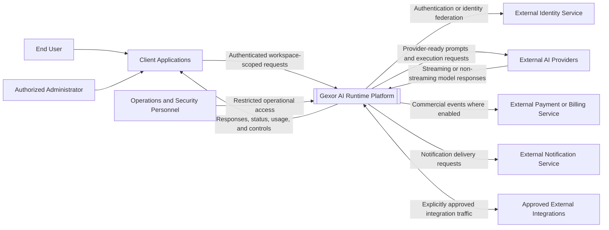
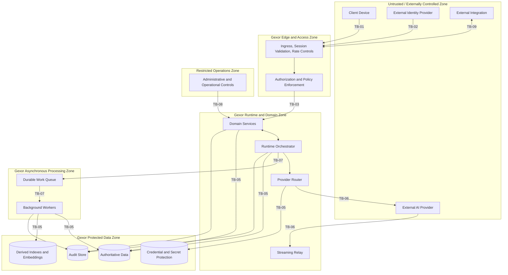
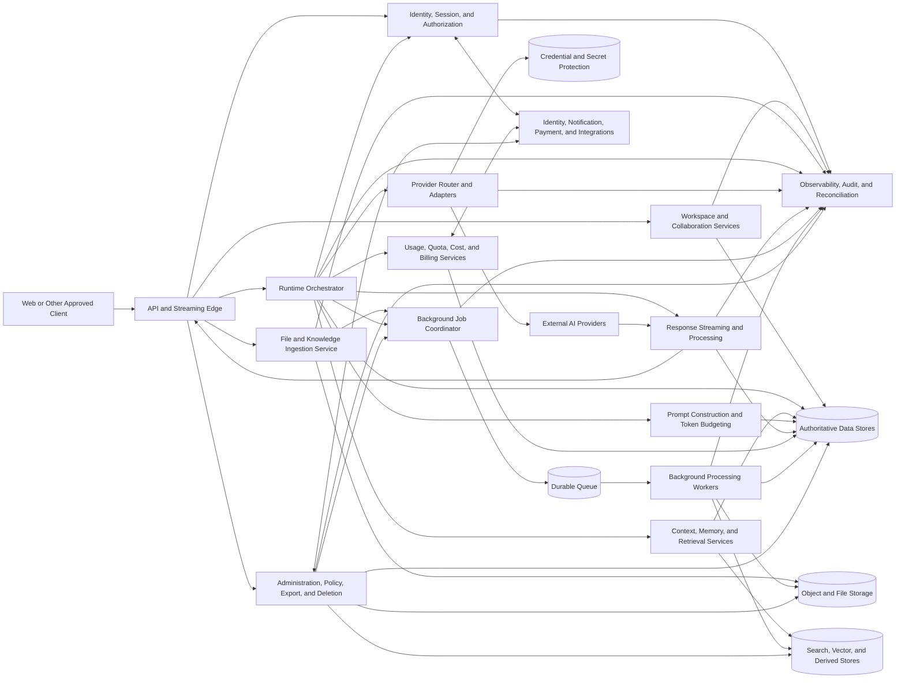
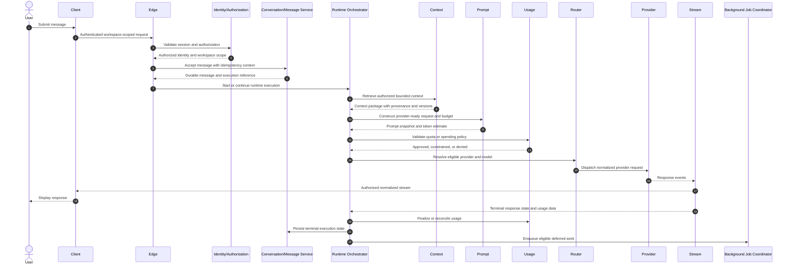
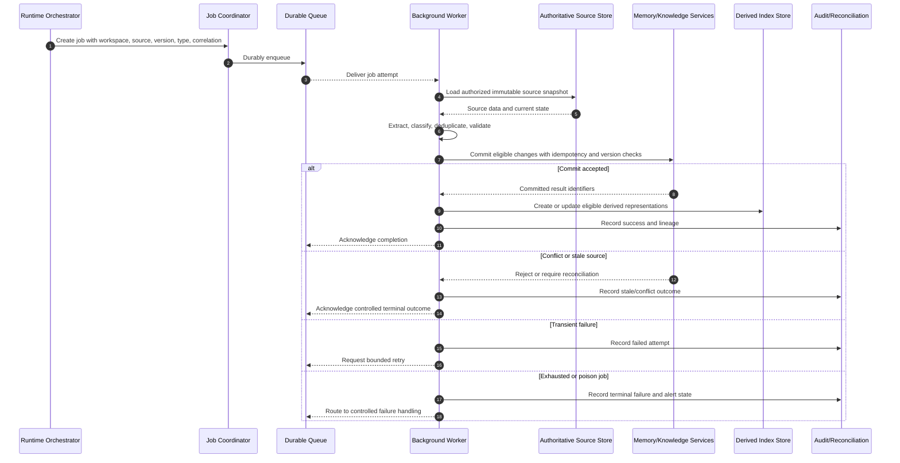

# GEXOR

## System Context and High-Level Architecture

**Document Version:** 1.0-MVP  
**Document Type:** System Context and High-Level Architecture  
**Product:** Gexor — AI Runtime Platform  
**Product Stage:** Pre-development  
**Status:** Complete — Pending Baseline Approval  
**Source Documents:** `PRD.md`, `FUNCTIONAL-REQUIREMENTS.md`, `NON-FUNCTIONAL-REQUIREMENTS.md`  
**Primary Release:** MVP  
**Target File:** `SYSTEM-CONTEXT-AND-HIGH-LEVEL-ARCHITECTURE.md`

---

# Document Control

| Field | Value |
| --- | --- |
| Document owner | Founder / Product Owner |
| Architecture owner | Principal Enterprise AI Architect / Designated Architecture Authority |
| Primary source of truth | Approved PRD, Functional Requirements Specification, and Non-Functional Requirements Specification |
| Intended audience | Product, architecture, engineering, security, data, QA, operations, and implementation teams |
| Architecture baseline | MVP |
| Change authority | Founder / Product Owner with Architecture Authority review |
| Implementation status | Phase 1 foundation partially implemented — see Document 15  |
| Approval status | Pending Product Owner baseline approval |
| Repository action | No GitHub modification authorized by this document generation |

---

# Contents

1. Document Purpose and Scope  
2. Architecture Principles  
3. System Context  
4. External Actors and External Systems  
5. System Boundary  
6. Trust Boundaries  
7. Major Architectural Components  
8. Component Responsibilities  
9. High-Level Runtime Request Flow  
10. Background-Processing Flow  
11. Memory and Knowledge Flow  
12. Provider-Routing Flow  
13. File-Processing and Retrieval Flow  
14. Data Ownership and Workspace-Isolation Boundaries  
15. Security Architecture Overview  
16. Observability and Audit Architecture  
17. Availability, Resilience, and Recovery Architecture  
18. Scalability Approach  
19. Deployment Topology  
20. Data-Store Categories  
21. Integration Boundaries  
22. Architecture Constraints  
23. Architecture Risks and Mitigations  
24. Architecture Decision Register  
25. Traceability to PRD, FRS, and NFRS  
26. Approval and Baseline Status  

---

# 1. Document Purpose and Scope

## 1.1 Purpose

This document defines the implementation-independent system context and high-level architecture for the Gexor MVP.

Gexor is a provider-independent AI runtime and workspace platform positioned between authorized users and supported external AI providers. Gexor does not train or operate its own foundation model as part of the MVP. It controls, enriches, routes, observes, records, and processes AI interactions while preserving user and workspace ownership of context, memory, knowledge, provider configuration, and operational history.

This document establishes:

* the system boundary;
* external actors and external dependencies;
* trust boundaries;
* major architectural components;
* component responsibilities;
* synchronous and asynchronous processing paths;
* data ownership and workspace-isolation boundaries;
* provider-routing and file-processing boundaries;
* security, observability, resilience, scalability, and deployment principles;
* architecture constraints, risks, decisions, and traceability.

This document shall guide subsequent domain, database, API, engine, security, UX, testing, deployment, and operational designs.

## 1.2 Scope

The architecture baseline covers the following MVP capability areas:

* identity and authenticated access;
* workspace-scoped authorization and isolation;
* projects, conversations, messages, and runtime executions;
* intent classification and prompt enhancement;
* context, memory, and knowledge retrieval;
* provider connection and credential use;
* model selection and provider routing;
* provider request execution and streaming response relay;
* response processing;
* background extraction, reconciliation, indexing, and deletion propagation;
* file ingestion, parsing, chunking, indexing, retrieval, and lifecycle control;
* usage, cost, quota, notification, administration, and audit support;
* data export, retention, deletion, backup, restoration, and recovery controls.

## 1.3 Out of Scope

This document does not define:

* physical database tables, columns, keys, indexes, or migration scripts;
* API endpoint paths, payload schemas, or transport-specific contracts;
* source-code packages, classes, methods, functions, or framework structures;
* final cloud provider, hosting vendor, database product, queue product, or observability vendor;
* detailed UI layouts or frontend component designs;
* detailed machine-learning model training;
* final enterprise service-level agreements;
* final regional deployment selections;
* autonomous multi-agent execution beyond approved MVP requirements;
* detailed billing plans or commercial pricing.

## 1.4 Architecture Authority Hierarchy

The following authority hierarchy shall apply:

1. approved `PRD.md`;
2. approved `FUNCTIONAL-REQUIREMENTS.md`;
3. approved `NON-FUNCTIONAL-REQUIREMENTS.md`;
4. approved `SYSTEM-CONTEXT-AND-HIGH-LEVEL-ARCHITECTURE.md`;
5. approved runtime, domain, database, API, engine, security, UX, testing, deployment, and operations documents;
6. implementation plans and source code;
7. test cases and operational procedures.

A lower-level artifact shall not contradict a higher-authority approved artifact.

Where a conflict is identified:

* the affected design or implementation shall not be treated as approved;
* the conflict shall be recorded;
* the higher-authority requirement shall control unless formally changed;
* dependent artifacts shall be reviewed;
* the resolution shall be approved before implementation proceeds.

## 1.5 Architectural Vocabulary

| Term | Meaning |
| --- | --- |
| Gexor | The complete AI runtime and workspace platform defined by the approved product baseline. |
| Runtime execution | One traceable orchestration instance created to process an accepted user request. |
| Synchronous path | The latency-sensitive path from request acceptance through provider response delivery and runtime finalization. |
| Background path | Deferred processing that shall not unnecessarily block the synchronous response path. |
| Workspace | The primary authorization, data-ownership, isolation, retrieval, usage, and lifecycle boundary. |
| Context | Information selected for inclusion in a specific runtime execution. |
| Memory | Structured information retained for possible future retrieval. |
| Knowledge | Structured or indexed information derived from approved sources, files, conversations, or explicit user input. |
| Provider | An external supported AI service that hosts one or more models. |
| Snapshot Lock | The non-blocking rule under which a subsequent message uses the last committed eligible context while preceding background processing remains incomplete. |
| Derived data | Embeddings, indexes, summaries, chunks, caches, projections, or other representations derived from source data. |
| Control plane | Administrative and configuration functions that govern runtime behaviour. |
| Data plane | The request-processing and data-processing functions that execute user workloads. |

---

# 2. Architecture Principles

## 2.1 Provider Independence

Gexor shall isolate provider-specific protocols, authentication methods, model metadata, error formats, streaming formats, capability differences, and pricing metadata behind controlled provider integration boundaries.

Core workspace data, memory, knowledge, projects, conversations, messages, usage history, and audit records shall remain independent of any single AI provider.

Changing a provider or model shall not require migration of Gexor-owned workspace context.

Provider-specific behaviour may be supported through adapters or capability profiles, but provider-specific assumptions shall not leak into provider-independent domain semantics.

## 2.2 Workspace Isolation

Every workspace-scoped read, write, search, retrieval, queue operation, provider execution, usage record, audit event, export, backup, restore, and deletion action shall carry and enforce an authorized workspace scope.

Workspace isolation shall be enforced in multiple layers and shall not rely solely on user-interface filtering or caller-supplied identifiers.

Cross-workspace access shall be denied unless an approved administrative capability explicitly authorizes it and records the action.

## 2.3 Structured Memory over Raw-History Dependence

The architecture shall support structured memory and bounded contextual retrieval rather than requiring complete conversation-history injection into every provider request.

Raw history may be used where permitted and relevant, but shall not be treated as the default long-term memory mechanism.

Memory candidates shall be subject to scope, provenance, lifecycle, validation, conflict, deduplication, user-control, and deletion rules.

## 2.4 Context Minimization

Each runtime execution shall include only the context that is authorized, relevant, within the applicable token budget, and necessary for the task.

The architecture shall distinguish trusted system instructions from user content, retrieved memories, files, search results, and provider-returned content.

Context minimization shall reduce unnecessary disclosure, cost, latency, and prompt dilution without silently removing mandatory instructions.

## 2.5 Explicit Trust Boundaries

The architecture shall define and enforce explicit boundaries between:

* unauthenticated clients and Gexor;
* authenticated clients and workspace-scoped services;
* Gexor and external AI providers;
* Gexor and external identity, notification, payment, or integration systems;
* synchronous runtime services and asynchronous workers;
* application services and data stores;
* operational administrators and customer workspace data;
* trusted instructions and untrusted contextual content.

Data crossing a trust boundary shall be authenticated, authorized, validated, minimized, protected in transit, and observable according to policy.

## 2.6 Reversible Automation

Automated actions that alter durable user-controlled state should be reversible where practical.

Memory extraction, classification, consolidation, conflict resolution, and lifecycle changes shall preserve sufficient provenance and audit information to support inspection, correction, deactivation, or deletion.

Irreversible actions shall require explicit authorization, clear state transitions, and durable audit evidence.

## 2.7 Real-Time Responsiveness

The architecture shall keep latency-sensitive message acceptance, runtime preparation, provider dispatch, and response streaming separate from processing that can safely occur after response delivery.

Background processing for a preceding message shall not block acceptance of a subsequent eligible message.

A failure in optional enrichment should degrade predictably rather than unnecessarily prevent a valid provider request.

## 2.8 Security by Design

Authentication, authorization, least privilege, credential protection, input validation, output handling, data minimization, isolation, auditability, secure deletion, and recovery controls shall be architectural concerns rather than implementation afterthoughts.

No performance or usability objective shall override mandatory authorization, isolation, integrity, deletion, or audit controls.

## 2.9 Auditability and Traceability

Material security, administrative, provider, runtime, memory, knowledge, file, usage, export, retention, and deletion actions shall produce traceable records.

A runtime execution shall be traceable to its accepted message, effective configuration, selected context identifiers and versions, provider route, normalized outcome, usage record, and resulting background jobs, subject to privacy and retention policy.

## 2.10 Operational Recoverability

The architecture shall assume partial failure.

Critical state transitions shall be atomic or recoverable. Asynchronous operations shall be idempotent where repeat execution is possible. Retries shall be bounded. Poison work shall be isolated. Reconciliation shall detect and repair incomplete or divergent states.

## 2.11 Implementation Independence

This architecture defines logical responsibilities and boundaries. It shall not require a specific vendor or technology unless an approved constraint makes that dependency unavoidable.

## 2.12 Measurable Quality Attributes

Architecture decisions shall preserve the measurable performance, availability, reliability, scalability, security, privacy, isolation, resilience, observability, portability, accessibility, integrity, retention, and governance requirements defined in the NFRS.

---

# 3. System Context

## 3.1 Context Summary

Gexor receives authenticated user requests through client applications, establishes an authorized workspace scope, constructs a controlled runtime execution, retrieves permitted context, selects or validates an external provider route, sends a provider-ready request, relays the provider response, records usage and audit information, and schedules eligible deferred processing.

Gexor depends on external providers for model inference. It may also depend on external identity, notification, payment, object-storage, security, and operational integrations. These dependencies remain outside the Gexor system boundary and shall be accessed through controlled integration interfaces.

## 3.2 System Context Diagram



## 3.3 Context Invariants

The following invariants shall apply:

1. External AI providers shall not become the authoritative store for Gexor workspace memory or knowledge.
2. Client applications shall not directly access internal data stores.
3. Provider credentials shall not be exposed to unauthorized clients, logs, analytics, or unrelated services.
4. Every workspace-scoped operation shall be evaluated against authenticated identity and authorized workspace scope.
5. Retrieved contextual data shall not automatically become trusted instructions.
6. Deferred processing shall not mutate state without source identity, workspace scope, idempotency control, and conflict protection.
7. External system failure shall be normalized into Gexor-controlled states and errors.
8. Administrative access shall be separated from ordinary user access and shall be auditable.
9. Deletion of source data shall propagate to applicable derived data according to policy.
10. Gexor shall preserve provider portability at the domain and data-ownership layers.

---

# 4. External Actors and External Systems

## 4.1 External Actors

### 4.1.1 End User

An end user is an authenticated person who operates within one or more authorized workspaces.

The end user may:

* manage workspace-scoped content and settings;
* connect supported provider accounts or credentials;
* create projects, conversations, messages, files, memories, and knowledge sources;
* initiate runtime executions;
* inspect and control eligible memory;
* review provider, model, token, cost, and execution information;
* request export or deletion;
* cancel eligible active executions.

### 4.1.2 Workspace Owner or Administrator

A workspace owner or administrator is an authenticated user with elevated permissions inside an authorized workspace.

This actor may manage membership, workspace policy, provider availability, quotas, retention settings, and other controls explicitly granted by the functional baseline.

Elevated workspace privileges shall not imply platform-wide administrative access.

### 4.1.3 Platform Administrator

A platform administrator is an authorized operational actor with restricted, role-based platform capabilities.

Platform administration shall use dedicated authorization controls and shall not grant unrestricted customer-content access by default.

Administrative actions affecting users, workspaces, credentials, billing, retention, deletion, or security shall be auditable.

### 4.1.4 Operations and Security Personnel

Operations and security personnel monitor health, availability, security events, capacity, recovery, and incident response.

Operational telemetry should minimize customer content. Access to sensitive diagnostic data shall be restricted and recorded.

### 4.1.5 External Integration Principal

An external integration principal is a non-human actor authorized through an approved integration mechanism.

It shall receive only the minimum scopes necessary for the approved integration.

## 4.2 External Systems

### 4.2.1 External AI Providers

External AI providers perform model inference.

Gexor shall treat each provider as an external dependency with independent availability, latency, quotas, pricing, model lifecycle, policy, error behaviour, and data-handling terms.

### 4.2.2 External Identity Systems

An external identity system may authenticate users or support identity federation.

Gexor remains responsible for establishing its own application session, authorization context, workspace permissions, and account lifecycle.

### 4.2.3 Payment or Billing Systems

An external payment or billing system may manage subscriptions, payment methods, invoices, or commercial events.

Commercial status received from such a system shall be validated before it changes Gexor entitlements.

### 4.2.4 Notification Systems

External notification systems may deliver email, push, or other notifications.

Notification content shall be minimized and shall not expose sensitive workspace data unless expressly required and authorized.

### 4.2.5 Approved External Integrations

Approved integrations may exchange workspace-scoped data with Gexor.

Each integration shall have a defined purpose, scope, permission model, failure model, rate policy, audit model, and revocation path.

---

# 5. System Boundary

## 5.1 Inside the Gexor Boundary

The logical Gexor system boundary includes:

* client-facing access interfaces owned by Gexor;
* identity/session integration logic;
* authorization and policy enforcement;
* workspace, project, conversation, message, file, memory, knowledge, provider, usage, and administration services;
* runtime orchestration;
* context retrieval and prompt construction;
* provider routing and provider adapters;
* streaming relay;
* background job coordination and workers;
* audit, observability, reconciliation, export, retention, and deletion coordination;
* Gexor-controlled primary and derived data stores;
* credential protection and secret-use controls;
* control-plane configuration and policy.

## 5.2 Outside the Gexor Boundary

The boundary excludes:

* user devices and unmanaged client environments;
* external AI-provider infrastructure and hosted models;
* external identity-provider infrastructure;
* external payment, notification, and integration infrastructure;
* public networks;
* vendor-operated infrastructure control planes;
* customer systems not operated as part of Gexor.

## 5.3 Boundary Rules

1. No external caller shall be trusted solely because it is on a private network.
2. All ingress shall be authenticated where the operation is protected.
3. Authorization shall be evaluated at the service boundary and at the data-access boundary where practical.
4. Egress to external providers shall use explicit provider routes and approved destinations.
5. Internal service identity shall be authenticated for privileged service-to-service operations.
6. Internal components shall receive only the data and permissions required for their responsibilities.
7. Boundary-crossing payloads shall be validated for format, size, type, ownership, and policy compliance.
8. Sensitive data shall be protected in transit and at rest according to the NFRS.
9. Boundary failures shall produce normalized, non-leaking errors.
10. External callbacks shall be authenticated, validated, replay-protected where applicable, and idempotently processed.

---

# 6. Trust Boundaries

## 6.1 Trust Boundary Categories

The architecture defines the following primary trust boundaries:

* **TB-01 — Public Client Boundary:** Between user-controlled clients and Gexor ingress.
* **TB-02 — Identity Boundary:** Between Gexor and an external identity system.
* **TB-03 — Workspace Authorization Boundary:** Between authenticated identity and workspace-scoped capabilities.
* **TB-04 — Service Boundary:** Between logical Gexor components with distinct privileges.
* **TB-05 — Data-Store Boundary:** Between application services and authoritative or derived stores.
* **TB-06 — Provider Boundary:** Between Gexor and external AI providers.
* **TB-07 — Asynchronous Boundary:** Between synchronous services, queues, and background workers.
* **TB-08 — Administrative Boundary:** Between operational administration and customer workloads or data.
* **TB-09 — External Integration Boundary:** Between Gexor and non-provider integrations.
* **TB-10 — Content Trust Boundary:** Between trusted control instructions and untrusted user, retrieved, file, tool, integration, or provider content.

## 6.2 Trust Boundary Diagram



## 6.3 Trust Boundary Controls

At each applicable trust boundary, the architecture shall support:

* authenticated principal identity;
* authorization and scope enforcement;
* input validation and size limits;
* content-type and file-type validation;
* rate, quota, and abuse controls;
* encryption in transit;
* replay protection where applicable;
* idempotency for repeatable write operations;
* correlation and audit identifiers;
* sensitive-data minimization;
* normalized error handling;
* timeout, retry, and circuit-breaking policies;
* egress allowlisting or destination control;
* credential isolation;
* security monitoring.

## 6.4 Content Trust Model

The architecture shall preserve a distinction between:

1. system-controlled instructions and policies;
2. user instructions;
3. workspace memory and knowledge;
4. retrieved conversation or file content;
5. external integration content;
6. provider-generated content.

Retrieved or provider-generated content shall not be interpreted as system authority merely because it is included in a prompt or processing pipeline.

Prompt construction shall maintain instruction hierarchy and provenance sufficient to apply approved conflict rules.

---

# 7. Major Architectural Components

## 7.1 Container-Level Architecture



## 7.2 Component Groups

The high-level architecture consists of:

1. Client Experience Layer  
2. Edge and Access Layer  
3. Identity and Authorization Layer  
4. Workspace and Collaboration Domain Layer  
5. Runtime Orchestration Layer  
6. Context, Memory, and Knowledge Layer  
7. Prompt and Token Optimization Layer  
8. Provider Routing and Gateway Layer  
9. Streaming and Response Processing Layer  
10. File Ingestion and Retrieval Layer  
11. Usage, Quota, Cost, and Billing Layer  
12. Background Processing Layer  
13. Administration, Governance, Export, and Deletion Layer  
14. Observability, Audit, and Reconciliation Layer  
15. Data and Secret Storage Layer  
16. External Integration Layer  

---

# 8. Component Responsibilities

## 8.1 Client Experience Layer

The client experience layer shall:

* capture user actions and display authorized state;
* submit authenticated requests;
* establish and consume streaming responses;
* expose provider, model, memory, context, usage, and error information permitted by the product baseline;
* avoid becoming the authoritative enforcer of permissions or workspace isolation;
* avoid storing provider credentials in recoverable client-side form;
* preserve retry and idempotency identifiers where required.

## 8.2 Edge and Access Layer

The edge and access layer shall:

* terminate approved client connections;
* apply request-size, content-type, rate, and abuse controls;
* validate session presence for protected operations;
* establish correlation identifiers;
* route requests to eligible internal components;
* support synchronous and streaming interaction patterns;
* normalize transport-level failures;
* avoid embedding domain authorization rules solely at the edge.

## 8.3 Identity, Session, and Authorization Component

This component shall:

* establish authenticated user identity;
* validate session state;
* resolve workspace membership and role;
* enforce authorization policy;
* support revocation and account-state controls;
* separate platform administration from workspace administration;
* provide security-relevant identity events to audit and monitoring systems.

## 8.4 Workspace and Collaboration Services

These services shall manage the authoritative lifecycle of:

* workspaces;
* workspace memberships and roles;
* projects;
* conversations;
* messages;
* user and workspace settings;
* applicable notification preferences;
* eligible shared state.

They shall validate ownership, lifecycle state, permissions, and workspace scope before mutation.

## 8.5 Runtime Orchestrator

The Runtime Orchestrator shall coordinate each runtime execution.

It shall:

* create or resolve a traceable runtime execution;
* capture the accepted message and effective configuration;
* classify the execution path;
* request authorized context;
* apply prompt and token policies;
* validate provider and model eligibility;
* coordinate cost or quota checks;
* dispatch the provider request;
* coordinate streaming and cancellation;
* record terminal execution state;
* schedule eligible background processing;
* enforce Snapshot Lock behaviour for rapid-fire messages;
* avoid direct dependence on provider-specific response semantics outside normalized interfaces.

The Runtime Orchestrator shall not become the authoritative owner of every domain entity. It shall coordinate domain capabilities through explicit contracts.

## 8.6 Context Service

The Context Service shall:

* resolve the eligible context sources for a runtime execution;
* enforce workspace and conversation scope;
* request relevant memory, knowledge, file, and conversation context;
* apply context minimization;
* preserve provenance and selected versions;
* distinguish trusted instructions from contextual content;
* return a bounded, traceable context package.

## 8.7 Memory Service

The Memory Service shall:

* manage memory candidates and durable memories;
* enforce memory scope and user controls;
* maintain lifecycle and eligibility state;
* support retrieval, correction, deactivation, expiration, and deletion;
* preserve provenance;
* detect or coordinate deduplication and conflicts;
* prevent uncommitted background results from appearing in active retrieval;
* expose the effective memory versions selected for an execution.

## 8.8 Knowledge and Retrieval Services

These services shall:

* manage approved knowledge sources;
* retrieve workspace-scoped indexed information;
* combine supported retrieval methods without weakening isolation;
* maintain source references and provenance;
* respect source lifecycle, permissions, retention, and deletion;
* avoid returning derived data whose source is no longer eligible.

## 8.9 Prompt Construction and Token Budgeting

This component shall:

* construct the effective provider-ready request;
* preserve the user’s intended objective;
* apply system policy and workspace settings;
* incorporate only authorized selected context;
* preserve instruction hierarchy;
* enforce context and output budgets;
* support provider capability adaptation without changing provider-independent intent;
* generate an immutable or reproducible prompt snapshot, subject to security and retention policy.

## 8.10 Provider Router

The Provider Router shall:

* resolve the eligible connected provider;
* resolve or validate the model;
* evaluate provider and model capability requirements;
* apply policy, quota, cost, and availability constraints;
* support explicit user selection where permitted;
* produce a traceable routing decision;
* avoid silent cross-provider fallback where the approved behaviour requires user awareness or consent.

## 8.11 Provider Adapters and Gateway

Provider adapters shall:

* translate normalized Gexor requests into provider-specific protocols;
* retrieve credentials only when required;
* protect provider credentials from callers and unrelated services;
* validate provider responses;
* normalize provider errors, usage data, finish reasons, and stream events;
* enforce timeout, retry, and cancellation policies;
* prevent one provider’s protocol from defining Gexor-wide domain semantics.

## 8.12 Streaming Relay

The Streaming Relay shall:

* establish an authorized client stream;
* relay normalized provider events with minimal avoidable delay;
* preserve event ordering within the execution;
* support heartbeats or continuity controls where required;
* handle client disconnect, provider disconnect, cancellation, and terminal events;
* prevent unauthorized reconnection or stream access;
* avoid presenting internal diagnostic or credential data.

## 8.13 Response Processing

Response Processing shall:

* validate normalized provider output;
* persist the eligible response state;
* record finish and failure conditions;
* coordinate usage finalization;
* identify processing tasks that may be deferred;
* avoid allowing optional post-processing failure to corrupt a successfully delivered response.

## 8.14 File and Knowledge Ingestion Service

This service shall:

* accept authorized file uploads;
* validate ownership, type, size, quota, and lifecycle;
* place accepted files into isolated storage;
* create traceable processing state;
* schedule parsing and indexing;
* expose processing status;
* ensure failed or unsupported files do not become retrievable;
* coordinate source deletion with derived-data deletion.

## 8.15 Usage, Quota, Cost, and Billing Services

These services shall:

* track request and provider usage;
* support estimates, reservations, final reconciliation, and adjustments where required;
* enforce configured quotas and spending controls;
* distinguish estimated from provider-reported values;
* preserve traceability to runtime executions;
* avoid allowing billing-system failure to corrupt runtime state;
* expose only authorized usage information.

## 8.16 Background Job Coordinator

The coordinator shall:

* create uniquely identifiable jobs;
* include source identity, source version or snapshot, workspace scope, job type, attempt state, and correlation identifiers;
* enqueue work durably;
* enforce idempotency and deduplication controls;
* schedule retries according to policy;
* route exhausted or poison jobs to controlled failure handling;
* expose status for operations and reconciliation.

## 8.17 Background Workers

Background workers may perform:

* memory candidate extraction;
* knowledge extraction;
* classification and enrichment;
* deduplication and conflict detection;
* consolidation;
* embeddings and indexing;
* file parsing and chunking;
* usage reconciliation;
* notification preparation;
* export generation;
* retention and deletion propagation;
* consistency reconciliation.

Workers shall be stateless where practical and shall not assume exclusive access unless an approved coordination mechanism establishes it.

## 8.18 Administration, Governance, Export, and Deletion

This component group shall:

* enforce privileged authorization;
* manage approved policy and configuration;
* support audit review;
* coordinate exports;
* coordinate retention and deletion workflows;
* support account, workspace, provider, and operational controls;
* record material administrative actions;
* separate customer-facing and platform-level privileges.

## 8.19 Observability, Audit, and Reconciliation

This component group shall:

* collect metrics, logs, traces, health signals, and security events;
* preserve correlation across synchronous and asynchronous processing;
* maintain durable audit evidence for material actions;
* detect incomplete, divergent, stale, or orphaned state;
* support operational dashboards and alerting;
* minimize sensitive content in telemetry;
* support controlled diagnostic access.

## 8.20 Data and Secret Storage

Logical storage responsibilities shall be separated by data class, access pattern, sensitivity, consistency need, and lifecycle.

Provider credentials and other secrets shall be stored and used through a protected secret boundary and shall not be treated as ordinary application data.

---

# 9. High-Level Runtime Request Flow

## 9.1 Synchronous Runtime Flow



## 9.2 Runtime Flow Stages

### Stage 1 — Request Acceptance

The system shall:

1. authenticate the caller;
2. authorize the requested workspace and conversation scope;
3. validate request structure, size, state, and idempotency;
4. durably accept the eligible message;
5. establish correlation and execution identifiers;
6. return or initiate the applicable response channel.

A message shall not be dispatched to a provider unless message acceptance and runtime execution identity are traceable.

### Stage 2 — Effective Configuration Resolution

The system shall resolve:

* workspace policy;
* user settings;
* conversation settings;
* requested provider and model;
* memory and context mode;
* prompt-enhancement mode;
* quota and cost controls;
* applicable feature availability.

The effective configuration used by the execution shall be identifiable or reproducible.

### Stage 3 — Runtime Classification

The Runtime Orchestrator shall determine the eligible processing path, which may include:

* direct route;
* enhanced route;
* clarification route;
* denied route;
* deferred or retryable route;
* cancelled route.

Optional enrichment failure should not block an otherwise valid direct route unless the missing control is mandatory for correctness or safety.

### Stage 4 — Context Retrieval

The system shall retrieve only authorized and eligible context.

Selection shall account for:

* workspace scope;
* conversation or project scope;
* memory status;
* knowledge-source status;
* relevance;
* provenance;
* time and version;
* token budget;
* user exclusions;
* deletion or retention state;
* trust classification.

### Stage 5 — Prompt Construction

The system shall construct the effective request while preserving:

* system policy;
* user intent;
* instruction hierarchy;
* selected context provenance;
* provider capability constraints;
* token budget;
* output constraints;
* traceability.

### Stage 6 — Routing and Dispatch

The system shall:

* validate provider connection state;
* validate model availability and capability;
* enforce cost, quota, and policy;
* obtain the required credential through the protected credential boundary;
* dispatch through the selected provider adapter;
* record the route and dispatch outcome.

### Stage 7 — Streaming and Cancellation

The system shall relay normalized provider events to the authorized client.

Cancellation shall stop additional normal generation output within the applicable NFR threshold, but shall not imply rollback of already committed effects unless a domain-specific compensating action exists.

### Stage 8 — Finalization

The system shall:

* identify the terminal execution state;
* persist the eligible assistant response;
* record normalized provider outcome;
* finalize or reconcile usage;
* preserve prompt, context, and route traceability according to policy;
* enqueue eligible background work;
* produce audit and observability events.

## 9.3 Snapshot Lock Behaviour

If Message B is accepted while background processing for immediately preceding Message A remains active:

1. Message B shall not wait for Message A’s background work to finish.
2. Message B shall use the last committed, active, and eligible workspace context available at its runtime snapshot.
3. Uncommitted results derived from Message A shall not be visible to Message B.
4. Message A’s background job shall process an identifiable source snapshot or version.
5. When Message A’s results commit successfully, they may become eligible for a subsequent Message C.
6. An older background result shall not overwrite newer committed state.
7. The execution record for Message B shall preserve the context identifiers and versions it used.

This rule preserves responsiveness, determinism, and traceability while preventing read-after-uncommitted-write behaviour.

## 9.4 Runtime Failure Classes

The runtime architecture shall distinguish:

* client validation failure;
* authentication failure;
* authorization failure;
* quota or cost denial;
* required context failure;
* optional enrichment degradation;
* provider-connection failure;
* provider timeout;
* provider rate limit;
* provider policy rejection;
* malformed provider response;
* stream interruption;
* cancellation;
* internal transient failure;
* internal terminal failure.

Each failure class shall map to a normalized state, user-safe error, audit behaviour, retry eligibility, and reconciliation policy.

---

# 10. Background-Processing Flow

## 10.1 Purpose

Background processing removes non-critical work from the synchronous response path while preserving correctness, isolation, recoverability, and traceability.

## 10.2 Asynchronous Background-Processing Diagram



## 10.3 Background Job Contract

Every background job shall include or resolve:

* unique job identifier;
* job type and schema version;
* workspace identifier;
* source entity identifier;
* source version, immutable snapshot, or equivalent concurrency token;
* initiating user or system principal where applicable;
* correlation and runtime execution identifiers;
* creation time and canonical processing time;
* idempotency key;
* attempt count;
* priority or service class where supported;
* retention and deletion eligibility;
* current lifecycle state.

## 10.4 Background Processing Invariants

1. A worker shall revalidate workspace scope before reading or writing protected data.
2. Repeat delivery shall not create duplicate committed effects.
3. A stale job shall not overwrite a newer source version.
4. A failed optional job shall not retroactively invalidate a successfully completed provider response.
5. Derived data shall remain linked to its source.
6. Source deletion or ineligibility shall prevent new derived data from becoming active.
7. Retry shall be bounded and classified by error type.
8. Permanent failure shall be observable and reconcilable.
9. Job cancellation shall not roll back committed effects unless an explicit compensation exists.
10. Queue backlog shall be monitored against NFR capacity and recovery thresholds.

## 10.5 Background Processing Categories

The architecture shall support at least these logical categories:

* memory extraction;
* memory validation and classification;
* conflict detection and deduplication;
* memory consolidation;
* knowledge extraction;
* file parsing and chunking;
* embeddings and search indexing;
* usage and provider-cost reconciliation;
* notification preparation;
* export generation;
* retention and deletion processing;
* consistency reconciliation;
* operational maintenance.

## 10.6 Atomicity and Compensation

A multi-step background operation shall define its commit boundary.

Where a single atomic transaction is not possible across stores:

* the source of truth shall be explicit;
* intermediate state shall be identifiable;
* retry shall be idempotent;
* compensating or reconciliation actions shall be defined;
* derived state shall not be treated as authoritative;
* user-visible state shall not claim completion before required commits succeed.

---

# 11. Memory and Knowledge Flow

## 11.1 Memory Lifecycle

The high-level memory lifecycle is:

```text
Detected Candidate
→ Validated
→ Classified
→ Deduplicated
→ Conflict Evaluated
→ Confirmed or Policy-Accepted
→ Active
→ Retrieved When Eligible
→ Updated, Superseded, Deactivated, Expired, or Deleted
```

Not every candidate shall become durable memory.

## 11.2 Memory Creation Flow

1. An eligible source event is committed.
2. A background job processes an identifiable source snapshot.
3. Candidate information is extracted.
4. Candidate scope, provenance, sensitivity, confidence, and type are identified.
5. Candidate information is validated.
6. Existing memories are checked for duplication or conflict.
7. Applicable confirmation or policy rules are applied.
8. Eligible memory changes are committed atomically or through a recoverable workflow.
9. Derived retrieval representations are updated.
10. Audit and lineage records are created.

## 11.3 Memory Retrieval Flow

1. The Runtime Orchestrator requests context for a specific authorized execution.
2. The Context Service establishes workspace, project, conversation, and user scope.
3. The Memory Service considers only active and eligible records.
4. Retrieval combines approved relevance signals.
5. Policy exclusions, deletion state, sensitivity, time, and token budget are applied.
6. Selected memory identifiers and effective versions are returned.
7. Prompt construction includes the selected content as contextual data under the applicable trust classification.
8. The execution preserves the retrieval snapshot for traceability.

## 11.4 Knowledge Flow

Knowledge may originate from:

* approved files;
* explicit user input;
* authorized conversations;
* approved integrations;
* structured workspace sources.

Knowledge processing shall preserve:

* workspace ownership;
* source identity;
* source version;
* extraction or indexing state;
* provenance;
* access scope;
* retention state;
* deletion lineage;
* retrieval eligibility.

## 11.5 Memory and Knowledge Separation

Memory and knowledge are related but distinct architectural concepts.

Memory is structured information retained to improve continuity and personalization. Knowledge is structured or indexed information derived from approved sources for retrieval and task support.

The architecture shall not assume that:

* all knowledge is memory;
* all memory is file-derived knowledge;
* a retrieved item is automatically trusted;
* a candidate is automatically active;
* derived data may outlive its source without policy authorization.

## 11.6 Conflict and Supersession

When new information conflicts with existing memory or knowledge:

* the conflict shall be identifiable;
* the system shall not silently overwrite authoritative user-confirmed state without an approved rule;
* competing versions or supersession lineage shall be preserved where required;
* automated resolution shall be reversible where practical;
* user confirmation may be required according to policy;
* stale background jobs shall be prevented from restoring superseded state.

## 11.7 Deletion Propagation

Deleting or making a source ineligible shall trigger evaluation of:

* active memory derived from the source;
* knowledge records;
* chunks;
* embeddings;
* search indexes;
* summaries;
* caches;
* exports in progress;
* queued jobs;
* backups and retention copies according to policy.

Deletion shall be tracked to a terminal or exception state and shall be reconcilable.

---

# 12. Provider-Routing Flow

## 12.1 Routing Objectives

Provider routing shall preserve:

* explicit user choice where configured;
* provider independence;
* model capability suitability;
* provider-connection eligibility;
* workspace policy;
* quota and cost controls;
* availability awareness;
* traceability;
* predictable fallback behaviour;
* credential confidentiality.

## 12.2 Routing Inputs

A routing decision may consider:

* explicit provider selection;
* explicit model selection;
* task type and complexity;
* required context size;
* streaming requirement;
* model capability metadata;
* provider connection state;
* credential validity state;
* workspace provider policy;
* user preferences;
* quota or spending limits;
* estimated input and output usage;
* provider availability or recent failure state;
* approved fallback policy.

## 12.3 Routing Decision Flow

1. Validate the requested provider and model identifiers.
2. Resolve the authorized workspace provider connection.
3. Validate connection state without exposing credential material.
4. Resolve provider and model capabilities.
5. Validate task requirements against model capabilities.
6. calculate or obtain the applicable token and cost estimate.
7. Enforce quota, budget, and policy.
8. Select the route or return a controlled denial or recommendation.
9. Record the routing factors necessary for traceability.
10. Dispatch through the matching provider adapter.

## 12.4 Fallback Rules

Fallback shall be explicit and policy-controlled.

The system shall not silently route sensitive or materially different work to another provider when doing so would violate:

* user selection;
* workspace policy;
* data-handling constraints;
* cost limits;
* capability requirements;
* geographic or compliance constraints;
* provider-credential ownership.

Where automatic fallback is approved, the route change shall be observable and auditable.

## 12.5 Provider Failure Isolation

Provider-specific failures shall be contained at the provider boundary.

A provider outage or malformed response shall not corrupt:

* workspace data;
* message acceptance state;
* another provider connection;
* memory or knowledge state;
* unrelated runtime executions;
* usage records beyond the affected reconciliation scope.

## 12.6 Credential Use

Provider credentials shall:

* remain encrypted or equivalently protected at rest;
* be retrieved only by authorized provider-gateway operations;
* be used only for the owning workspace and approved provider;
* not be written to logs, traces, prompts, analytics, or user-visible errors;
* support revocation and rotation;
* fail closed when required authorization or credential state cannot be established.

---

# 13. File-Processing and Retrieval Flow

## 13.1 File Acceptance

The file-ingestion boundary shall validate:

* authenticated identity;
* workspace authorization;
* file ownership scope;
* declared and detected type;
* supported format;
* size limits;
* workspace quota;
* malware or content-security policy where applicable;
* duplicate or idempotency state;
* retention and deletion policy.

File parsing shall not occur in the latency-sensitive upload acceptance path unless required by a specific validation rule.

## 13.2 File Processing Stages

The logical file-processing stages are:

```text
Upload Accepted
→ Isolated Object Stored
→ Processing Job Created
→ Type and Integrity Validated
→ Parsed
→ Structured
→ Chunked
→ Enriched Where Approved
→ Indexed
→ Retrieval Eligible
```

A file shall enter a failed or quarantined state if a mandatory processing control fails.

## 13.3 Retrieval Eligibility

File-derived content shall be retrievable only when:

* the source file remains active and authorized;
* required parsing completed successfully;
* the derived record belongs to the same workspace;
* the requesting principal and execution have permission;
* the source is not pending deletion or quarantined;
* retrieval complies with context and token policies.

## 13.4 Retrieval Provenance

Each returned file-derived item shall be traceable to:

* workspace;
* source file;
* source version;
* chunk or segment;
* processing version where required;
* index version where required;
* retrieval execution;
* deletion lineage.

## 13.5 File Failure Handling

Failures shall be classified as:

* unsupported type;
* invalid or corrupt file;
* size or quota violation;
* security rejection;
* parsing failure;
* indexing failure;
* transient processing failure;
* deletion conflict;
* internal processing failure.

The system shall expose an authorized, user-safe processing status without leaking internal infrastructure details.

## 13.6 File Deletion

File deletion shall coordinate:

* source-object removal according to retention policy;
* derived chunk removal;
* embedding and index invalidation;
* knowledge-record inactivation or removal;
* cache invalidation;
* queued-job cancellation or stale-source rejection;
* export and backup handling according to policy;
* audit and reconciliation.

---

# 14. Data Ownership and Workspace-Isolation Boundaries

## 14.1 Ownership Model

Gexor shall treat the workspace as the primary data-ownership and authorization boundary.

Workspace-scoped data includes, where applicable:

* projects;
* conversations;
* messages;
* runtime executions;
* prompt snapshots;
* context-selection records;
* memories and candidates;
* knowledge sources;
* files and objects;
* chunks and embeddings;
* provider connections;
* provider requests and normalized responses;
* usage and cost records;
* queues and job state;
* exports;
* retention and deletion state;
* audit events;
* backups and recovery records.

## 14.2 Isolation Invariants

1. Every workspace-scoped record shall carry or resolve an authoritative workspace identity.
2. Caller-provided workspace identity shall not be trusted without authorization.
3. Cross-workspace joins, searches, caches, indexes, exports, and background jobs shall be prevented by design or validated by equivalent controls.
4. Provider credentials shall be bound to their owning workspace.
5. Usage and cost shall be attributed to the correct workspace and execution.
6. Derived data shall inherit the source workspace.
7. Queue messages shall include workspace scope and shall be revalidated by workers.
8. Cache keys shall include sufficient tenant scope.
9. Search and vector retrieval shall apply workspace filtering before results become visible.
10. Administrative cross-workspace actions shall require explicit privilege and audit.
11. Backup and restore processes shall preserve tenant boundaries.
12. Test and non-production environments shall not receive production customer data unless an approved, protected process permits it.

## 14.3 Shared Infrastructure

The MVP may use shared logical or physical infrastructure, provided that:

* tenant isolation remains enforceable;
* access paths remain workspace-scoped;
* noisy-neighbour controls are available;
* capacity and failure of one workspace do not create unauthorized disclosure to another;
* backup, restore, export, and deletion remain attributable;
* isolation is verified through automated negative-path testing.

## 14.4 Workspace Transfer or Membership Change

Membership, role, transfer, suspension, and deletion changes shall invalidate or re-evaluate affected access.

Long-lived sessions, cached authorization, active streams, queued jobs, and integration tokens shall not preserve access beyond the approved revocation policy.

## 14.5 Data Portability

Workspace-owned data shall remain exportable in an implementation-independent or documented portable representation where required by the functional baseline.

Provider switching shall not require loss of Gexor-owned memory, knowledge, conversations, or workspace structure.

---

# 15. Security Architecture Overview

## 15.1 Security Objectives

The security architecture shall protect:

* identity and sessions;
* workspace authorization;
* provider credentials;
* personal and workspace content;
* prompts and provider responses;
* memory and knowledge;
* files and derived data;
* usage and billing data;
* audit evidence;
* administrative capabilities;
* availability and operational integrity.

## 15.2 Authentication

Protected operations shall require a valid authenticated session or approved non-human credential.

Authentication failure shall not reveal whether protected resources exist.

Session lifecycle shall support expiration, revocation, and security-event response.

## 15.3 Authorization

Authorization shall apply:

* least privilege;
* deny by default;
* workspace membership and role;
* resource ownership;
* operation type;
* record lifecycle;
* administrative scope;
* policy restrictions.

Authorization shall be re-evaluated at material trust boundaries and shall not rely solely on client state.

## 15.4 Credential and Secret Protection

The architecture shall separate provider and platform secrets from ordinary application data.

Sensitive credentials shall:

* be encrypted or equivalently protected at rest;
* be protected in transit;
* be masked from user-visible interfaces after entry;
* be excluded from logs and traces;
* be accessed only by authorized components;
* support rotation and revocation;
* be deleted or disabled when the owning connection is removed.

## 15.5 Input and Content Security

All ingress shall be validated.

File and prompt content shall be treated as untrusted data. The architecture shall support controls for:

* injection-resistant instruction hierarchy;
* file-type validation;
* payload-size limits;
* malformed stream events;
* unsafe redirects or destinations;
* untrusted callback payloads;
* output encoding;
* abuse and rate controls.

## 15.6 Network and Service Security

Service-to-service communication for privileged operations shall use authenticated identities or equivalent controls.

Egress to providers and integrations shall be limited to approved destinations.

Network location alone shall not establish trust.

## 15.7 Data Protection

Sensitive data shall be minimized in:

* prompts;
* provider requests;
* logs;
* traces;
* metrics;
* notifications;
* support tooling;
* exports;
* backups.

Data protection controls shall align with classification, retention, deletion, and applicable legal obligations.

## 15.8 Administrative Security

Administrative capabilities shall be:

* separated from normal user capabilities;
* role-restricted;
* strongly authenticated;
* audited;
* subject to least privilege;
* reviewable;
* revocable.

Sensitive administrative actions should support elevated confirmation or additional control where required.

## 15.9 Security Failure Behaviour

Security controls shall fail closed when authorization, credential state, isolation, or integrity cannot be established.

Security errors shall be user-safe and shall not expose secrets, internal topology, or cross-workspace information.

---

# 16. Observability and Audit Architecture

## 16.1 Observability Model

The architecture shall support four complementary evidence types:

1. **Metrics** for aggregate health, latency, throughput, capacity, errors, queues, provider performance, and business operations.
2. **Logs** for structured diagnostic events.
3. **Traces** for correlated request and job execution paths.
4. **Audit Records** for durable, security- and governance-relevant actions.

Observability data shall not replace authoritative domain state.

## 16.2 Correlation Model

The architecture should correlate, where applicable:

* request identifier;
* user identifier or protected surrogate;
* workspace identifier;
* conversation identifier;
* message identifier;
* runtime execution identifier;
* provider request identifier;
* stream identifier;
* job identifier;
* source entity and version;
* export, deletion, or reconciliation identifier.

Correlation identifiers shall not grant authorization.

## 16.3 Runtime Observability

The runtime path shall expose stage-level telemetry for:

* request acceptance;
* authorization;
* context retrieval;
* memory retrieval;
* prompt construction;
* token budgeting;
* routing;
* provider dispatch;
* provider first event;
* stream relay;
* finalization;
* background enqueue;
* usage reconciliation.

This telemetry shall support the measurable NFR thresholds without requiring storage of unnecessary prompt or response content.

## 16.4 Background Observability

Background processing shall expose:

* queue depth;
* enqueue delay;
* job age;
* attempt count;
* processing latency;
* success, retry, conflict, stale, cancellation, and failure outcomes;
* poison-job counts;
* deletion backlog;
* indexing backlog;
* reconciliation backlog.

## 16.5 Provider Observability

Provider telemetry shall distinguish:

* Gexor-added latency;
* provider latency;
* provider availability;
* provider rate limits;
* model-specific failures;
* malformed events;
* usage discrepancies;
* circuit state;
* fallback decisions.

## 16.6 Audit Events

Material audit events shall include, where applicable:

* authentication and session security events;
* membership and role changes;
* provider connection creation, update, validation, revocation, and deletion;
* provider routing decisions where required;
* memory creation, confirmation, correction, deactivation, conflict resolution, and deletion;
* file upload, processing, access, and deletion;
* export initiation and completion;
* retention and deletion actions;
* administrative actions;
* quota, spending, and billing control changes;
* security-policy changes;
* recovery and restore operations;
* access to restricted diagnostic or customer data.

## 16.7 Telemetry Protection

Logs, metrics, traces, and audit records shall:

* avoid plaintext credentials;
* avoid unnecessary full prompts or responses;
* apply retention policy;
* be access-controlled;
* preserve canonical time;
* support integrity and tamper-evidence appropriate to their purpose;
* distinguish audit evidence from mutable operational diagnostics.

## 16.8 Reconciliation Architecture

Reconciliation processes shall detect:

* accepted messages without terminal runtime state;
* completed executions without finalized usage;
* committed sources without expected derived state;
* deleted sources with remaining active derived state;
* stuck exports or deletions;
* stale jobs;
* orphaned objects;
* provider usage discrepancies;
* inconsistent memory or knowledge versions.

Reconciliation shall repair safely where deterministic repair is possible and shall escalate unresolved exceptions.

---

# 17. Availability, Resilience, and Recovery Architecture

## 17.1 Availability Approach

The architecture shall avoid unnecessary single points of failure in critical runtime services.

Stateless request-processing components should support multiple concurrently available instances.

Stateful dependencies shall have an approved redundancy, backup, or recovery strategy appropriate to their criticality.

## 17.2 Failure Containment

Failures shall be contained by boundary:

* one user request shall not corrupt unrelated requests;
* one workspace workload shall not disclose or corrupt another workspace;
* one provider failure shall not disable unrelated provider routes where alternatives remain eligible;
* one background job failure shall not stop the queue;
* one malformed file shall not stop unrelated file processing;
* observability failure shall not silently disable all core processing without alerting;
* optional post-processing failure shall not corrupt completed synchronous responses.

## 17.3 Timeout and Retry

Every external or asynchronous call shall have an explicit timeout policy.

Retries shall:

* apply only to retryable failures;
* be bounded;
* use backoff and jitter where appropriate;
* preserve idempotency;
* avoid retry storms;
* respect provider limits;
* stop when cancellation, deletion, or stale-source state makes the work ineligible.

## 17.4 Circuit Breaking and Load Shedding

The architecture should support circuit breaking for unstable external dependencies.

Under overload, the system shall preserve higher-priority controls and may:

* reject new optional work;
* delay background processing;
* reduce non-critical enrichment;
* apply admission control;
* shed low-priority requests;
* prevent queue growth beyond safe capacity.

Load shedding shall not bypass authentication, authorization, isolation, or integrity controls.

## 17.5 Recovery Point and Recovery Time

Detailed recovery objectives shall be governed by the NFRS and subsequent deployment documentation.

The architecture shall classify data by recoverability need:

* authoritative transactional state;
* security and audit evidence;
* provider credentials and configuration;
* files and source objects;
* derived indexes and embeddings;
* ephemeral caches;
* queue and workflow state;
* observability data.

Derived data may be rebuilt from authoritative sources where the process is deterministic, authorized, and operationally acceptable.

## 17.6 Backup

Backups shall:

* protect required authoritative data;
* preserve encryption and access controls;
* remain attributable to the correct environment and tenant scope;
* support integrity verification;
* follow retention policy;
* participate in deletion handling as legally and technically required;
* be tested through controlled restoration exercises.

## 17.7 Restore

Restore operations shall:

* require privileged authorization;
* be auditable;
* validate backup integrity;
* prevent cross-environment or cross-tenant contamination;
* reconcile derived stores after authoritative restoration;
* revalidate credentials and external integration state where required;
* verify application-level consistency before service is declared recovered.

## 17.8 Queue Recovery

Durable asynchronous work shall survive ordinary worker restart.

After recovery:

* duplicate delivery shall remain safe;
* stale jobs shall be rejected;
* job age and backlog shall be observable;
* poison jobs shall remain isolated;
* deletion and security jobs may receive elevated priority according to policy.

## 17.9 Provider Degradation

When a provider is degraded:

* the system shall preserve accepted message and execution state;
* the provider error shall be normalized;
* retries shall follow policy;
* fallback shall follow explicit routing rules;
* the user shall receive a controlled status;
* usage shall not be falsely finalized;
* other provider routes shall remain isolated from the failure.

---

# 18. Scalability Approach

## 18.1 Scalability Model

The architecture shall scale by workload dimension rather than requiring all components to scale identically.

Primary dimensions include:

* authenticated request rate;
* concurrent streams;
* provider request concurrency;
* workspace count;
* active users;
* message volume;
* memory and knowledge volume;
* file volume and size;
* search and vector index size;
* background-job throughput;
* audit and telemetry volume;
* export and deletion workload.

## 18.2 Horizontal Scaling

Stateless or partition-tolerant components should scale horizontally, including:

* edge services;
* domain APIs;
* runtime orchestration workers;
* provider adapters;
* streaming relays;
* background workers;
* file processors;
* retrieval services;
* notification processors.

State required for coordination shall not be held only in one process.

## 18.3 Partitioning

Workspace identity is the preferred logical partition key for tenant-scoped workload.

Partitioning strategies shall preserve:

* workspace isolation;
* balanced load;
* recoverability;
* query efficiency;
* export and deletion completeness;
* avoidance of global hot spots.

Large individual workspaces may require secondary partitioning in later releases without changing provider-independent domain semantics.

## 18.4 Queue-Based Elasticity

Background workers may scale independently by job type, backlog, age, resource demand, and priority.

CPU-intensive, memory-intensive, and external-I/O-intensive jobs should be separable to prevent one workload class from starving another.

## 18.5 Streaming Scalability

Streaming infrastructure shall account for:

* long-lived connections;
* connection authorization;
* event ordering;
* backpressure;
* client disconnects;
* provider disconnects;
* node failure;
* reconnection policy;
* per-workspace and per-user concurrency limits.

## 18.6 Retrieval Scalability

Memory, knowledge, keyword, and vector retrieval shall scale without removing workspace filters.

Index partitioning, replication, caching, or query optimization may be used, provided that source lifecycle, provenance, deletion, and tenant isolation remain correct.

## 18.7 Noisy-Neighbour Controls

The architecture shall support:

* per-user and per-workspace rate limits;
* provider concurrency limits;
* file and storage quotas;
* queue admission controls;
* query limits;
* export limits;
* cost and token controls;
* operational prioritization.

## 18.8 Capacity Management

Capacity planning shall use measurable NFR reference loads and shall monitor:

* saturation;
* latency percentile degradation;
* error rates;
* stream concurrency;
* queue age;
* storage growth;
* index growth;
* provider quotas;
* cost exposure.

---

# 19. Deployment Topology

## 19.1 Logical Deployment Zones

The MVP deployment shall separate, logically or physically:

1. public ingress and streaming;
2. application and domain services;
3. runtime orchestration;
4. provider gateway and credential use;
5. background processing;
6. protected data services;
7. administrative and operational access;
8. observability and audit services.

The exact infrastructure products are deferred to deployment design.

## 19.2 Environment Separation

Production, pre-production, test, and development environments shall be separated.

Environment separation shall cover:

* identities and permissions;
* credentials and secrets;
* data stores;
* queues;
* object storage;
* provider connections;
* audit and telemetry;
* deployment pipelines;
* external callbacks.

Production data shall not be copied into lower environments without an approved protected process.

## 19.3 Logical Topology

```text
User and Administrator Clients
        |
Approved Public Ingress and Streaming Edge
        |
Identity, Session, Authorization, and Policy
        |
+---------------- Gexor Application Plane ----------------+
| Workspace Services | Runtime | Retrieval | Administration |
+----------------------------------------------------------+
        |
+---------------- Gexor Processing Plane -----------------+
| Provider Gateway | Stream Relay | Background Workers     |
+----------------------------------------------------------+
        |
+----------------- Protected Data Plane -------------------+
| Authoritative Stores | Object Store | Indexes | Audit    |
| Queue State | Secret Protection | Backup and Recovery    |
+----------------------------------------------------------+
        |
External AI Providers and Approved External Systems
```

## 19.4 Availability Domains

Where the selected infrastructure supports multiple failure domains, critical stateless services and required stateful dependencies should be distributed to reduce single-domain failure.

The MVP may begin with a single approved deployment region if permitted by the NFRS, provided that:

* backups are protected from primary-environment loss;
* recovery procedures are documented and tested;
* regional dependency risk is recorded;
* future multi-region evolution is not blocked by domain design.

## 19.5 Administrative Access

Administrative access shall use a restricted path separate from ordinary client access where practical.

Direct production data-store access shall be exceptional, privileged, time-bounded where possible, and auditable.

## 19.6 Deployment Independence

Business and domain components shall not require a particular infrastructure vendor’s identity, queue, object, database, or observability semantics to appear in user-facing contracts.

Vendor-specific deployment choices may be made in lower-level documents without changing this logical architecture.

---

# 20. Data-Store Categories

## 20.1 Authoritative Transactional Store

This category contains durable system-of-record state such as:

* users and application identity references;
* workspaces and membership;
* projects and conversations;
* messages and runtime executions;
* memory and knowledge metadata;
* provider connection metadata;
* file metadata;
* usage and cost records;
* lifecycle and deletion state;
* configuration and policy;
* job and workflow state where required.

The authoritative transactional store shall support consistency appropriate to permission, ownership, lifecycle, and state-transition decisions.

## 20.2 Object and File Store

This category contains:

* uploaded source files;
* generated exports;
* large processing artifacts where approved;
* backup objects where applicable.

Objects shall be bound to workspace, lifecycle, encryption, retention, and deletion metadata.

## 20.3 Search and Vector Stores

This category contains derived retrieval representations such as:

* keyword indexes;
* vector embeddings;
* chunks;
* retrieval metadata;
* ranking features.

These stores shall not become the sole authoritative source for ownership, permission, or source lifecycle.

## 20.4 Cache and Ephemeral State

This category may contain:

* short-lived authorization results;
* provider metadata;
* rate-limit counters;
* prompt or retrieval intermediates;
* stream coordination state;
* temporary locks;
* transient responses.

Caches shall be scoped, expirable, invalidatable, and non-authoritative.

Sensitive cached data shall receive protection equivalent to its classification.

## 20.5 Durable Queue and Workflow State

This category supports:

* background job delivery;
* retries;
* delayed work;
* cancellation markers;
* poison-job isolation;
* workflow progress;
* deletion and export coordination.

Queue messages shall not contain unnecessary sensitive content when identifiers can be resolved securely by the worker.

## 20.6 Secret and Credential Store

This category contains:

* provider API credentials;
* integration secrets;
* encryption keys or protected key references;
* service credentials;
* signing material.

Access shall be narrowly restricted and audited where applicable.

## 20.7 Audit Store

The audit store contains durable records of material security, administrative, data-lifecycle, and runtime actions.

Audit records shall be distinguishable from normal application logs and protected against unauthorized modification.

## 20.8 Observability Store

This category contains operational metrics, traces, and diagnostic logs.

It shall use content minimization and shall not be treated as a substitute for authoritative or audit data.

## 20.9 Backup and Recovery Store

This category contains protected recoverable copies and recovery metadata.

Backup storage shall preserve environment separation, encryption, integrity, retention, and access control.

## 20.10 Data-Store Selection Principles

Detailed products shall be selected according to:

* consistency needs;
* access patterns;
* latency thresholds;
* scale;
* data sensitivity;
* tenant isolation;
* retention and deletion;
* backup and restore;
* portability;
* operational maturity;
* cost.

No data-store selection shall weaken a mandatory NFR.

---

# 21. Integration Boundaries

## 21.1 Provider Integration Boundary

Each AI provider integration shall define:

* supported authentication mechanism;
* supported models and capabilities;
* request adaptation;
* stream adaptation;
* error normalization;
* timeout and retry policy;
* usage normalization;
* cancellation support;
* data-handling constraints;
* health and availability signals;
* versioning and deprecation handling.

## 21.2 Identity Integration Boundary

Identity integration shall define:

* identity assertion validation;
* account linking;
* session establishment;
* revocation;
* provider outage behaviour;
* security-event handling;
* privacy-minimized attribute use.

## 21.3 Payment and Billing Boundary

The payment or billing boundary shall define:

* authenticated event receipt;
* event validation;
* replay and idempotency handling;
* entitlement reconciliation;
* commercial failure handling;
* separation between commercial records and provider usage records.

## 21.4 Notification Boundary

The notification boundary shall define:

* destination validation;
* template and content minimization;
* delivery status;
* retry;
* suppression;
* user preference;
* provider failure handling.

## 21.5 General External Integration Boundary

Every approved external integration shall define:

* purpose;
* data direction;
* workspace scope;
* permission scopes;
* authentication;
* authorization;
* rate limits;
* schema versioning;
* idempotency;
* timeout and retry;
* error normalization;
* audit;
* revocation;
* retention and deletion;
* security and privacy review.

## 21.6 Webhook or Callback Boundary

Where callbacks are supported, the system shall validate:

* approved source;
* authenticity;
* signature or equivalent proof;
* timestamp or replay window;
* event identifier;
* schema version;
* payload size and type;
* target workspace;
* idempotency state.

## 21.7 Integration Failure Independence

An external integration failure shall not corrupt unrelated Gexor state.

Integration state shall be reconcilable where asynchronous delivery or eventual consistency is unavoidable.

---

# 22. Architecture Constraints

## 22.1 Product Constraints

1. Gexor shall not depend on operating its own foundation model for MVP viability.
2. Users shall be able to use supported external providers through controlled connections.
3. Provider switching shall preserve Gexor-owned workspace continuity.
4. User control over memory, provider choice, cost, export, and deletion shall be maintained.
5. The product shall support a familiar conversational interaction model.
6. Background processing shall not unnecessarily delay response delivery.

## 22.2 Security and Isolation Constraints

1. Workspace isolation is mandatory and release-blocking.
2. Provider credentials shall remain protected.
3. Authorization shall precede protected data access.
4. Retrieved context shall not automatically become trusted instruction.
5. Cross-workspace data leakage shall be treated as a critical security failure.
6. Administrative access shall be restricted and auditable.

## 22.3 Runtime Constraints

1. The synchronous runtime path shall satisfy NFR latency thresholds excluding external provider latency where specified.
2. Provider response streaming shall begin and relay within applicable thresholds.
3. Snapshot Lock shall prevent preceding background work from blocking a subsequent message.
4. Context selection shall be bounded and traceable.
5. Runtime state transitions shall be recoverable.
6. Cancellation shall produce a controlled terminal state.

## 22.4 Data Constraints

1. Authoritative and derived data shall be distinguishable.
2. Derived data shall preserve source and workspace lineage.
3. Deletion shall propagate to applicable derived state.
4. Backups and restores shall preserve isolation and integrity.
5. Provider-hosted conversation state shall not become the sole source of truth for Gexor continuity.
6. Time-sensitive decisions shall use canonical server-controlled time.

## 22.5 Portability Constraints

1. Core domain semantics shall remain vendor-independent.
2. Provider adapters shall isolate provider-specific behaviour.
3. Deployment choices shall not leak into user-facing domain contracts without approved necessity.
4. Data export shall use documented portable representations where required.
5. Replacement of an infrastructure component shall not require redefining product ownership boundaries.

## 22.6 Operational Constraints

1. Critical workflows shall be observable.
2. Material actions shall be auditable.
3. Retries shall be bounded and idempotent.
4. Queue backlog and stuck workflows shall be detectable.
5. Recovery procedures shall be documented and tested.
6. No lower-priority quality attribute shall override a higher-priority mandatory control.

---

# 23. Architecture Risks and Mitigations

| Risk ID | Architecture Risk | Impact | Primary Mitigation |
| --- | --- | --- | --- |
| AR-001 | Provider outage, rate limiting, or unstable latency | Runtime failures and degraded user experience | Provider isolation, explicit timeouts, normalized errors, circuit breaking, controlled retries, optional policy-based fallback |
| AR-002 | Cross-workspace data leakage | Critical confidentiality and trust failure | Workspace scope on every record and operation, layered authorization, scoped indexes and caches, negative-path isolation testing |
| AR-003 | Provider credential disclosure | Account compromise and financial exposure | Protected secret boundary, least-privilege retrieval, masking, log filtering, rotation, revocation, restricted adapter access |
| AR-004 | Prompt injection through retrieved or provider content | Policy bypass or unsafe action | Explicit content trust model, instruction hierarchy, contextual-data labeling, minimized tool authority, validation |
| AR-005 | Background race overwrites newer state | Memory or knowledge corruption | Source snapshots, optimistic concurrency or version checks, idempotency, stale-job rejection, reconciliation |
| AR-006 | Background processing delays new messages | Latency and conversational disruption | Snapshot Lock, separation of synchronous and asynchronous paths, independent scaling |
| AR-007 | Duplicate queue delivery creates duplicate effects | Data duplication and inconsistent state | Idempotency keys, unique job identity, commit guards, deduplication |
| AR-008 | Derived data survives source deletion | Privacy, retention, and correctness failure | Source lineage, deletion propagation, index invalidation, reconciliation, terminal deletion tracking |
| AR-009 | Token-budget overflow or excessive context | Provider rejection, cost growth, poor quality | Context minimization, token budgeting, deterministic truncation priorities, model capability validation |
| AR-010 | Silent provider fallback violates user intent | Trust, privacy, or cost failure | Explicit fallback policy, route audit, user-visible provider selection, compliance validation |
| AR-011 | Incomplete usage or cost records | Quota and billing errors | Estimate/reservation/final reconciliation model, provider-usage normalization, discrepancy workflows |
| AR-012 | Streaming disconnect causes ambiguous completion | Duplicate output or inconsistent message state | Stream sequence and terminal states, reconnect policy, execution status endpoint, idempotent finalization |
| AR-013 | Search or vector store returns another tenant’s data | Critical data leakage | Mandatory workspace filter, partitioning, defense-in-depth authorization, isolation testing |
| AR-014 | File parser vulnerability or malicious file | Service compromise or data exposure | Isolated processing, strict type and size validation, least privilege, resource limits, quarantine and patching |
| AR-015 | Queue backlog causes stale context processing | Incorrect memory and delayed deletion | Job age monitoring, priority classes, stale-source checks, autoscaling, backlog alerts |
| AR-016 | Observability captures sensitive content | Privacy and credential leakage | Structured telemetry, content minimization, redaction, access control, retention limits |
| AR-017 | Administrative privilege misuse | Broad customer impact | Role separation, least privilege, strong authentication, audit, approval controls, periodic access review |
| AR-018 | Backup restore crosses tenant or environment boundary | Data contamination or disclosure | Environment-scoped backups, restore authorization, integrity validation, tenant reconciliation tests |
| AR-019 | Vendor-specific infrastructure lock-in | Reduced portability and strategic flexibility | Logical interfaces, provider adapters, documented data contracts, portable domain model |
| AR-020 | Runtime Orchestrator becomes an unmaintainable central monolith | Delivery risk and broad failure domain | Clear orchestration-only responsibility, domain-owned state, explicit component contracts, incremental modularization |
| AR-021 | Provider model metadata becomes stale | Wrong routing or failed requests | Metadata refresh, validation at dispatch, deprecation handling, controlled configuration |
| AR-022 | Eventual consistency exposes incomplete state | User confusion or incorrect retrieval | Explicit lifecycle states, commit boundaries, snapshot reads, readiness flags, reconciliation |
| AR-023 | Excessive per-request enrichment breaches latency targets | Slow first response | Direct versus enhanced routes, stage budgets, optional degradation, caching of safe metadata |
| AR-024 | Data export omits derived or governed state | Portability or compliance failure | Export manifest, completeness validation, asynchronous workflow, audit and reconciliation |
| AR-025 | Deletion and backup retention conflict | Legal or user-control failure | Documented retention policy, deletion markers, backup expiry controls, legal exception handling |
| AR-026 | Single-region or single-dependency failure | Extended outage | Redundancy within failure domains, protected backups, recovery exercises, future regional evolution |
| AR-027 | Cost optimization silently reduces quality | Product trust failure | Explicit routing policy, quality constraints, user controls, route transparency |
| AR-028 | Long-lived session or stream survives access revocation | Unauthorized continued access | Session revocation, authorization refresh, bounded token lifetime, stream termination policy |
| AR-029 | Schema or event-version drift breaks workers | Processing failures or corruption | Versioned job contracts, compatibility policy, staged rollout, dead-letter inspection |
| AR-030 | Unbounded memory growth reduces retrieval quality | Cost, latency, and relevance degradation | Lifecycle policy, deduplication, consolidation, relevance thresholds, capacity monitoring |

---

# 24. Architecture Decision Register

## 24.1 Decision Status Definitions

| Status | Meaning |
| --- | --- |
| Proposed | Identified but not yet approved |
| Accepted | Approved for the current baseline |
| Superseded | Replaced by a later decision |
| Deferred | Intentionally postponed |
| Rejected | Considered and not approved |

## 24.2 Decision Register

| ADR ID | Decision | Status | Rationale | Consequence |
| --- | --- | --- | --- | --- |
| ADR-001 | Position Gexor as a runtime and workspace layer rather than a foundation-model provider | Accepted | Preserves product focus and provider independence | External model availability remains a critical dependency |
| ADR-002 | Use workspace as the primary authorization, ownership, isolation, usage, and lifecycle boundary | Accepted | Provides consistent tenant control | Every service and store must carry workspace scope |
| ADR-003 | Separate synchronous runtime processing from asynchronous enrichment | Accepted | Preserves response latency and resilience | Requires durable jobs, idempotency, and reconciliation |
| ADR-004 | Apply Snapshot Lock for rapid-fire messages | Accepted | Prevents background work from blocking new messages and avoids uncommitted reads | A subsequent message may not use newly extracted memory until commit |
| ADR-005 | Use structured memory and bounded retrieval instead of full-history injection by default | Accepted | Reduces token waste and improves relevance and control | Requires memory lifecycle, provenance, and retrieval architecture |
| ADR-006 | Isolate provider-specific behaviour behind normalized adapters | Accepted | Preserves portability and consistent domain semantics | Adapter capability and error normalization must be maintained |
| ADR-007 | Treat external and retrieved content as untrusted contextual data | Accepted | Reduces instruction-confusion and prompt-injection risk | Prompt construction must preserve trust classification |
| ADR-008 | Preserve immutable or reproducible runtime snapshots | Accepted | Supports audit, debugging, and deterministic traceability | Storage and privacy policies must govern snapshot retention |
| ADR-009 | Keep authoritative state separate from derived indexes and embeddings | Accepted | Preserves integrity, deletion, and rebuild capability | Derived stores require lineage and reconciliation |
| ADR-010 | Require idempotent background processing and stale-source protection | Accepted | Handles duplicate delivery and concurrency safely | Job contracts must carry source identity and version |
| ADR-011 | Use explicit, policy-controlled provider fallback | Accepted | Protects user intent, privacy, and cost expectations | Some provider failures will remain user-visible rather than silently rerouted |
| ADR-012 | Separate audit evidence from normal diagnostic logging | Accepted | Provides stronger governance and security evidence | Additional storage and access-control responsibilities |
| ADR-013 | Keep provider credentials behind a protected secret-use boundary | Accepted | Limits credential exposure | Provider dispatch must occur through authorized gateway components |
| ADR-014 | Model deletion as a coordinated workflow that includes derived data | Accepted | Supports privacy and correctness | Deletion may be asynchronous and requires terminal tracking |
| ADR-015 | Prefer stateless horizontally scalable runtime services | Accepted | Improves availability and elasticity | Coordination state must be externalized |
| ADR-016 | Permit shared infrastructure only with enforceable tenant isolation | Accepted | Supports MVP efficiency without weakening security | Isolation testing and noisy-neighbour controls are mandatory |
| ADR-017 | Use canonical server-controlled time for state, audit, and expiry decisions | Accepted | Avoids client clock manipulation and inconsistency | Time synchronization becomes an operational dependency |
| ADR-018 | Normalize provider stream events, errors, usage, and finish states | Accepted | Gives clients and domain logic consistent behaviour | Provider adapters require ongoing compatibility maintenance |
| ADR-019 | Treat observability as content-minimized operational evidence | Accepted | Supports operations without unnecessary data exposure | Deep debugging may require controlled, temporary elevated diagnostics |
| ADR-020 | Defer vendor-specific infrastructure selections to deployment design | Accepted | Preserves implementation independence | Lower-level design must prove NFR compliance |

## 24.3 Decision Change Control

A decision that changes a mandatory product, functional, or non-functional requirement shall not be approved solely through this register.

Such a change shall:

1. identify the affected source requirement;
2. update the higher-authority artifact first;
3. update dependent architecture sections;
4. update traceability;
5. record migration or compatibility consequences;
6. obtain baseline approval.

---

# 25. Traceability to PRD, FRS, and NFRS

## 25.1 Traceability Method

This architecture uses domain-level and requirement-range traceability.

Detailed one-to-one requirement mapping may be expanded in subsequent specialized documents. This document shall remain traceable enough to show how major architecture elements satisfy the approved product and quality baseline.

## 25.2 Product Traceability

| Architecture Area | Product Requirement Theme |
| --- | --- |
| System context and boundary | Gexor as a provider-independent runtime between users and external AI providers |
| Workspace isolation | User and workspace data isolation, ownership, and protection |
| Runtime orchestration | Intent, prompt enhancement, context retrieval, provider execution, streaming, and post-processing |
| Memory architecture | Structured, inspectable, controllable long-term memory |
| Knowledge and retrieval | Relevant context and file-derived knowledge |
| Provider routing | Model selection, provider choice, portability, capability, and cost awareness |
| Background processing | Non-blocking memory and knowledge extraction |
| Usage and cost | Token and provider-cost visibility and control |
| Audit and observability | Runtime transparency, traceability, and operational control |
| Export and deletion | User control, portability, retention, and removal |
| Resilience and recovery | Reliable operation and recoverability |
| Security architecture | Security by design and explicit trust boundaries |

## 25.3 Functional Requirement Traceability

| Architecture Section | Primary FRS Domains or Requirements |
| --- | --- |
| Sections 3–6 — Context, boundary, actors, trust | FR-AUTH, FR-WORKSPACE, FR-ADMIN |
| Sections 7–8 — Components and responsibilities | All FRS domains |
| Section 9 — Runtime request flow | FR-MSG, FR-RUNTIME, FR-STREAM, FR-PROVIDER, FR-ADMIN usage controls |
| Section 9.3 — Snapshot Lock | FR-RUNTIME-043; related memory, knowledge, and background requirements |
| Section 10 — Background processing | FR-BACKGROUND; FR-RUNTIME-042–043; memory and knowledge extraction requirements |
| Section 11 — Memory and knowledge | FR-MEMORY; FR-KNOWLEDGE; relevant FR-RUNTIME context requirements |
| Section 12 — Provider routing | FR-PROVIDER; FR-RUNTIME provider-selection and dispatch requirements |
| Section 13 — File and retrieval | FR-STREAM file-processing and search requirements; FR-KNOWLEDGE |
| Section 14 — Ownership and isolation | FR-AUTH workspace authorization; FR-WORKSPACE; all workspace-scoped domains |
| Section 15 — Security | Authentication, authorization, provider credential, administration, export, and deletion requirements |
| Section 16 — Observability and audit | FRS audit convention; runtime, provider, memory, file, usage, administration, and background requirements |
| Section 17 — Resilience and recovery | FRS error, idempotency, atomicity, cancellation, retry, and reconciliation behaviours |
| Section 18 — Scalability | All high-volume functional domains |
| Section 20 — Data-store categories | Domain lifecycle, retrieval, credential, usage, audit, export, and deletion requirements |
| Section 21 — Integration boundaries | Identity, provider, notification, billing, administration, and approved integration requirements |
| Section 22 — Constraints | Cross-domain permission, validation, idempotency, atomicity, time, audit, and error conventions |

## 25.4 Non-Functional Requirement Traceability

| Architecture Area | Primary NFR Domains |
| --- | --- |
| Runtime staging and streaming | NFR-PERF |
| Redundant stateless services and health controls | NFR-AVAIL |
| Atomic, idempotent, traceable state transitions | NFR-REL |
| Horizontal scaling, partitioning, and capacity management | NFR-SCALE |
| Authentication, authorization, credentials, service boundaries | NFR-SEC |
| Data minimization, retention, export, and deletion | NFR-PRIV |
| Workspace-scoped data, queues, indexes, caches, and backups | NFR-ISOLATION / tenant-isolation requirements |
| Retry, circuit breaking, backup, restore, and reconciliation | NFR-RES |
| Metrics, logs, traces, audit, and alerting | NFR-OBS |
| Modular responsibilities and implementation independence | NFR-MAINT |
| Provider adapters and vendor-neutral domain design | NFR-PORT |
| Client and error architecture supporting accessible usage | NFR-ACCESS / usability requirements |
| Source-of-truth separation, lifecycle, backup, and deletion | NFR-DATA |
| Decision register, authority hierarchy, and baseline control | NFR-GOV |

## 25.5 Critical Cross-Requirement Traceability

### Workspace Isolation

The architecture satisfies workspace isolation through:

* workspace-scoped authorization;
* workspace identity on records and jobs;
* scoped caches and indexes;
* provider credential binding;
* scoped retrieval;
* scoped export, backup, restore, and deletion;
* administrative audit;
* negative-path verification.

### Snapshot Lock

The architecture satisfies Snapshot Lock through:

* non-blocking runtime acceptance;
* last-committed context snapshots;
* exclusion of uncommitted background results;
* source-versioned jobs;
* stale-write protection;
* memory retrieval snapshots;
* background enqueue and queue latency controls.

### Provider Independence

The architecture satisfies provider independence through:

* normalized provider interfaces;
* provider adapters;
* provider-independent domain state;
* protected provider connections;
* explicit routing;
* portable workspace memory and knowledge;
* no dependence on provider-hosted history as the Gexor source of truth.

### Deletion Correctness

The architecture satisfies deletion correctness through:

* source lifecycle control;
* derived-data lineage;
* queued deletion workflows;
* cache and index invalidation;
* backup-policy handling;
* terminal tracking;
* reconciliation and audit.

### Operational Recoverability

The architecture satisfies recoverability through:

* durable acceptance and job state;
* idempotent retries;
* bounded retry policies;
* poison-work isolation;
* reconciliation;
* backup and restore;
* provider failure isolation;
* explicit terminal states.

## 25.6 Traceability Maintenance Rules

1. Architecture changes shall identify affected PRD, FRS, and NFRS references.
2. New components shall identify the requirements they satisfy.
3. Removed components shall demonstrate where their responsibilities moved.
4. A requirement shall not be marked architecturally covered merely because a component name exists.
5. Lower-level designs shall trace to this architecture and to the original requirement.
6. Test plans shall trace to measurable NFR thresholds and functional acceptance behaviour.
7. Traceability gaps shall block final baseline approval for the affected scope.

---

# 26. Approval and Baseline Status

## 26.1 Completion Status

This document is complete as a proposed consolidated MVP architecture baseline.

It defines:

* document purpose and scope;
* architecture principles;
* system context;
* external actors and systems;
* system and trust boundaries;
* major components and responsibilities;
* synchronous and asynchronous flows;
* memory, knowledge, provider, file, and retrieval flows;
* workspace ownership and isolation;
* security, observability, resilience, scalability, deployment, and storage architecture;
* integration boundaries;
* constraints;
* risks and mitigations;
* architecture decisions;
* traceability.

## 26.2 Approval Conditions

Before baseline approval, the reviewer shall verify that:

1. the architecture does not contradict the approved PRD;
2. all mandatory FRS domains are represented;
3. applicable NFR thresholds can be satisfied by the architecture;
4. workspace isolation is enforceable end to end;
5. provider independence is preserved;
6. Snapshot Lock behaviour is correctly represented;
7. authoritative and derived data are clearly distinguished;
8. credential access is restricted;
9. deletion and recovery responsibilities are complete;
10. trust boundaries and administrative access are explicit;
11. all five required Mermaid diagrams render correctly;
12. no unauthorized GitHub modification has occurred.

## 26.3 Baseline Record

| Field | Status |
| --- | --- |
| Document generation | Complete |
| Internal consistency review | Complete |
| PRD alignment review | Complete at architecture-theme level |
| FRS alignment review | Complete at domain and critical-requirement level |
| NFRS alignment review | Complete at quality-attribute level |
| Mermaid diagrams | Included |
| GitHub modification | Not performed |
| Product Owner approval | Pending |
| Architecture baseline | Pending approval |
| Implementation authorization | Not granted by this document alone |

## 26.4 Approval Sign-Off

| Role | Name | Decision | Date | Notes |
| --- | --- | --- | --- | --- |
| Founder / Product Owner | Pending | Pending | Pending |  |
| Architecture Authority | Pending | Pending | Pending |  |
| Security Reviewer | Pending | Pending | Pending |  |
| Engineering Lead | Pending | Pending | Pending |  |
| QA / Verification Lead | Pending | Pending | Pending |  |

## 26.5 Change History

| Version | Date | Change | Author | Approval |
| --- | --- | --- | --- | --- |
| 1.0-MVP | 2026-07-11 | Initial consolidated System Context and High-Level Architecture aligned to the finalized PRD, FRS, and NFRS | OpenAI / Architecture Draft | Pending |

---

# End of Document
