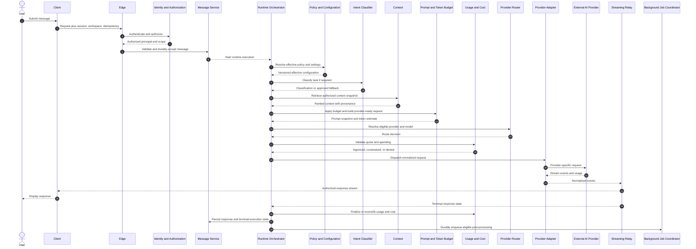
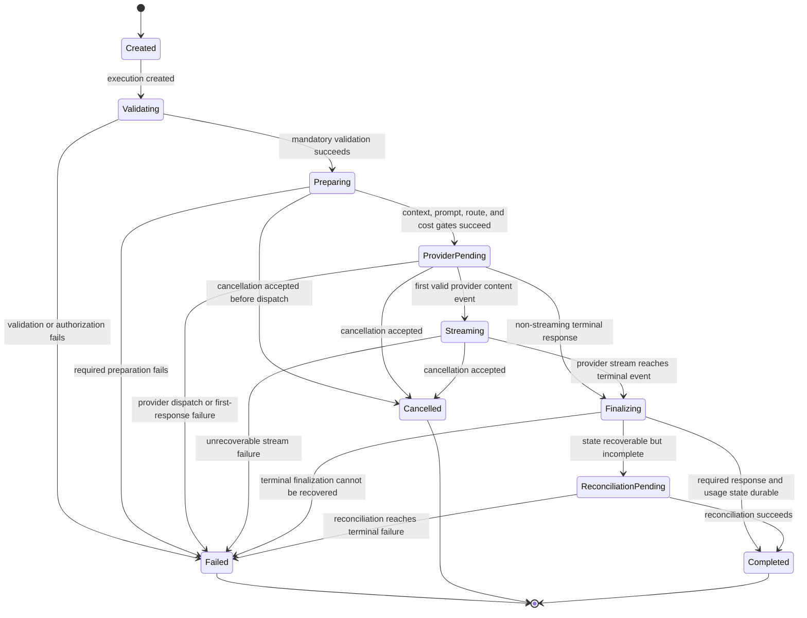
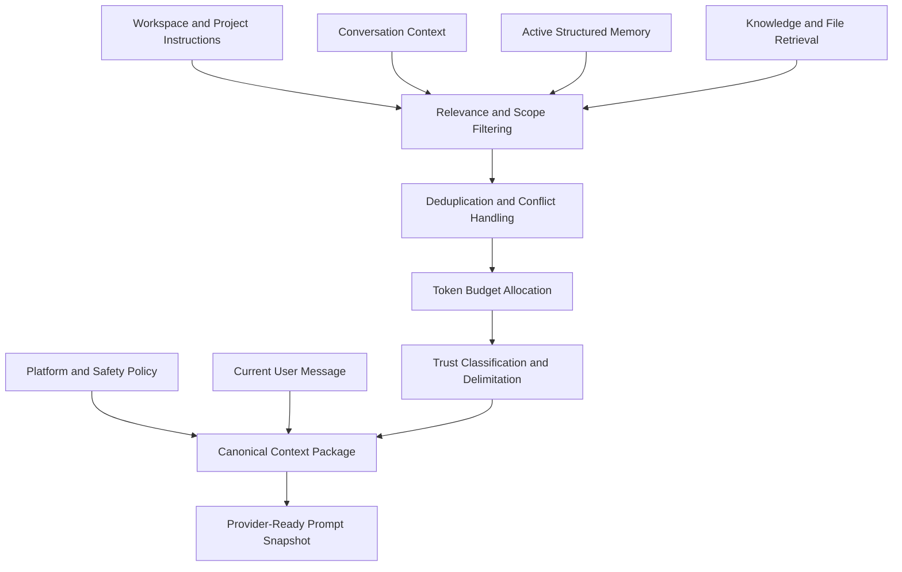
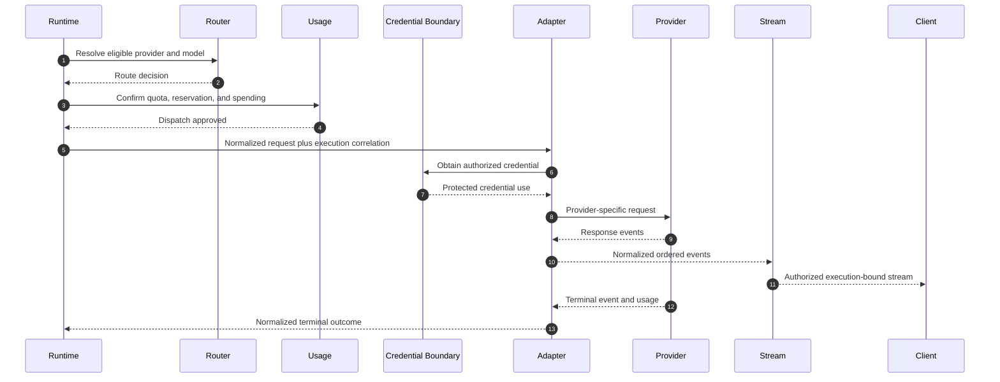
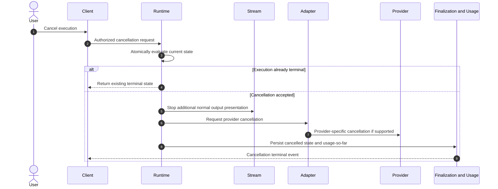
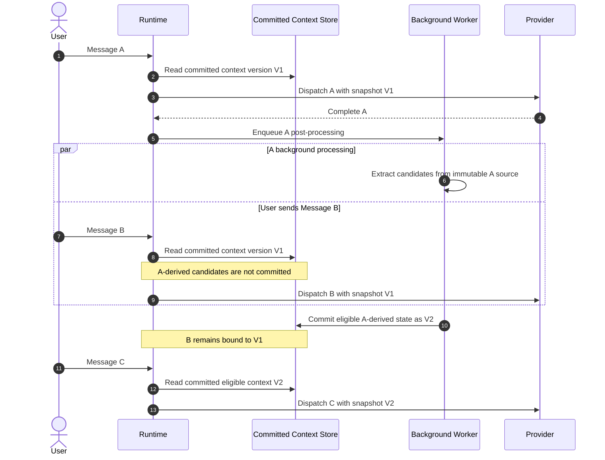
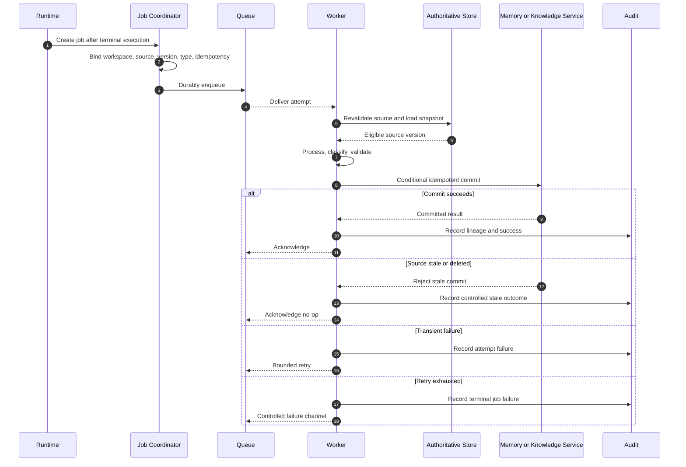
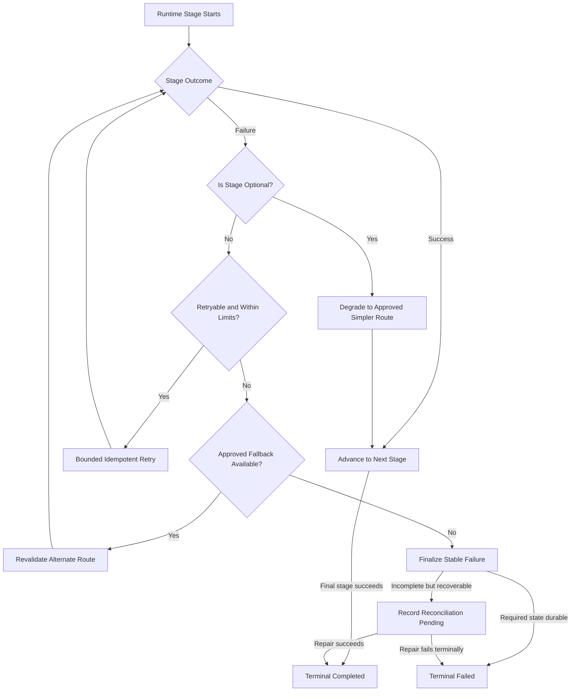

# GEXOR

## Runtime Pipeline Specification

**Document Version:** 1.0-MVP  
**Document Type:** Runtime Pipeline Specification  
**Product:** Gexor — AI Runtime Platform  
**Product Stage:** Pre-development  
**Status:** Complete — Pending Baseline Approval  
**Source Documents:** `PRD.md`, `FUNCTIONAL-REQUIREMENTS.md`, `NON-FUNCTIONAL-REQUIREMENTS.md`, `SYSTEM-CONTEXT-AND-HIGH-LEVEL-ARCHITECTURE.md`  
**Primary Release:** MVP  
**Target File:** `RUNTIME-PIPELINE.md`

---

# Document Control

| Field | Value |
| --- | --- |
| Document owner | Founder / Product Owner |
| Architecture owner | Principal Enterprise AI Architect / Designated Architecture Authority |
| Runtime design authority | Designated Runtime Architecture Owner |
| Primary source of truth | Approved PRD, FRS, NFRS, and System Context and High-Level Architecture |
| Intended audience | Product, architecture, backend, AI, security, data, QA, operations, and implementation teams |
| Runtime baseline | MVP |
| Change authority | Founder / Product Owner with Architecture Authority review |
| Implementation status | Phase 1 foundation partially implemented — see Document 15  |
| Approval status | Pending Product Owner baseline approval |
| Repository action | No GitHub modification authorized by this document generation |

---

# Contents

1. Document Purpose and Scope  
2. Runtime Principles  
3. Runtime Actors and Component Responsibilities  
4. Runtime Execution Identifiers and Correlation Model  
5. Runtime Execution Lifecycle  
6. Runtime State Model  
7. Message Acceptance and Validation Flow  
8. Permission and Workspace-Scope Enforcement  
9. Effective Configuration Resolution  
10. Intent and Task Classification  
11. Direct-Route and Enhanced-Route Decisioning  
12. Context, Memory, Knowledge, File, and Conversation Retrieval  
13. Context Minimization and Relevance Filtering  
14. Prompt Construction  
15. Token-Budget Calculation and Enforcement  
16. Provider and Model Eligibility Validation  
17. Cost, Quota, and Spending Validation  
18. Provider Routing and Dispatch  
19. Provider Adapter Interaction  
20. Streaming Response Handling  
21. Cancellation Behavior  
22. Timeout Behavior  
23. Retry Behavior  
24. Error Normalization  
25. Runtime Finalization  
26. Usage and Cost Reconciliation  
27. Prompt and Context Snapshot Preservation  
28. Snapshot Lock Behavior for Rapid-Fire Messages  
29. Background-Job Creation and Dispatch  
30. Idempotency, Atomicity, and Concurrency Rules  
31. Failure and Recovery Behavior  
32. Reconciliation Workflows  
33. Observability, Audit, and Traceability  
34. Performance and Latency Boundaries  
35. Security and Trust-Boundary Controls  
36. Runtime Constraints and Invariants  
37. Runtime Risks and Mitigations  
38. Traceability to PRD, FRS, NFRS, and Document 4  
39. Approval and Baseline Status  

---

# 1. Document Purpose and Scope

## 1.1 Purpose

This document defines the complete implementation-independent runtime pipeline for the Gexor MVP.

The runtime pipeline is the controlled lifecycle through which Gexor accepts an authenticated user message, establishes authorization and workspace scope, creates a traceable runtime execution, resolves the effective configuration, classifies the task where required, retrieves permitted context, constructs a provider-ready request, validates provider eligibility and cost constraints, dispatches the request to an external AI provider, streams or returns the provider response, records execution and usage outcomes, and schedules eligible asynchronous post-processing.

This document translates the approved product, functional, non-functional, and architecture baselines into a precise runtime control model.

## 1.2 Objectives

The runtime pipeline shall:

* preserve the user’s intended task;
* enforce authentication, authorization, policy, quota, and spending controls;
* prevent cross-workspace data access;
* minimize and bound provider context;
* preserve provider independence;
* deliver provider output with minimal avoidable platform latency;
* isolate external-provider failures;
* support cancellation, timeout, retry, and recovery;
* preserve execution, prompt, context, provider, usage, and background-job traceability;
* prevent background processing from blocking rapid-fire messages;
* ensure finalization and deferred processing are idempotent and reconcilable.

## 1.3 Scope

This specification covers:

* message acceptance;
* runtime execution creation;
* permission and eligibility validation;
* effective configuration resolution;
* intent and task classification;
* execution-route selection;
* conversation, memory, knowledge, and file retrieval;
* context ranking, minimization, and token budgeting;
* prompt construction;
* provider and model validation;
* cost, quota, and spending validation;
* provider dispatch;
* response streaming;
* cancellation and timeout handling;
* retries and regeneration;
* terminal finalization;
* usage and cost reconciliation;
* execution snapshots;
* Snapshot Lock;
* background-job handoff;
* concurrency, idempotency, atomicity, failure, recovery, reconciliation, observability, audit, security, and latency boundaries.

## 1.4 Out of Scope

This document does not define:

* physical database tables or indexes;
* API endpoint paths or payload schemas;
* source-code modules, classes, methods, or framework choices;
* provider-specific wire formats;
* final queue, database, cloud, or observability products;
* detailed prompt text;
* detailed model-evaluation methodology;
* user-interface layouts;
* autonomous agent planning beyond approved MVP behavior.

## 1.5 Authority Hierarchy

The following authority hierarchy shall apply:

1. `PRD.md`;
2. `FUNCTIONAL-REQUIREMENTS.md`;
3. `NON-FUNCTIONAL-REQUIREMENTS.md`;
4. `SYSTEM-CONTEXT-AND-HIGH-LEVEL-ARCHITECTURE.md`;
5. `RUNTIME-PIPELINE.md`;
6. subsequent domain, database, API, engine, security, testing, deployment, and operational documents;
7. implementation plans and source code.

A lower-level artifact shall not weaken or contradict a higher-authority approved requirement.

## 1.6 Normative Language

* **Shall** indicates mandatory behavior.
* **Shall not** indicates prohibited behavior.
* **Should** indicates recommended behavior that may be deferred only with a documented reason.
* **May** indicates optional or policy-configurable behavior.
* **Runtime execution** means one traceable orchestration instance for one accepted request that may invoke an external AI provider.
* **Terminal state** means completed, failed, or cancelled.
* **Committed context** means context derived from state that has completed its authoritative commit boundary and is eligible for retrieval.
* **Uncommitted context** means candidate or derived state that has not completed its authoritative commit boundary.

---

# 2. Runtime Principles

## 2.1 Controlled Stage Progression

Every execution shall progress through an explicit, observable, and policy-controlled sequence.

Mandatory stages shall not be skipped because of client input, provider behavior, cache state, or optimization.

Optional stages may be omitted only when the effective route permits omission.

## 2.2 Provider Independence

The runtime shall operate on provider-independent messages, context packages, route decisions, events, usage records, errors, and terminal outcomes.

Provider-specific behavior shall be isolated behind provider adapters and normalized contracts.

## 2.3 Workspace Isolation

Every runtime read, write, search, context retrieval, provider dispatch, usage record, event, snapshot, queue message, and background job shall carry and enforce an authorized workspace scope.

## 2.4 Structured Memory

The runtime shall retrieve eligible structured memories rather than rely exclusively on complete raw conversation history.

Memory candidates created after a response shall not become active runtime context until committed and eligible.

## 2.5 Context Minimization

The runtime shall send only context that is authorized, relevant, non-duplicative, within budget, and required or materially useful for the task.

## 2.6 Explicit Trust Classification

The runtime shall distinguish:

1. mandatory platform policy;
2. safety instructions;
3. organization policy;
4. workspace instructions;
5. project instructions;
6. conversation instructions;
7. current user instructions;
8. retrieved contextual data;
9. provider-generated data.

Retrieved content shall not become higher-authority instruction merely because it contains imperative language.

## 2.7 Real-Time Responsiveness

The synchronous path shall contain only work necessary to safely prepare, dispatch, stream, and finalize the active request.

Eligible memory extraction, knowledge extraction, indexing, consolidation, notification, and reconciliation work shall occur outside the critical response path.

## 2.8 Snapshot Consistency

Each execution shall use a stable effective configuration and a stable set of context identifiers and versions.

Later background commits shall not mutate the already assembled context of an active execution.

## 2.9 Reversible Automation

Automated memory and knowledge changes shall preserve provenance and shall be reversible or correctable where practical.

## 2.10 Security by Design

No latency, cost, or convenience optimization shall bypass mandatory authorization, isolation, validation, credential protection, integrity, deletion, or audit controls.

## 2.11 Auditability

A runtime execution shall be traceable from accepted message through terminal outcome and eligible background work without requiring plaintext provider credentials or unnecessary full content in operational logs.

## 2.12 Operational Recoverability

The runtime shall assume partial failure, duplicate delivery, delayed provider events, interrupted streams, worker restarts, and inconsistent intermediate state.

Critical state transitions shall be atomic or recoverable through deterministic reconciliation.

---

# 3. Runtime Actors and Component Responsibilities

## 3.1 End User

The end user initiates a message, may select a provider or model, may configure eligible runtime options, receives streamed or final output, and may request cancellation, retry, or regeneration.

The user shall operate only within authorized workspace scope.

## 3.2 Client Application

The client application shall:

* submit the canonical user request;
* provide valid session and workspace context;
* preserve idempotency information where required;
* establish or consume the response stream;
* display authorized runtime status and errors;
* submit cancellation only for an execution the user may control;
* avoid treating a transport retry as permission to create duplicate messages.

The client shall not be the authoritative enforcer of authorization, quota, cost, context scope, or provider credential use.

## 3.3 Edge and Access Layer

The edge shall:

* receive approved requests;
* validate transport-level structure;
* apply size, content-type, rate, and abuse controls;
* establish request correlation;
* validate session presence;
* route requests to authorized domain and runtime services;
* support streaming continuity and termination.

## 3.4 Identity and Authorization Service

This service shall:

* validate authenticated identity;
* resolve session state;
* resolve workspace membership and role;
* authorize the requested operation;
* provide an immutable or reproducible authorization context;
* enforce revocation and disabled-account behavior;
* produce security-relevant audit events.

## 3.5 Message and Conversation Service

This service shall:

* validate conversation eligibility;
* durably accept the canonical user message;
* enforce message idempotency;
* bind the message to the workspace and conversation;
* preserve message ordering sufficient for runtime correctness;
* create or coordinate the runtime execution reference;
* prevent accepted messages from being silently replaced.

## 3.6 Runtime Orchestrator

The Runtime Orchestrator shall:

* coordinate the runtime lifecycle;
* create and transition execution state;
* resolve effective configuration;
* select the execution route;
* request context;
* request prompt assembly and token budgeting;
* validate provider, model, quota, and spending eligibility;
* coordinate dispatch, streaming, cancellation, timeout, and finalization;
* schedule background work;
* preserve stage-level traceability;
* enforce Snapshot Lock.

The Runtime Orchestrator shall coordinate domain services rather than become the sole authoritative owner of all domain state.

## 3.7 Intent and Task Classifier

The classifier may identify:

* task type;
* complexity;
* required output form;
* retrieval need;
* memory relevance;
* file relevance;
* model capability need;
* expected output size;
* safety or policy category.

Classification failure shall degrade to an approved fallback when a safe general route exists.

## 3.8 Context Service

The Context Service shall:

* resolve eligible context categories;
* enforce workspace, project, conversation, memory, file, and knowledge scope;
* preserve provenance and versions;
* request ranking and relevance filtering;
* return a bounded context package;
* exclude deleted, inactive, unauthorized, stale, quarantined, or uncommitted data.

## 3.9 Memory Service

The Memory Service shall return only active, eligible, workspace-scoped memories permitted by the effective policy.

It shall preserve selected memory identifiers and versions for the execution snapshot.

## 3.10 Knowledge and Retrieval Services

These services shall retrieve approved workspace knowledge, file chunks, indexed content, and search results.

They shall preserve source identity and shall not make source-ineligible derived content retrievable.

## 3.11 Prompt Construction Service

This service shall:

* preserve user intent;
* apply deterministic instruction precedence;
* delimit untrusted context;
* assemble the canonical provider-independent request;
* adapt the request to provider capabilities through approved metadata;
* preserve an immutable or reproducible prompt snapshot.

## 3.12 Token Budget Service

This service shall:

* resolve the selected model’s supported context bound;
* reserve output capacity;
* estimate provider overhead;
* calculate available input capacity;
* apply deterministic allocation and reduction rules;
* fail or reduce context safely when exact token counting is unavailable.

## 3.13 Provider Router

The Provider Router shall resolve or validate:

* provider connection;
* provider eligibility;
* model availability;
* model capability;
* user selection;
* workspace policy;
* fallback permission;
* availability signal;
* route decision.

## 3.14 Usage and Cost Service

This service shall:

* estimate input and output usage;
* resolve pricing version;
* enforce quota and spending controls;
* create reservations where required;
* capture provider-reported usage;
* reconcile estimates and actuals;
* preserve cost for completed, failed, and cancelled requests where usage occurred.

## 3.15 Provider Adapter

The Provider Adapter shall:

* obtain the authorized provider credential through the protected secret boundary;
* translate the normalized request;
* enforce provider timeout and cancellation controls;
* normalize response events, finish reasons, errors, and usage;
* prevent provider-specific semantics from leaking into runtime domain state.

## 3.16 Streaming Relay

The Streaming Relay shall:

* authorize the client stream;
* relay ordered normalized events;
* enforce execution binding;
* handle client disconnect and reconnection policy;
* stop active presentation after accepted cancellation;
* report stream terminal state to the Runtime Orchestrator.

## 3.17 Background Job Coordinator

This component shall create and durably enqueue eligible deferred work with workspace scope, source identity, source version, idempotency identity, and correlation metadata.

## 3.18 Background Workers

Workers shall process eligible source snapshots, apply stale-source and concurrency protection, commit idempotently, and produce observable terminal outcomes.

## 3.19 Observability, Audit, and Reconciliation Services

These services shall:

* capture stage metrics, logs, traces, and audit events;
* correlate synchronous and asynchronous processing;
* detect incomplete or divergent runtime state;
* perform or coordinate deterministic repair;
* protect sensitive content.

---

# 4. Runtime Execution Identifiers and Correlation Model

## 4.1 Identifier Categories

The runtime shall use stable identifiers for:

| Identifier | Purpose |
| --- | --- |
| Request identifier | Correlates one inbound transport request |
| Idempotency identifier | Detects repeated submission of the same intended operation |
| User identifier | Identifies the authenticated principal |
| Workspace identifier | Establishes the tenant and data-ownership boundary |
| Project identifier | Identifies an applicable project scope |
| Conversation identifier | Identifies the conversation |
| User-message identifier | Identifies the accepted canonical user message |
| Runtime execution identifier | Identifies one orchestration attempt |
| Assistant-message or response-version identifier | Identifies one generated outcome |
| Context snapshot identifier | Identifies the selected context set and versions |
| Prompt snapshot identifier | Identifies the effective provider-ready request representation |
| Route-decision identifier | Identifies the provider and model decision |
| Provider request identifier | Correlates the external provider call |
| Stream identifier | Identifies the authorized response stream |
| Usage record identifier | Identifies estimated or reported usage |
| Cost record identifier | Identifies cost calculation and pricing version |
| Background job identifier | Identifies deferred work |
| Audit correlation identifier | Correlates material audit events |
| Reconciliation identifier | Identifies an integrity-repair workflow |

## 4.2 Identifier Rules

1. Identifiers shall be unique within their defined scope.
2. A runtime execution identifier shall not be reused for a retry or regeneration.
3. A transport retry may resolve to the same accepted message only when idempotency rules establish that it represents the same intended submission.
4. A provider request identifier shall be bound to exactly one runtime execution attempt.
5. Correlation identifiers shall not grant authorization.
6. User-facing identifiers shall not expose secrets or internal topology.
7. Background jobs shall carry or resolve the originating execution and source identifiers.
8. Audit and telemetry systems may use protected surrogates where privacy policy requires it.
9. Identifier generation shall not depend on a client clock.
10. Canonical server-controlled time shall be used for ordering and lifecycle decisions.

## 4.3 Correlation Chain

The minimum logical correlation chain shall be:

```text
Authenticated User
→ Workspace
→ Conversation
→ Accepted User Message
→ Runtime Execution
→ Context Snapshot
→ Prompt Snapshot
→ Route Decision
→ Provider Request
→ Stream / Assistant Response
→ Usage and Cost Records
→ Background Jobs
→ Derived Memory or Knowledge Outcomes
```

## 4.4 Retry Correlation

A retry shall:

* create a new runtime execution identifier;
* reference the original failed execution;
* preserve the original execution unchanged;
* revalidate current provider, model, context, quota, spending, and policy;
* record material differences from the original attempt.

## 4.5 Regeneration Correlation

A regeneration shall create:

* a new runtime execution;
* a distinct assistant response or response version;
* independent provider, model, usage, cost, context, and prompt records;
* a relationship to the original user message and previous response.

---

# 5. Runtime Execution Lifecycle

## 5.1 Lifecycle Summary

A normal runtime execution shall progress through these logical phases:

1. inbound request received;
2. transport validation;
3. authentication and authorization;
4. canonical message validation;
5. durable message acceptance;
6. runtime execution creation;
7. eligibility validation;
8. effective configuration resolution;
9. task classification;
10. route resolution;
11. context retrieval;
12. context minimization;
13. token-budget calculation;
14. prompt construction;
15. provider and model validation;
16. cost, quota, and spending validation;
17. provider dispatch;
18. response streaming;
19. response persistence;
20. usage and cost finalization;
21. execution terminal transition;
22. background-job scheduling.

## 5.2 End-to-End Synchronous Runtime Flow



## 5.3 Lifecycle Entry Condition

A runtime execution may begin only after:

* a canonical user message is eligible for acceptance;
* authenticated identity is established;
* workspace and conversation authorization succeed;
* the message is durably accepted or placed into an approved recoverable acceptance state;
* a unique runtime execution record can be created.

## 5.4 Provider Dispatch Gate

Provider dispatch shall not occur until all mandatory validations succeed.

At minimum, the dispatch gate shall confirm:

* valid authenticated user;
* authorized workspace access;
* active workspace;
* active and eligible conversation;
* accepted user message;
* valid execution state;
* approved route;
* eligible provider connection;
* eligible model;
* context within supported bounds;
* mandatory prompt construction success;
* policy compliance;
* quota compliance;
* spending compliance or approved unknown-cost behavior;
* valid provider credential access.

## 5.5 Lifecycle Exit Conditions

An execution exits the synchronous lifecycle only when it reaches one of:

* **Completed:** required response and usage state are durable or recoverably reconcilable.
* **Failed:** terminal stage, stable error category, retry eligibility, and finalization time are recorded.
* **Cancelled:** cancellation is accepted, normal output presentation is stopped, and terminal state is recorded.

## 5.6 Deferred Continuation

After synchronous completion or eligible terminal failure, the runtime may continue through asynchronous jobs.

Asynchronous completion shall not alter the terminal state of the original provider execution unless a defined reconciliation rule corrects an incomplete terminal record.

---

# 6. Runtime State Model

## 6.1 Required States

The runtime shall support at least:

* `created`;
* `validating`;
* `preparing`;
* `provider_pending`;
* `streaming`;
* `completed`;
* `failed`;
* `cancelled`.

The implementation may use additional internal states, provided they map unambiguously to this baseline.

## 6.2 Recommended Expanded States

The runtime should distinguish:

* `created`;
* `validating_access`;
* `validating_eligibility`;
* `resolving_configuration`;
* `classifying`;
* `resolving_route`;
* `retrieving_context`;
* `budgeting_context`;
* `constructing_prompt`;
* `validating_provider`;
* `validating_cost`;
* `provider_pending`;
* `streaming`;
* `finalizing`;
* `reconciliation_pending`;
* `completed`;
* `failed`;
* `cancellation_requested`;
* `cancelled`.

## 6.3 Runtime State Machine



## 6.4 Transition Rules

1. State transitions shall be explicit and timestamped.
2. A terminal execution shall not return to a non-terminal state.
3. Late provider events shall not reactivate a terminal execution.
4. Duplicate transition commands shall be idempotent.
5. A completed execution shall not be marked completed until response and required usage metadata are durable or recoverably reconcilable.
6. A failed execution shall identify the terminal stage and stable error category.
7. Cancellation acceptance shall prevent further normal output presentation.
8. A retry shall create a new execution rather than reopen the failed execution.
9. Reconciliation shall correct incomplete state without duplicating response, usage, cost, or jobs.
10. State transitions shall use canonical server-controlled time.

## 6.5 Terminal-State Precedence

Where concurrent events occur:

1. an already committed terminal state shall control;
2. a later duplicate terminal request shall become a no-op or reconciliation input;
3. cancellation accepted before terminal completion shall normally produce `cancelled`;
4. provider completion committed before cancellation acceptance shall remain `completed`;
5. ambiguous races shall be resolved by a documented atomic or compare-and-set rule;
6. the winning transition and discarded competing transition shall be observable.

---

# 7. Message Acceptance and Validation Flow

## 7.1 Acceptance Stages

Message acceptance shall include:

1. transport validation;
2. authentication validation;
3. workspace authorization;
4. conversation existence and lifecycle validation;
5. message structure validation;
6. content and size validation;
7. idempotency validation;
8. rate, quota, and abuse validation applicable before acceptance;
9. durable canonical-message creation;
10. runtime execution creation or binding.

## 7.2 Canonical Message

The accepted canonical message shall preserve:

* message identifier;
* workspace identifier;
* conversation identifier;
* sender identity;
* canonical user content;
* supported attachment or source references;
* creation time;
* ordering information;
* applicable user-selected provider or model request;
* applicable runtime options;
* idempotency reference;
* deletion and exclusion state.

## 7.3 Acceptance Atomicity

The system shall not acknowledge successful message acceptance unless:

* the canonical message is durably stored; and
* the request can be associated with a runtime execution or an approved recoverable execution-creation workflow.

Where message creation and execution creation cannot be committed atomically in one transaction, the system shall use a recoverable workflow that detects and repairs accepted messages without executions.

## 7.4 Duplicate Submission

When the same idempotency identifier and equivalent canonical request are repeated:

* the system shall return the existing accepted message and execution reference; or
* the system shall return a stable conflict if the identifier was reused with materially different input.

The runtime shall not dispatch duplicate provider requests solely because a client repeated an acceptance request after a transport failure.

## 7.5 Validation Failure

Validation failure shall:

* prevent provider dispatch;
* avoid creation of partially visible user content unless policy permits a failed draft state;
* return a stable user-safe error;
* preserve an internal correlation identifier;
* avoid disclosing cross-workspace existence or internal topology.

---

# 8. Permission and Workspace-Scope Enforcement

## 8.1 Authorization Context

The runtime authorization context shall include or resolve:

* authenticated principal;
* account state;
* session state;
* workspace identifier;
* workspace membership;
* workspace role;
* conversation access;
* provider-connection access;
* file and knowledge access;
* memory-mode permissions;
* administrative elevation where applicable;
* authorization policy version.

## 8.2 Enforcement Points

Authorization shall be enforced at:

* message acceptance;
* runtime initiation;
* configuration resolution;
* context retrieval;
* memory retrieval;
* file and knowledge retrieval;
* provider connection resolution;
* usage and cost access;
* stream establishment;
* cancellation;
* retry and regeneration;
* background-job execution;
* audit and administrative access.

## 8.3 Workspace Binding

Every runtime artifact shall carry or resolve the same authorized workspace identity, including:

* message;
* execution;
* context snapshot;
* prompt snapshot;
* route decision;
* provider credential;
* provider request;
* stream;
* response;
* usage and cost records;
* background jobs;
* derived memory and knowledge.

A workspace mismatch shall fail closed.

## 8.4 Authorization Revalidation

Long-running or deferred operations shall revalidate authorization or source eligibility when required by policy.

At minimum:

* background jobs shall revalidate workspace and source eligibility;
* stream reconnection shall revalidate stream access;
* retry and regeneration shall revalidate current permission;
* provider credentials shall be resolved using current eligible connection state;
* cancellation shall validate control over the target execution.

## 8.5 Revocation

Access revocation shall affect future protected operations and should terminate or invalidate active access within the applicable NFR boundary.

Revoked access shall not remain effective because of stale client state, cache state, queue state, or previously resolved configuration.

---

# 9. Effective Configuration Resolution

## 9.1 Configuration Sources

Effective runtime configuration may be derived from:

1. mandatory platform policy;
2. safety policy;
3. organization policy where enabled;
4. workspace policy;
5. project settings;
6. conversation settings;
7. user preferences;
8. explicit request options;
9. provider and model capability metadata;
10. quota and spending state;
11. feature availability and rollout policy.

## 9.2 Precedence

Configuration resolution shall use deterministic precedence.

A lower-authority setting shall not override a higher-authority mandatory restriction.

Explicit user selection may override a default only where policy permits it.

## 9.3 Effective Configuration Snapshot

The runtime shall preserve an immutable or reproducible representation of:

* applied configuration identifiers and versions;
* resolved provider and model preference;
* memory and retrieval mode;
* prompt-enhancement mode;
* context policy;
* output requirements;
* timeout policy;
* fallback policy;
* quota and spending controls;
* classification policy;
* retention and audit policy relevant to the execution.

## 9.4 Configuration Failure

If a required configuration cannot be resolved consistently:

* provider dispatch shall not occur;
* the execution shall fail with a stable configuration error;
* the conflict shall be observable;
* the user-safe response shall avoid exposing protected policy details.

## 9.5 Configuration Changes During Execution

Configuration changes committed after the execution snapshot shall not silently alter the active execution.

They shall apply to subsequent executions unless a documented security revocation rule requires immediate termination.

---

# 10. Intent and Task Classification

## 10.1 Classification Purpose

Classification may support:

* route selection;
* retrieval determination;
* prompt enhancement;
* model capability matching;
* expected output sizing;
* cost estimation;
* safety controls;
* file-processing requirements.

## 10.2 Classification Inputs

Inputs may include:

* canonical user message;
* explicit user-selected mode;
* conversation metadata;
* available attachment metadata;
* approved workspace instructions;
* limited context needed for classification;
* current provider or model preference.

Classification shall not require unrestricted retrieval before authorization and context policy are established.

## 10.3 Classification Outputs

The effective classification may include:

* category;
* complexity;
* retrieval requirement;
* file relevance;
* memory relevance;
* knowledge relevance;
* model capability requirement;
* streaming suitability;
* expected response size;
* confidence or certainty state;
* policy flags;
* fallback instruction.

## 10.4 Classification Confidence

When confidence is insufficient, the runtime shall apply a configured fallback, which may:

* use a general classification;
* select the direct route;
* disable optional enhancement;
* use a general-capability model;
* request clarification;
* continue without classification-dependent optimization.

## 10.5 Classification Failure

Classification failure shall not automatically fail an otherwise safe request when a general execution path exists.

Classification shall fail the execution only when the missing classification is mandatory for:

* safety;
* policy;
* required provider capability;
* required retrieval;
* cost or quota control;
* correct output handling.

## 10.6 Classification Preservation

The execution shall preserve:

* effective classification;
* classification version;
* confidence or fallback state;
* material route consequences;
* failure or degradation state.

---

# 11. Direct-Route and Enhanced-Route Decisioning

## 11.1 Supported Routes

The runtime shall support at least:

* direct route;
* enhanced route;
* retrieval-assisted route;
* clarification route;
* denied route.

## 11.2 Direct Route

The direct route may be selected when:

* no memory retrieval is required;
* no file or knowledge retrieval is required;
* no complex prompt enhancement is required;
* the selected model supports the task;
* the user and workspace policy permit direct execution;
* token and cost checks remain valid.

The direct route shall not skip mandatory policy, authorization, provider, quota, cost, or prompt-safety controls.

## 11.3 Enhanced Route

The enhanced route may include:

* classification;
* memory retrieval;
* project or workspace instruction resolution;
* prompt enhancement;
* context ranking;
* model recommendation;
* expanded traceability.

## 11.4 Retrieval-Assisted Route

The retrieval-assisted route shall be selected when the task requires eligible:

* conversation context;
* structured memory;
* project knowledge;
* file content;
* indexed workspace information.

## 11.5 Clarification Route

The clarification route may be selected when:

* the user’s objective is materially ambiguous;
* a required provider or file is missing;
* cost authorization is required;
* classification confidence is insufficient;
* a policy requires explicit user confirmation.

## 11.6 Denied Route

The denied route shall apply when mandatory eligibility fails, including:

* no authorization;
* inactive workspace or conversation;
* prohibited content or policy state;
* unavailable required provider;
* no eligible model;
* quota or spending denial;
* invalid credential state;
* unrecoverable token bound violation.

## 11.7 Route Decision Rules

1. Route selection shall not bypass user-disabled features.
2. Memory-disabled conversations shall not retrieve memory.
3. File-disabled workspaces shall not inject file content.
4. Cost ceilings shall not be bypassed.
5. A provider lock shall not be ignored without explicit fallback permission.
6. Optional enrichment may degrade to a simpler route when safe.
7. The selected route and material reasons shall be preserved.
8. User-visible transparency should identify the route, provider, model, and context categories used.

---

# 12. Context, Memory, Knowledge, File, and Conversation Retrieval

## 12.1 Context Sources

Eligible context may include:

* current user message;
* mandatory platform and safety instructions;
* workspace instructions;
* project instructions;
* conversation instructions;
* recent conversation messages;
* conversation summary;
* active structured memories;
* approved knowledge records;
* eligible file chunks;
* approved search results;
* temporary execution context.

## 12.2 Retrieval Preconditions

Retrieval shall not begin until:

* authenticated identity is established;
* workspace scope is authorized;
* execution and conversation are identified;
* effective policy is resolved;
* retrieval categories are permitted;
* source lifecycle and exclusion rules can be enforced.

## 12.3 Context and Prompt Assembly Diagram



## 12.4 Conversation Retrieval

Conversation retrieval shall consider:

* same-workspace binding;
* conversation lifecycle;
* message deletion and exclusion state;
* ordering;
* relevance;
* recency;
* summary availability;
* token budget;
* role and trust classification.

Complete raw history shall not be injected by default when bounded context is sufficient.

## 12.5 Memory Retrieval

Memory retrieval shall consider only memories that are:

* bound to the workspace;
* active;
* retrieval eligible;
* within applicable scope;
* permitted by memory mode;
* not pending deletion;
* relevant to the request;
* within the execution’s snapshot boundary.

Uncommitted candidates shall not be retrieved.

## 12.6 Knowledge Retrieval

Knowledge retrieval shall preserve:

* source identity;
* source version;
* workspace scope;
* source status;
* retrieval score or ranking basis;
* chunk or segment identity;
* deletion lineage.

## 12.7 File Retrieval

File-derived context shall be eligible only when:

* the file is active;
* processing completed successfully;
* the file is not quarantined or pending deletion;
* the execution has permission;
* the derived chunk matches the source workspace;
* retrieval remains within context policy.

## 12.8 Retrieval Failure

A retrieval failure shall be classified as:

* authorization failure;
* source unavailable;
* index unavailable;
* required source missing;
* optional retrieval degraded;
* timeout;
* stale or deleted source;
* internal retrieval failure.

Optional retrieval failure may allow a direct or reduced-context route when policy permits. Required retrieval failure shall prevent provider dispatch or produce a clarification route.

## 12.9 Retrieval Snapshot

The execution shall preserve:

* context snapshot identifier;
* selected source identifiers;
* selected versions;
* category;
* scope;
* inclusion or omission reason where required;
* truncation or compression state;
* retrieval timestamp;
* effective retrieval policy version.

---

# 13. Context Minimization and Relevance Filtering

## 13.1 Minimization Objectives

Context minimization shall:

* reduce unnecessary provider disclosure;
* reduce token cost;
* reduce prompt dilution;
* preserve mandatory instructions;
* preserve user intent;
* preserve essential continuity;
* remain deterministic and traceable.

## 13.2 Filtering Stages

Context should be filtered in this order:

1. authorization and workspace scope;
2. lifecycle and deletion eligibility;
3. feature and policy eligibility;
4. source trust classification;
5. task relevance;
6. duplication;
7. conflict handling;
8. recency or temporal applicability;
9. token-priority ranking;
10. final budget allocation.

## 13.3 Deterministic Reduction Priority

When eligible context exceeds the budget, the runtime shall protect:

1. mandatory platform policy;
2. mandatory safety instructions;
3. current user message;
4. required output instructions;
5. essential workspace, project, and conversation instructions;
6. essential recent conversation context;
7. highest-relevance active memories;
8. highest-relevance knowledge and file content;
9. lower-priority historical context.

## 13.4 Deduplication

The runtime shall remove or reduce materially duplicate content where doing so preserves required meaning.

Deduplication shall not merge conflicting statements into a false single statement.

## 13.5 Conflict Handling

Conflicting retrieved context shall:

* retain provenance;
* be ranked according to scope, confirmation, recency, and policy;
* not silently override mandatory or user-confirmed instructions;
* be excluded or clearly delimited where unresolved;
* produce clarification when the conflict prevents correct execution.

## 13.6 Context Compression

The runtime may summarize or compress lower-priority context when:

* the method is approved;
* required meaning and provenance are preserved;
* the operation does not elevate untrusted content;
* the compression state is recorded;
* the result remains within token bounds.

## 13.7 Transparency

The runtime shall record whether context was:

* included;
* omitted;
* truncated;
* summarized;
* compressed;
* deduplicated;
* rejected as unauthorized;
* rejected as stale;
* rejected as untrusted instruction.

---

# 14. Prompt Construction

## 14.1 Prompt Construction Inputs

The provider-ready request shall be constructed from:

* effective platform and safety policy;
* effective organization and workspace instructions;
* effective project and conversation instructions;
* canonical user message;
* approved context package;
* output format requirements;
* provider-independent tool or capability requests where enabled;
* model and provider constraints;
* token budget;
* trust-classification markers.

## 14.2 User Intent Preservation

Prompt enhancement shall preserve the user’s intended objective.

The runtime shall not silently:

* add a materially different task;
* change the requested output into another purpose;
* disclose unrelated workspace content;
* weaken user-selected constraints;
* elevate retrieved content above the user message without approved precedence.

## 14.3 Instruction Precedence

The runtime shall apply:

1. mandatory platform policy;
2. system safety instructions;
3. organization policy;
4. workspace instructions;
5. project instructions;
6. conversation instructions;
7. current user message;
8. retrieved contextual data.

## 14.4 Untrusted Context Delimitation

Retrieved memories, files, search results, external integration content, prior provider responses, and current provider output shall be identified as data rather than system authority unless an approved policy explicitly classifies them otherwise.

## 14.5 Canonical Prompt Representation

The runtime shall maintain a provider-independent canonical request before provider-specific adaptation.

This representation should contain:

* effective instruction blocks;
* canonical user message;
* selected context references;
* expected response constraints;
* token limits;
* model capability requirements;
* trust classifications;
* approved tool declarations where applicable.

## 14.6 Provider Adaptation

Provider adaptation may alter:

* role encoding;
* message grouping;
* metadata placement;
* supported parameter names;
* stream configuration;
* provider formatting overhead.

Provider adaptation shall not alter the provider-independent intent or bypass policy.

## 14.7 Prompt Construction Failure

Provider dispatch shall not occur when:

* mandatory instructions cannot be assembled;
* the current user message cannot be preserved;
* trust classification cannot be maintained;
* token bounds cannot be satisfied;
* provider adaptation fails;
* the prompt would violate mandatory policy.

---

# 15. Token-Budget Calculation and Enforcement

## 15.1 Budget Inputs

The token budget shall consider:

* selected model context limit;
* reserved output capacity;
* system and safety instructions;
* provider formatting overhead;
* current user message;
* workspace, project, and conversation instructions;
* conversation context;
* memories;
* file and knowledge context;
* tool definitions where applicable;
* safety margin.

## 15.2 Budget Formula

The logical input budget shall be:

```text
Maximum Supported Context
− Reserved Output Capacity
− Mandatory Instruction Overhead
− Provider Formatting Overhead
− Safety Margin
= Maximum Eligible Variable Input Context
```

The implementation may use provider-specific counting methods behind a normalized budget interface.

## 15.3 Output Reservation

Output capacity shall be reserved before final variable-context allocation.

The reservation shall consider:

* model limit;
* user request;
* expected output form;
* workspace policy;
* provider maximum-output constraints;
* cost controls.

## 15.4 Estimation

Exact counting should be used where available.

Where exact counting is unavailable, the runtime shall use a documented conservative method and shall fail or reduce context safely rather than knowingly exceed the provider limit.

## 15.5 Budget Enforcement

The runtime shall not knowingly dispatch a request exceeding the selected model’s supported bound.

When the budget is exceeded, the runtime shall:

1. remove ineligible context;
2. deduplicate;
3. reduce lower-priority history;
4. reduce lower-priority memory;
5. reduce lower-priority knowledge and file content;
6. apply approved compression;
7. select another eligible model only when policy permits;
8. ask for clarification or fail safely if required content still cannot fit.

## 15.6 Budget Record

The execution shall preserve:

* model context limit;
* reserved output tokens;
* estimated input tokens;
* provider overhead estimate;
* safety margin;
* category allocations;
* truncation and compression decisions;
* tokenization method or version.

## 15.7 Token Counting Performance

Local token estimation and budget calculation shall remain within the applicable NFR latency threshold for prompts up to the approved MVP context size.

---

# 16. Provider and Model Eligibility Validation

## 16.1 Provider Validation

The runtime shall validate:

* supported provider;
* active provider connection;
* workspace ownership;
* current connection status;
* credential availability;
* provider policy eligibility;
* required geographic or compliance constraints where configured;
* provider availability signal;
* provider quota state where known.

## 16.2 Model Validation

The runtime shall validate:

* supported model identifier;
* current model availability;
* required context size;
* streaming support;
* output-mode support;
* required modality;
* required tool capability where enabled;
* provider and workspace policy;
* model deprecation or retirement state;
* pricing metadata availability where required.

## 16.3 Explicit User Selection

An explicit user selection shall be honored when:

* the user is authorized;
* the provider connection is eligible;
* the model supports the task;
* policy permits the selection;
* cost and quota controls permit execution.

## 16.4 Model Recommendation

The runtime may recommend a model based on:

* task requirements;
* context size;
* latency;
* cost;
* quality policy;
* provider availability;
* user preference.

Cost optimization shall not silently reduce quality below mandatory task requirements.

## 16.5 Eligibility Failure

If the selected provider or model is ineligible, the runtime shall:

* return a stable provider or model error;
* offer an eligible alternative only when permitted;
* not expose credential details;
* not silently fallback when explicit consent or policy is required;
* preserve the failed eligibility reason.

---

# 17. Cost, Quota, and Spending Validation

## 17.1 Pre-Execution Estimate

Where data is available, the runtime shall estimate:

* input tokens;
* expected or reserved output tokens;
* provider;
* model;
* pricing version;
* currency or billing unit;
* estimated total provider cost.

## 17.2 Quota Controls

Quota validation may include:

* user request rate;
* workspace request rate;
* provider concurrency;
* model concurrency;
* token allowance;
* file or retrieval allowance;
* plan entitlement;
* provider-side quota where observable.

## 17.3 Spending Controls

The runtime shall enforce applicable:

* per-request ceiling;
* user spending ceiling;
* workspace spending ceiling;
* daily or monthly limit;
* model restrictions;
* unknown-cost policy.

## 17.4 Reservation

Where concurrent execution could oversubscribe a spending limit, the runtime should reserve estimated capacity before dispatch.

Reservation shall be:

* execution-bound;
* idempotent;
* releasable or adjustable;
* reconciled after terminal usage;
* recoverable after failure.

## 17.5 Unknown Cost

If reliable estimation is unavailable, policy may:

* allow with warning;
* require confirmation;
* block execution;
* use a conservative maximum.

The chosen policy shall be preserved in the execution record.

## 17.6 Validation Failure

Cost or quota denial shall occur before provider dispatch unless provider-side behavior prevents prior knowledge.

The user-safe error shall identify the applicable limit category without exposing restricted account information.

---

# 18. Provider Routing and Dispatch

## 18.1 Routing Inputs

The route decision may use:

* user-selected provider;
* user-selected model;
* effective route type;
* task classification;
* required capabilities;
* context size;
* streaming requirement;
* availability;
* workspace policy;
* fallback policy;
* quota;
* estimated cost;
* latency policy;
* data-handling restrictions.

## 18.2 Routing Decision

The route decision shall identify:

* provider;
* provider connection;
* model;
* adapter;
* route type;
* fallback eligibility;
* capability match;
* pricing version;
* decision timestamp;
* material decision factors.

## 18.3 Provider Dispatch and Streaming Diagram



## 18.4 Dispatch Gate

The provider request shall be dispatched only once per execution unless a documented provider-retry rule authorizes another attempt.

The dispatch operation shall be bound to:

* execution identifier;
* route decision;
* prompt snapshot;
* provider connection;
* cost reservation;
* timeout policy;
* cancellation token or equivalent control;
* internal provider correlation identifier.

## 18.5 Fallback

Fallback may occur only when:

* the fallback policy permits it;
* user selection permits it;
* data-handling constraints permit it;
* an eligible provider connection exists;
* the alternate model satisfies mandatory capability;
* cost and quota are revalidated;
* route changes are recorded.

## 18.6 Late Provider Output

Provider output received after an execution becomes terminal shall:

* not be attached to an unrelated execution;
* not be presented as active generation;
* be discarded or stored only according to controlled diagnostic policy;
* be counted for usage if provider cost occurred and reconciliation requires it;
* produce an observable late-event outcome.

---

# 19. Provider Adapter Interaction

## 19.1 Adapter Contract

Each adapter shall implement normalized behavior for:

* request translation;
* credential use;
* model and parameter validation;
* timeout controls;
* stream parsing;
* finish reason normalization;
* usage extraction;
* error normalization;
* cancellation;
* provider request correlation.

## 19.2 Credential Boundary

The adapter shall receive or use credentials only for:

* the authorized workspace;
* the selected provider connection;
* the active execution;
* the minimum required duration.

Credentials shall not appear in:

* prompt content;
* runtime logs;
* traces;
* analytics;
* user-safe errors;
* background-job payloads unrelated to provider use.

## 19.3 Response Validation

The adapter shall validate:

* event structure;
* execution correlation;
* sequence where available;
* content type;
* finish state;
* usage shape;
* provider error shape.

Malformed provider events shall not be forwarded blindly.

## 19.4 Provider-Specific Retry

Provider request retries shall be permitted only when duplicate external effects are absent or controlled.

A retry shall not be performed when:

* the provider may already be generating and no idempotent provider control exists;
* duplicate billing risk violates policy;
* cancellation is accepted;
* the execution is terminal;
* the provider error is non-retryable;
* total timeout would be exceeded.

## 19.5 Adapter Versioning

The effective adapter or protocol version should be traceable for incident analysis and compatibility testing.

---

# 20. Streaming Response Handling

## 20.1 Streaming Objectives

Streaming shall:

* minimize avoidable delay;
* preserve event ordering;
* bind every event to the execution;
* protect authorization;
* normalize provider differences;
* support cancellation and terminal states;
* prevent internal data leakage.

## 20.2 Stream Establishment

A stream may be established only after:

* session and execution authorization;
* workspace match;
* valid stream identifier;
* execution eligibility;
* applicable connection limit validation.

## 20.3 Normalized Event Categories

The runtime may support normalized events such as:

* stream accepted;
* provider pending;
* content delta;
* structured output delta;
* usage update;
* warning;
* cancellation acknowledged;
* terminal completion;
* terminal failure;
* heartbeat or continuity event.

## 20.4 Event Ordering

Events within one execution shall be presented in deterministic order.

Duplicate provider or transport events shall not create duplicate persisted content.

## 20.5 Persistence

The system shall preserve final assistant content.

It may persist partial content during streaming when doing so supports recovery, provided partial and final states remain distinguishable.

## 20.6 Client Disconnect

A client disconnect shall follow configured policy, which may:

* continue the provider execution;
* attempt provider cancellation;
* preserve the execution for later retrieval;
* mark the stream disconnected while the execution continues.

A client disconnect shall not automatically imply provider cancellation unless policy states it.

## 20.7 Reconnection

If reconnection is supported, the system shall:

* reauthorize access;
* bind to the same execution;
* prevent cross-user or cross-workspace stream access;
* avoid duplicate persisted output;
* resume from an eligible event position or return current terminal state.

## 20.8 First-Event and Relay Latency

After the first valid provider event is received, Gexor shall relay the corresponding client event within the applicable NFR threshold.

Platform relay overhead shall be measured separately from provider generation latency.

## 20.9 Stream Finalization

A stream shall end with one controlled terminal outcome.

Transport closure without a terminal provider event shall trigger failure classification or reconciliation rather than be assumed completed.

---

# 21. Cancellation Behavior

## 21.1 Cancellation Eligibility

Cancellation may be requested by:

* the authorized initiating user;
* another authorized workspace actor where policy permits;
* the system due to timeout, policy, security, shutdown, or administrative control.

## 21.2 Cancellation Flow



## 21.3 Cancellation Rules

1. Cancellation shall be idempotent.
2. Cancellation shall validate authorization.
3. Cancellation shall not reopen or alter an already terminal execution.
4. After cancellation is accepted, additional normal generation output shall stop within the applicable NFR threshold.
5. Provider-side cancellation should be attempted where supported.
6. Provider inability to cancel shall not permit late output to be presented as active.
7. Usage or cost incurred before cancellation shall be recorded.
8. Cancellation shall not roll back committed effects unless a domain defines compensation.
9. Eligible background work shall be determined by policy; cancellation may suppress optional post-processing.
10. Cancellation race resolution shall be observable.

## 21.4 Cancellation Before Dispatch

If cancellation is accepted before dispatch:

* the provider shall not be invoked;
* cost reservation shall be released;
* the execution shall finalize as cancelled;
* no provider usage shall be recorded unless another external effect already occurred.

## 21.5 Cancellation During Streaming

If cancellation is accepted during streaming:

* displayed and persisted partial content shall remain identifiable;
* additional normal deltas shall be suppressed;
* the execution shall not be marked completed;
* usage shall be captured or estimated;
* background extraction from partial content shall occur only if policy explicitly permits it.

---

# 22. Timeout Behavior

## 22.1 Timeout Categories

The runtime shall support configurable:

* connection timeout;
* provider dispatch timeout;
* first-response timeout;
* stream-idle timeout;
* total-execution timeout;
* context-retrieval timeout;
* prompt-construction timeout;
* cost-validation timeout;
* finalization timeout;
* background-enqueue timeout.

## 22.2 Timeout Rules

1. Every external call shall have an explicit timeout.
2. Timeout shall produce a stable category.
3. Timeout shall not be reported as a generic internal error when a more precise category is available.
4. Late output shall not reactivate a terminal execution.
5. Eligible fallback may occur only according to policy.
6. Timeout retries shall remain within total-execution limits.
7. Timeout shall release or reconcile reservations.
8. Required partial state shall be persisted before terminal failure where possible.

## 22.3 Timeout and Cancellation Relationship

System timeout may initiate cancellation of downstream processing.

User cancellation and timeout may race; the first committed terminal transition shall control, while the other event shall be recorded as a no-op or secondary cause.

## 22.4 Timeout Failure State

A timeout failure shall record:

* timeout category;
* affected stage;
* configured threshold;
* elapsed time;
* provider and model where applicable;
* retry eligibility;
* fallback outcome;
* finalization time.

---

# 23. Retry Behavior

## 23.1 User-Initiated Retry

An authorized user may retry an eligible failed execution.

The retry shall:

* create a new execution;
* preserve the original execution unchanged;
* revalidate current authorization;
* re-resolve configuration;
* re-retrieve current eligible context;
* revalidate provider and model;
* revalidate cost and quota;
* create a new route and prompt snapshot;
* create independent usage and cost records.

## 23.2 Regeneration

Regeneration may be supported for an existing user message.

It shall not overwrite earlier assistant responses.

## 23.3 Internal Stage Retry

Internal retry may be applied to:

* transient metadata lookup;
* transient retrieval;
* transient provider connection;
* usage reconciliation;
* background enqueue;
* durable state finalization.

Internal retry shall not create duplicate external provider calls or duplicate durable effects.

## 23.4 Retry Eligibility

A failure shall be classified as:

* retryable immediately;
* retryable after delay;
* retryable with user action;
* retryable with alternate provider or model;
* non-retryable;
* administratively retryable.

## 23.5 Retry Controls

Retries shall:

* be bounded;
* use backoff and jitter where appropriate;
* preserve idempotency;
* respect cancellation;
* respect total timeout;
* respect current policy;
* not bypass spending controls;
* not create retry storms.

## 23.6 Material Difference Disclosure

When a retry uses a materially different:

* provider;
* model;
* context snapshot;
* prompt policy;
* cost estimate;
* route;
* fallback;

the user should be informed according to product transparency rules.

---

# 24. Error Normalization

## 24.1 Error Objectives

Error normalization shall provide:

* stable system categories;
* user-safe messages;
* internal diagnostic detail;
* retry eligibility;
* terminal-stage traceability;
* provider independence.

## 24.2 Error Categories

The runtime shall distinguish at least:

* authentication failure;
* authorization failure;
* workspace inactive;
* conversation inactive;
* validation failure;
* duplicate or idempotency conflict;
* rate limit;
* quota exceeded;
* spending limit exceeded;
* policy denial;
* classification failure;
* required context unavailable;
* context bound exceeded;
* prompt construction failure;
* provider connection unavailable;
* provider credential invalid;
* provider model unavailable;
* provider rate limit;
* provider timeout;
* provider policy rejection;
* malformed provider response;
* stream interruption;
* cancellation;
* finalization failure;
* usage reconciliation pending;
* background enqueue failure;
* internal transient failure;
* internal terminal failure.

## 24.3 Error Record

A failed execution shall record:

* stable error code;
* normalized category;
* terminal stage;
* retry eligibility;
* provider code where safe and required;
* internal correlation identifier;
* user-safe message key;
* first failure time;
* terminal finalization time;
* secondary causes where relevant.

## 24.4 Error Leakage Prevention

User-facing errors shall not expose:

* provider credentials;
* internal secrets;
* another workspace’s existence;
* internal network topology;
* raw stack traces;
* protected policy details;
* unnecessary prompt or response content.

## 24.5 Provider Error Preservation

Provider-native error details may be retained in restricted diagnostic form, subject to privacy and retention policy.

The user-facing and domain state shall use the normalized category.

---

# 25. Runtime Finalization

## 25.1 Successful Finalization

An execution shall be marked completed only after:

* terminal provider output is validated;
* final assistant content is durably recorded;
* provider, model, and route metadata are recorded;
* required usage metadata is recorded or in recoverable reconciliation state;
* terminal timestamp is recorded;
* stream terminal state is established;
* eligible background work is scheduled or in recoverable enqueue state.

## 25.2 Failure Finalization

A failed execution shall record:

* terminal stage;
* error category;
* retry eligibility;
* provider usage or estimated usage where applicable;
* partial response state;
* finalization time;
* reconciliation need;
* background-work eligibility.

## 25.3 Cancellation Finalization

A cancelled execution shall record:

* cancellation actor or system cause;
* cancellation acceptance time;
* stage;
* partial content state;
* provider cancellation outcome;
* usage or cost incurred;
* suppressed or eligible background work.

## 25.4 Idempotent Finalization

Repeated finalization shall not duplicate:

* assistant messages;
* response versions;
* usage records;
* cost records;
* terminal audit events;
* background jobs.

## 25.5 Recoverable Finalization

Where all required state cannot be committed atomically, finalization shall:

* identify the authoritative terminal state;
* record pending sub-effects;
* enqueue or expose reconciliation;
* avoid falsely reporting complete durability;
* preserve enough data for deterministic repair.

## 25.6 Finalization Ordering

The preferred logical order is:

1. validate terminal provider result;
2. persist final response or partial terminal response;
3. capture provider usage;
4. apply usage and cost reconciliation;
5. commit terminal execution state;
6. commit stream terminal event;
7. schedule background work;
8. emit audit and observability events.

The physical transaction boundary may differ, provided incomplete steps remain recoverable and idempotent.

---

# 26. Usage and Cost Reconciliation

## 26.1 Usage Sources

Usage may come from:

* pre-execution estimate;
* local token estimate;
* provider incremental usage events;
* provider terminal usage;
* provider billing report;
* administrative adjustment.

## 26.2 Preserved Values

The system shall preserve both estimated and provider-reported usage when they differ.

Usage should include:

* input tokens;
* output tokens;
* total tokens;
* cached or special token classes where supported;
* provider;
* model;
* provider request;
* execution;
* measurement source;
* measurement time.

## 26.3 Cost Calculation

Cost calculation shall identify:

* usage source;
* pricing version;
* currency or billing unit;
* input cost;
* output cost;
* special token or request cost;
* total estimated or reported cost;
* adjustment state.

## 26.4 Failed and Cancelled Executions

Failed and cancelled executions shall record cost when provider usage may have occurred.

They shall not be assumed cost-free merely because no complete response was delivered.

## 26.5 Reservation Reconciliation

After terminal outcome:

* unused reservation shall be released;
* actual usage shall replace or adjust estimated usage according to policy;
* discrepancies shall be recorded;
* concurrent spending state shall be updated atomically or recoverably.

## 26.6 Missing Provider Usage

If provider usage is unavailable:

* the system shall preserve the estimate;
* the record shall identify estimated status;
* reconciliation may remain pending;
* policy may use a conservative estimate;
* the execution shall not fabricate provider-reported values.

## 26.7 Reconciliation Idempotency

Repeated usage reconciliation shall not duplicate charges, adjustments, or usage totals.

---

# 27. Prompt and Context Snapshot Preservation

## 27.1 Snapshot Purpose

Snapshots support:

* runtime traceability;
* debugging;
* audit;
* user transparency;
* reproduction;
* incident analysis;
* retry difference analysis.

## 27.2 Context Snapshot

The context snapshot shall preserve:

* workspace;
* execution;
* selected source identifiers;
* selected source versions;
* context categories;
* ranking or inclusion decisions where required;
* omissions and truncations;
* token allocation;
* policy version;
* creation time.

## 27.3 Prompt Snapshot

The prompt snapshot shall preserve an immutable or reproducible representation of:

* canonical user message;
* effective instruction hierarchy;
* approved context references;
* provider-independent request;
* provider adaptation version;
* model and provider constraints;
* token budget;
* output requirements.

## 27.4 Privacy and Security

Snapshot preservation shall be subject to:

* retention policy;
* content minimization;
* encryption;
* workspace authorization;
* restricted support access;
* deletion propagation;
* audit.

Operational logs shall not substitute for secure prompt snapshots.

## 27.5 Snapshot Immutability

An active execution’s snapshots shall not be mutated by:

* later memory commits;
* later knowledge indexing;
* configuration changes;
* provider metadata changes;
* user edits made after dispatch;
* background processing completion.

Correction shall create a new version or new execution rather than rewrite historical execution evidence.

---

# 28. Snapshot Lock Behavior for Rapid-Fire Messages

## 28.1 Purpose

Snapshot Lock preserves real-time responsiveness when a new message arrives before background processing from the preceding message finishes.

## 28.2 Required Behavior

If Message B is accepted while background processing for immediately preceding Message A remains active:

1. Message B shall not wait for Message A’s background processing.
2. Message B shall create its context snapshot from committed, active, and eligible state available when Message B begins.
3. Uncommitted memory or knowledge candidates from Message A shall not be included.
4. Message B shall proceed through normal runtime preparation and dispatch.
5. Message A’s background job shall continue independently.
6. When Message A’s results commit, they may become eligible for Message C or later executions.
7. Message A’s later commit shall not mutate Message B’s context or prompt snapshots.
8. An older background result shall not overwrite newer committed state.

## 28.3 Snapshot Lock Concurrency Flow



## 28.4 Non-Blocking Requirement

Active background work for Message A shall add no more than the applicable NFR platform-latency allowance to Message B acceptance.

## 28.5 Stale-Write Protection

Message A’s job shall process an identifiable source snapshot or source version.

Commit shall fail or reconcile when:

* the target memory was updated after job creation;
* source content was deleted;
* workspace policy changed in a way that makes the result ineligible;
* a newer job already committed a superseding result;
* the source no longer belongs to the expected workspace.

## 28.6 Multiple Rapid Messages

For Messages A, B, C, and D sent before preceding jobs complete:

* each execution shall use the committed snapshot available at its own start;
* jobs may complete out of order;
* each job shall use source-version protection;
* completion order shall not define authority;
* committed version and conflict rules shall define the eligible resulting state.

---

# 29. Background-Job Creation and Dispatch

## 29.1 Eligible Background Work

Background work may include:

* memory extraction;
* memory candidate classification;
* deduplication;
* conflict detection;
* consolidation;
* knowledge extraction;
* file parsing and indexing;
* embeddings;
* usage reconciliation;
* notification preparation;
* deletion propagation;
* export generation;
* consistency reconciliation.

## 29.2 Job Creation Preconditions

A job shall be created only when:

* the source entity exists or an immutable source snapshot is available;
* workspace scope is known;
* job type is eligible;
* source lifecycle permits processing;
* idempotency identity can be established;
* required correlation identifiers are available.

## 29.3 Background-Job Handoff Diagram



## 29.4 Job Contract

Every job shall contain or resolve:

* job identifier;
* job type;
* job schema version;
* workspace identifier;
* source identifier;
* source version or immutable snapshot;
* initiating execution;
* initiating principal where applicable;
* idempotency key;
* creation time;
* attempt state;
* priority;
* cancellation or deletion state;
* retention eligibility.

## 29.5 Enqueue Durability

Eligible work shall be durably enqueued within the applicable NFR threshold.

If immediate enqueue fails:

* finalization shall record background-enqueue pending;
* retry or reconciliation shall be scheduled;
* duplicate jobs shall be prevented;
* the user response shall not be blocked after synchronous completion unless the job is mandatory for correctness.

## 29.6 Worker Revalidation

Workers shall revalidate:

* workspace;
* source existence;
* source version;
* deletion state;
* policy eligibility;
* permission or system authority;
* job cancellation;
* idempotency state.

## 29.7 Job Completion

A job shall enter one terminal outcome:

* succeeded;
* succeeded with no eligible change;
* stale;
* cancelled;
* failed terminally;
* superseded.

---

# 30. Idempotency, Atomicity, and Concurrency Rules

## 30.1 Message Idempotency

Repeated equivalent submissions under the same idempotency identity shall not create duplicate accepted messages or provider calls.

## 30.2 Dispatch Idempotency

The runtime shall prevent accidental duplicate provider dispatch caused by:

* process restart;
* transport retry;
* finalization retry;
* duplicate queue event;
* concurrent orchestrator claim.

When provider-side idempotency is unavailable, Gexor shall use an exclusive dispatch claim or equivalent durable guard.

## 30.3 Finalization Idempotency

Repeated finalization shall not duplicate durable side effects.

## 30.4 Background Idempotency

Repeated job delivery shall produce at most one committed effect for the same job identity and source version.

## 30.5 Atomic State Transitions

The following transitions shall be atomic or protected by equivalent compare-and-set semantics:

* execution non-terminal to terminal;
* provider dispatch claim;
* cancellation acceptance;
* usage reservation;
* reservation reconciliation;
* response finalization;
* job commit;
* memory supersession;
* deletion terminal state.

## 30.6 Concurrency Ownership

Concurrent workers or orchestrators shall not assume exclusive ownership without a durable claim, lease, version check, or equivalent coordination mechanism.

## 30.7 Optimistic Concurrency

Version-based concurrency should be used where long-running work operates on source snapshots.

A stale version shall not overwrite newer state.

## 30.8 Ordering

Conversation message ordering shall remain deterministic.

Background job completion order shall not be treated as message-authority order.

## 30.9 Race Resolution

Race conditions shall have documented winners, including:

* completion versus cancellation;
* timeout versus provider completion;
* message deletion versus background extraction;
* provider credential revocation versus dispatch;
* memory update versus stale job commit;
* usage finalization versus provider reconciliation.

## 30.10 Canonical Time

Server-controlled canonical time shall govern:

* execution creation;
* state transitions;
* timeout;
* retention;
* expiry;
* ordering where timestamps are used;
* audit.

Client timestamps may be retained as metadata but shall not control security or lifecycle decisions.

---

# 31. Failure and Recovery Behavior

## 31.1 Failure Philosophy

The runtime shall degrade predictably.

Optional enrichment failure should not fail an otherwise safe direct request.

Mandatory security, policy, authorization, isolation, provider eligibility, token-bound, quota, or spending failure shall prevent dispatch.

## 31.2 Failure Domains

Failures shall be isolated across:

* users;
* workspaces;
* conversations;
* executions;
* providers;
* streams;
* jobs;
* files;
* indexes;
* usage records.

## 31.3 Runtime Failure and Recovery Diagram



## 31.4 Stage Failure Behavior

### Access Failure

Fail closed. Do not disclose resource existence.

### Classification Failure

Use approved general fallback when safe.

### Optional Retrieval Failure

Continue with reduced context when policy permits and record degradation.

### Required Retrieval Failure

Clarify or fail before dispatch.

### Prompt Failure

Fail before dispatch.

### Provider Failure

Normalize, apply bounded retry or approved fallback, then finalize.

### Stream Failure

Preserve partial content state, determine provider terminal state, and reconcile.

### Finalization Failure

Enter recoverable state when deterministic repair remains possible.

### Background Enqueue Failure

Record pending enqueue and reconcile without duplicating jobs.

## 31.5 Recovery After Process Restart

After restart, the system shall detect:

* created executions without progression;
* dispatch-claimed executions without known provider outcome;
* streaming executions without active stream ownership;
* finalizing executions with incomplete records;
* completed executions without background jobs;
* usage reservations without terminal reconciliation.

The system shall not blindly redispatch provider requests when external outcome is uncertain.

## 31.6 Ambiguous Provider Outcome

When provider dispatch may have succeeded but the outcome is unknown:

* the execution shall enter an explicit ambiguous or reconciliation-pending condition;
* automatic provider retry shall occur only when duplicate-generation and duplicate-cost risk are acceptable;
* late provider usage may be reconciled;
* the user shall receive a controlled status;
* the system shall not fabricate a completed response.

---

# 32. Reconciliation Workflows

## 32.1 Purpose

Reconciliation detects and repairs incomplete or divergent state created by partial failure, eventual consistency, external-provider delay, or asynchronous processing.

## 32.2 Runtime Reconciliation Cases

The system shall detect:

* accepted message without execution;
* execution without accepted message;
* dispatch claim without provider correlation;
* provider terminal outcome without execution terminal state;
* final response without completion;
* completion without final response;
* usage reservation without final usage;
* provider usage without cost record;
* completed execution without eligible background jobs;
* duplicate background jobs;
* cancelled execution still emitting output;
* terminal execution receiving late provider events.

## 32.3 Repair Principles

Reconciliation shall:

* preserve authoritative source state;
* be idempotent;
* avoid duplicate provider dispatch;
* avoid duplicate response creation;
* avoid duplicate cost;
* preserve audit evidence;
* use current source version;
* fail closed on workspace mismatch;
* escalate non-deterministic cases.

## 32.4 Reconciliation Outcomes

A reconciliation may:

* create a missing execution;
* mark an orphaned message failed;
* complete missing finalization;
* release a reservation;
* create missing usage or cost metadata from verified evidence;
* enqueue missing background work;
* suppress duplicate work;
* mark state irrecoverable;
* require administrative review.

## 32.5 Reconciliation Observability

Each reconciliation shall record:

* reconciliation identifier;
* detected inconsistency;
* affected workspace and execution;
* authoritative evidence;
* repair action;
* outcome;
* time;
* actor or system process;
* remaining exception.

---

# 33. Observability, Audit, and Traceability

## 33.1 Stage Telemetry

The runtime shall measure:

* acceptance latency;
* authorization latency;
* configuration latency;
* classification latency;
* context retrieval latency;
* memory retrieval latency;
* prompt construction latency;
* token counting latency;
* route decision latency;
* cost validation latency;
* provider dispatch latency;
* provider first-response latency;
* stream relay overhead;
* finalization latency;
* background enqueue latency.

## 33.2 Runtime Trace

A trace should span:

```text
Ingress
→ Authentication
→ Message Acceptance
→ Runtime Execution
→ Configuration
→ Classification
→ Retrieval
→ Prompt
→ Routing
→ Provider Adapter
→ Provider
→ Streaming
→ Finalization
→ Usage
→ Background Handoff
```

## 33.3 Audit Record

The runtime audit record shall contain, subject to privacy policy:

* execution identifier;
* workspace;
* requesting user;
* accepted message reference;
* effective provider;
* effective model;
* route;
* context categories;
* token metrics;
* cost metrics;
* state transitions;
* error category;
* cancellation actor;
* background jobs;
* timestamps.

## 33.4 Content Minimization

Operational logs and traces shall not contain:

* plaintext provider credentials;
* unnecessary complete prompts;
* unnecessary complete responses;
* unrelated workspace content;
* secrets;
* raw authorization tokens.

## 33.5 Prompt and Context Evidence

Detailed prompt and context evidence shall be stored only in the protected snapshot mechanism and accessed according to policy.

## 33.6 Metrics

Metrics shall support:

* percentile latency;
* throughput;
* concurrent streams;
* provider availability;
* provider errors;
* route distribution;
* context truncation;
* fallback frequency;
* cancellation;
* retries;
* finalization pending;
* reconciliation backlog;
* background queue age.

## 33.7 Alerts

Alerts should cover:

* elevated authorization failures;
* cross-workspace control violations;
* provider credential failures;
* sustained provider errors;
* first-event latency breach;
* stream relay latency breach;
* stuck finalization;
* usage reconciliation backlog;
* background enqueue failure;
* Snapshot Lock acceptance-latency breach;
* duplicate dispatch detection;
* late provider events.

---

# 34. Performance and Latency Boundaries

## 34.1 Message Acceptance

The system shall acknowledge 95% of valid user-message submissions within 750 milliseconds before external provider generation begins.

## 34.2 Runtime Preparation

Excluding external-provider latency:

* direct-route preparation shall complete within 1,500 milliseconds at the 95th percentile;
* enhanced-route preparation shall complete within 3,000 milliseconds at the 95th percentile;

under the approved MVP reference load.

## 34.3 Streaming First Event

After receiving the first valid provider event, Gexor shall emit the corresponding client event within 250 milliseconds at the 95th percentile.

## 34.4 Stream Relay Overhead

Median platform-added delay between provider delta receipt and authorized client emission shall not exceed 100 milliseconds under the approved MVP reference load.

## 34.5 Memory Retrieval

Eligible memory retrieval shall complete within 750 milliseconds at the 95th percentile for the approved MVP data bound.

## 34.6 Cancellation

After authorized cancellation is accepted, normal generation output shall stop within 500 milliseconds at the 95th percentile.

## 34.7 Snapshot Lock

Active background processing for the preceding message shall add no more than 100 milliseconds of platform latency to acceptance of a subsequent Snapshot Lock message.

## 34.8 Background Enqueue

Eligible background work shall be enqueued within 2 seconds after synchronous runtime finalization for 99% of completed executions.

## 34.9 Token Counting

Local token estimation and budget calculation shall add no more than 250 milliseconds at the 95th percentile for prompts within the approved MVP maximum context size.

## 34.10 Performance Degradation

At 80% of approved MVP capacity, critical runtime 95th-percentile latency shall not exceed twice the corresponding baseline threshold.

## 34.11 Measurement Separation

Measurements shall distinguish:

* Gexor latency;
* provider connection latency;
* provider generation latency;
* client-network latency where measurable;
* queue delay;
* worker processing time.

---

# 35. Security and Trust-Boundary Controls

## 35.1 Public Client Boundary

At ingress, the runtime shall enforce:

* transport protection;
* session validation;
* request validation;
* content and size limits;
* rate and abuse controls;
* correlation;
* safe errors.

## 35.2 Workspace Authorization Boundary

The runtime shall enforce:

* authenticated identity;
* workspace membership;
* conversation access;
* resource ownership;
* role;
* feature policy;
* current account and workspace state.

## 35.3 Content Trust Boundary

The runtime shall preserve instruction hierarchy and shall delimit:

* retrieved memory;
* file content;
* knowledge content;
* search results;
* prior provider output;
* external integration content.

## 35.4 Provider Boundary

At the provider boundary, the runtime shall enforce:

* approved destination;
* authorized credential use;
* provider and model validation;
* payload minimization;
* timeout;
* response validation;
* error normalization;
* usage capture;
* egress observability.

## 35.5 Asynchronous Boundary

At queue and worker boundaries, the runtime shall enforce:

* workspace scope;
* job identity;
* source identity;
* source version;
* idempotency;
* schema validation;
* retry bounds;
* stale-source protection;
* deletion state;
* audit.

## 35.6 Data-Store Boundary

Access to authoritative and derived stores shall enforce:

* least privilege;
* workspace scope;
* source lifecycle;
* consistency rules;
* encryption;
* deletion propagation;
* audit for privileged operations.

## 35.7 Credential Protection

Provider credentials shall:

* remain protected at rest and in transit;
* be accessed only by authorized provider-gateway operations;
* be excluded from prompts, logs, traces, analytics, and errors;
* be bound to the owning workspace;
* support revocation and rotation;
* fail closed when eligibility cannot be established.

## 35.8 Security Failures

Security, authorization, isolation, credential, or integrity uncertainty shall prevent provider dispatch.

---

# 36. Runtime Constraints and Invariants

## 36.1 Mandatory Invariants

1. Every accepted provider-eligible request shall have a unique runtime execution.
2. A retry or regeneration shall create a new execution.
3. Provider dispatch shall occur only after mandatory validation.
4. Every runtime artifact shall remain bound to one authorized workspace.
5. Provider credentials shall not be exposed outside the protected credential boundary.
6. Active execution snapshots shall not change after construction.
7. Uncommitted background results shall not be retrieved.
8. Context shall not knowingly exceed model limits.
9. Retrieved content shall not automatically become trusted instruction.
10. Cost and quota controls shall not be bypassed by route selection.
11. Terminal state shall be explicit.
12. Terminal execution shall not return to a non-terminal state.
13. Late provider output shall not be attached to another execution.
14. Finalization shall be idempotent.
15. Background jobs shall be idempotent and source-version protected.
16. Cancellation shall stop active presentation of further normal output.
17. Failed and cancelled executions shall record usage where provider use occurred.
18. Context, prompt, route, and usage shall remain traceable.
19. Cross-workspace access shall fail closed.
20. Canonical server time shall govern lifecycle decisions.

## 36.2 Prohibited Behaviors

The runtime shall not:

* dispatch before authorization;
* use a provider credential from another workspace;
* silently exceed spending limits;
* silently fallback contrary to policy;
* overwrite an earlier execution during retry;
* make candidate memory active before commit;
* let background completion mutate an active prompt;
* treat a dropped stream as successful completion without evidence;
* duplicate assistant messages during finalization retry;
* duplicate charges during usage reconciliation;
* trust client-supplied workspace identity without authorization;
* depend on provider-hosted history as the authoritative Gexor memory store.

## 36.3 Implementation Constraints

The implementation may use any suitable technology that satisfies this specification, but shall preserve:

* provider adapters;
* explicit runtime states;
* durable execution identity;
* protected credential use;
* isolated context retrieval;
* deterministic budget policy;
* idempotent finalization;
* Snapshot Lock;
* recoverable background handoff;
* traceable state transitions.

---

# 37. Runtime Risks and Mitigations

| Risk ID | Runtime Risk | Impact | Mitigation |
| --- | --- | --- | --- |
| RR-001 | Duplicate client submission dispatches provider twice | Duplicate response and cost | Message idempotency, dispatch claim, execution correlation |
| RR-002 | Cross-workspace context retrieval | Critical confidentiality failure | Workspace-scoped queries, authorization at retrieval and data boundaries, negative testing |
| RR-003 | Background completion blocks next message | Excess latency | Snapshot Lock, separate queues and workers, non-blocking committed snapshot |
| RR-004 | Stale background job overwrites newer memory | Incorrect continuity | Source version, conditional commit, conflict detection, reconciliation |
| RR-005 | Prompt exceeds model context | Provider rejection and cost | Conservative token budget, output reservation, deterministic reduction |
| RR-006 | Retrieved prompt injection overrides policy | Security and correctness failure | Trust delimitation, instruction precedence, content classification |
| RR-007 | Provider timeout leaves ambiguous execution | Duplicate retry or stuck state | Explicit ambiguous state, provider correlation, cautious retry, reconciliation |
| RR-008 | Cancellation races with provider completion | Wrong terminal state | Atomic terminal transition and observable race resolution |
| RR-009 | Stream disconnect loses completed response | Data inconsistency | Partial persistence, provider terminal correlation, reconnect and reconciliation |
| RR-010 | Finalization retry duplicates response or usage | Corrupted records | Idempotent finalization keys and unique effect guards |
| RR-011 | Provider usage differs from estimate | Incorrect cost control | Preserve both values, pricing version, reconciliation |
| RR-012 | Unknown provider cost bypasses budget | Financial exposure | Configured unknown-cost policy and conservative reservation |
| RR-013 | Silent fallback violates user choice | Trust and privacy failure | Explicit fallback policy, revalidation, route transparency |
| RR-014 | Provider credential appears in telemetry | Credential compromise | Secret boundary, redaction, structured telemetry, access controls |
| RR-015 | Classification adds latency without value | Slow response | Direct-route eligibility, stage timeout, safe general fallback |
| RR-016 | Retrieval index is stale after deletion | Deleted content sent to provider | Source eligibility validation, index invalidation, deletion reconciliation |
| RR-017 | Concurrent spending reservations exceed ceiling | Budget violation | Atomic reservation, execution-bound adjustment |
| RR-018 | Queue outage loses post-processing | Missing memory and knowledge | Durable enqueue state, retry, reconciliation |
| RR-019 | Late provider events attach to terminal execution | State corruption | Terminal guard, event correlation, late-event policy |
| RR-020 | Client retries stream connection without authorization | Unauthorized access | Reauthorization and execution/workspace binding |
| RR-021 | Provider adapter drift misnormalizes events | Incorrect output or usage | Adapter versioning, contract tests, provider simulators |
| RR-022 | Full prompts in logs expose data | Privacy failure | Protected snapshots, log minimization, redaction |
| RR-023 | Route optimization silently lowers quality | Product trust failure | Mandatory capability constraints and explicit quality policy |
| RR-024 | Context compression changes meaning | Incorrect provider response | Approved method, provenance, validation, transparency |
| RR-025 | Process restart redispatches uncertain provider call | Duplicate cost | Durable dispatch claim and ambiguous-outcome recovery |
| RR-026 | Background jobs complete out of order | Incorrect memory state | Version checks and authority independent of completion order |
| RR-027 | Revoked access remains in caches | Unauthorized operation | Bounded cache lifetime, revalidation at material boundaries |
| RR-028 | Overload causes retry storm | Availability degradation | Bounded backoff, circuit breaking, admission control |
| RR-029 | Partial response used for memory extraction after cancellation | Incorrect memory | Policy-based suppression unless explicitly eligible |
| RR-030 | Reconciliation repairs wrong workspace | Critical corruption | Workspace-bound reconciliation evidence and fail-closed mismatch |

---

# 38. Traceability to PRD, FRS, NFRS, and Document 4

## 38.1 Traceability Method

This runtime specification traces each major pipeline area to approved requirement domains and architecture sections.

Detailed test-case traceability shall be added in the verification documentation.

## 38.2 PRD Traceability

| Runtime Area | Product Theme |
| --- | --- |
| Message acceptance and execution | Familiar provider-independent chat |
| Classification and route selection | Intent understanding and intelligent runtime processing |
| Context retrieval | Relevant context without repeated explanation |
| Structured memory | Persistent, controlled continuity |
| Prompt construction | Improved requests without requiring prompt-engineering expertise |
| Token budgeting | Reduced waste and bounded provider context |
| Provider routing | Provider independence and model choice |
| Streaming | Real-time responsiveness |
| Usage and cost | Cost visibility and control |
| Snapshot Lock | Non-blocking rapid-fire interaction |
| Background processing | Deferred memory and knowledge extraction |
| Audit and snapshots | Transparency and traceability |
| Retry, recovery, reconciliation | Operational reliability |
| Workspace enforcement | Data ownership and isolation |

## 38.3 FRS Traceability

| Runtime Specification Section | Primary Functional Requirements |
| --- | --- |
| Sections 4–6 | FR-RUNTIME-001 through FR-RUNTIME-006 |
| Section 7 | FR-MSG message acceptance, idempotency, error metadata; FR-RUNTIME-001–003 |
| Section 8 | FR-AUTH, FR-WORKSPACE, and all workspace-scoped permission conventions |
| Sections 9–10 | FR-RUNTIME-004, FR-RUNTIME-007–010 |
| Section 11 | FR-RUNTIME-011–016 |
| Sections 12–13 | FR-RUNTIME-017–023; FR-MEMORY-016–026; FR-KNOWLEDGE and search requirements |
| Section 14 | FR-RUNTIME-024–028 |
| Section 15 | FR-RUNTIME-017–023 |
| Sections 16, 18, and 19 | FR-RUNTIME-029–038; FR-PROVIDER |
| Section 17 | FR-RUNTIME-029–035; usage, quota, and administration requirements |
| Section 20 | FR-STREAM-001–015; FR-RUNTIME-036–040 |
| Section 21 | FR-MSG cancellation requirements; FR-RUNTIME-039 |
| Section 22 | FR-RUNTIME-038 |
| Section 23 | FR-MSG-031–032; retry and regeneration requirements |
| Section 24 | Functional Error Catalogue; FR-MSG-030; FR-RUNTIME-041 |
| Sections 25–26 | FR-RUNTIME-040–045 |
| Section 27 | FR-RUNTIME-028; FR-MEMORY-025 |
| Section 28 | FR-RUNTIME-043; FR-BACKGROUND-009–010 |
| Section 29 | FR-RUNTIME-042; FR-BACKGROUND |
| Section 30 | Functional idempotency, atomicity, time, and error conventions; FR-RUNTIME-044 |
| Sections 31–32 | FR-RUNTIME failure, retry, finalization, and audit requirements |
| Section 33 | FR-RUNTIME-005, FR-RUNTIME-045, audit conventions |
| Section 35 | Permission, validation, audit, and provider credential requirements |

## 38.4 NFRS Traceability

| Runtime Quality Area | Primary NFR Domain |
| --- | --- |
| Acceptance, preparation, relay, cancellation, Snapshot Lock, enqueue | NFR-PERF |
| Terminal correctness, idempotency, state consistency | NFR-REL |
| Provider and component failure tolerance | NFR-AVAIL and resilience requirements |
| Concurrent execution and queue scaling | NFR-SCALE |
| Authentication, authorization, credential protection, prompt trust | NFR-SEC |
| Workspace scope across messages, context, usage, and jobs | Tenant-isolation requirements |
| Content minimization, snapshots, retention, deletion | NFR-PRIV and data-lifecycle requirements |
| Retry, timeout, recovery, and reconciliation | NFR-RES |
| Metrics, traces, logs, alerts, and audit | NFR-OBS |
| Provider adapters and normalized semantics | NFR-PORT |
| Modular stage responsibilities and versioning | NFR-MAINT |
| Cost and usage integrity | NFR-DATA and reliability requirements |
| Authority hierarchy, decisions, and evidence | NFR-GOV |

## 38.5 Document 4 Traceability

| Runtime Specification Area | Architecture Baseline Section |
| --- | --- |
| Runtime actors and components | Document 4 Sections 7–8 |
| End-to-end synchronous flow | Document 4 Section 9 |
| Snapshot Lock | Document 4 Section 9.3 |
| Background handoff | Document 4 Section 10 |
| Memory and knowledge retrieval | Document 4 Section 11 |
| Provider routing | Document 4 Section 12 |
| File retrieval | Document 4 Section 13 |
| Workspace isolation | Document 4 Section 14 |
| Security controls | Document 4 Section 15 |
| Observability and audit | Document 4 Section 16 |
| Failure, recovery, and retry | Document 4 Section 17 |
| Runtime scalability | Document 4 Section 18 |
| Integration and provider boundaries | Document 4 Section 21 |
| Runtime constraints | Document 4 Section 22 |
| Runtime risks | Document 4 Section 23 |
| Architecture decisions | ADR-003 through ADR-019 as applicable |

## 38.6 Critical Requirement Coverage

### Provider Independence

Covered through canonical provider-independent requests, normalized provider adapters, normalized errors, explicit route decisions, and provider-independent execution state.

### Workspace Isolation

Covered at acceptance, configuration, retrieval, credential selection, provider dispatch, streaming, persistence, usage, snapshots, queueing, workers, audit, and reconciliation.

### Structured Memory

Covered through retrieval eligibility, committed-state snapshots, provenance, context ranking, and deferred candidate processing.

### Context Minimization

Covered through eligibility filtering, relevance ranking, deduplication, deterministic priority, token budgeting, and snapshot transparency.

### Real-Time Responsiveness

Covered through direct-route support, optional-stage degradation, streaming thresholds, background handoff, and Snapshot Lock.

### Reversible Automation

Covered through memory candidate state, source snapshots, provenance, versioned commits, and correction rather than historical overwrite.

### Auditability

Covered through correlation chain, snapshots, stage status, route decision, usage, terminal records, jobs, and reconciliation evidence.

### Operational Recoverability

Covered through idempotency, atomic transition guards, retry, timeout, ambiguous outcome handling, durable enqueue, and reconciliation.

## 38.7 Traceability Maintenance Rules

1. Runtime changes shall identify affected requirements.
2. New states shall map to baseline states.
3. New provider behavior shall remain behind normalized adapters.
4. New background work shall define source, version, idempotency, and terminal outcome.
5. New context sources shall define authorization, trust, provenance, deletion, and token priority.
6. Test plans shall verify positive, negative, failure, concurrency, and recovery paths.
7. Traceability gaps shall block approval for the affected behavior.

---

# 39. Approval and Baseline Status

## 39.1 Completion Status

This document is complete as a proposed consolidated MVP runtime pipeline baseline.

It defines:

* the end-to-end synchronous lifecycle;
* runtime actors and responsibilities;
* identifiers and correlation;
* state model;
* message acceptance;
* authorization and workspace enforcement;
* configuration and classification;
* execution routes;
* retrieval and context minimization;
* prompt and token budgeting;
* provider validation, routing, dispatch, and adapters;
* streaming;
* cancellation, timeout, retry, and errors;
* finalization;
* usage and cost reconciliation;
* snapshots;
* Snapshot Lock;
* background handoff;
* idempotency, atomicity, concurrency, failure, recovery, reconciliation, observability, latency, security, constraints, risks, and traceability.

## 39.2 Required Mermaid Diagrams

| Required Diagram | Status |
| --- | --- |
| End-to-end synchronous runtime flow | Included |
| Runtime state machine | Included |
| Context and prompt assembly | Included |
| Provider dispatch and streaming | Included |
| Cancellation and timeout flow | Included through cancellation sequence and timeout rules |
| Snapshot Lock concurrency flow | Included |
| Background-job handoff | Included |
| Runtime failure and recovery flow | Included |

## 39.3 Approval Conditions

Before approval, reviewers shall verify:

1. all mandatory FRS runtime requirements are represented;
2. NFR latency thresholds are preserved;
3. provider dispatch gates are complete;
4. workspace scope is enforced at every material boundary;
5. token reduction priority matches the FRS;
6. prompt trust classification is explicit;
7. cancellation and timeout races have deterministic behavior;
8. retries do not reopen original executions;
9. finalization is idempotent;
10. Snapshot Lock excludes uncommitted results;
11. background jobs use source snapshots and stale-write protection;
12. usage and cost reconciliation preserves estimates and provider reports;
13. no vendor-specific infrastructure dependency has been introduced;
14. all Mermaid diagrams render correctly;
15. GitHub has not been modified without approval.

## 39.4 Baseline Record

| Field | Status |
| --- | --- |
| Document generation | Complete |
| PRD alignment | Complete at product-theme level |
| FRS alignment | Complete at runtime-domain level |
| NFRS alignment | Complete at quality-attribute level |
| Document 4 alignment | Complete |
| Runtime diagrams | Included |
| GitHub modification | Not performed |
| Product Owner approval | Pending |
| Architecture approval | Pending |
| Runtime baseline | Pending approval |
| Implementation authorization | Not granted by this document alone |

## 39.5 Approval Sign-Off

| Role | Name | Decision | Date | Notes |
| --- | --- | --- | --- | --- |
| Founder / Product Owner | Pending | Pending | Pending |  |
| Architecture Authority | Pending | Pending | Pending |  |
| Runtime Architecture Owner | Pending | Pending | Pending |  |
| Security Reviewer | Pending | Pending | Pending |  |
| Engineering Lead | Pending | Pending | Pending |  |
| QA / Verification Lead | Pending | Pending | Pending |  |

## 39.6 Change History

| Version | Date | Change | Author | Approval |
| --- | --- | --- | --- | --- |
| 1.0-MVP | 2026-07-11 | Initial consolidated Runtime Pipeline Specification aligned to Documents 1–4 | OpenAI / Runtime Architecture Draft | Pending |

---

# End of Document
