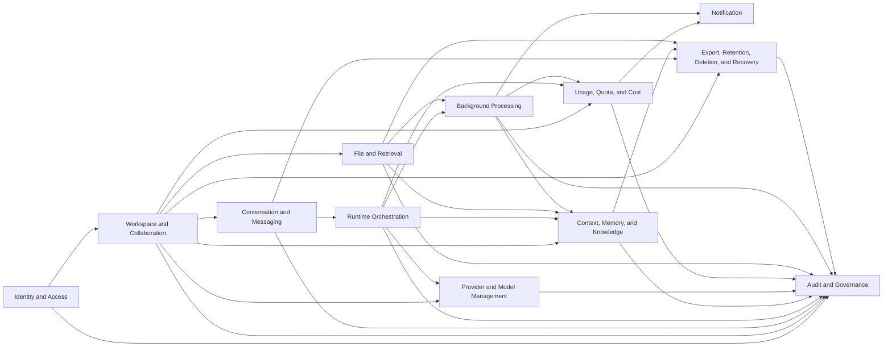
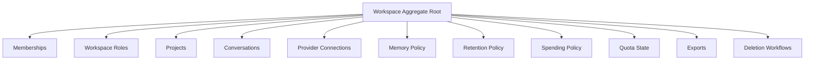
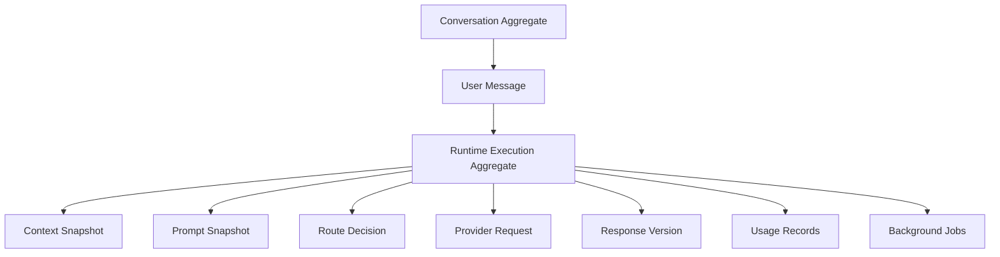
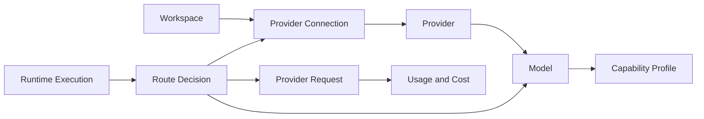
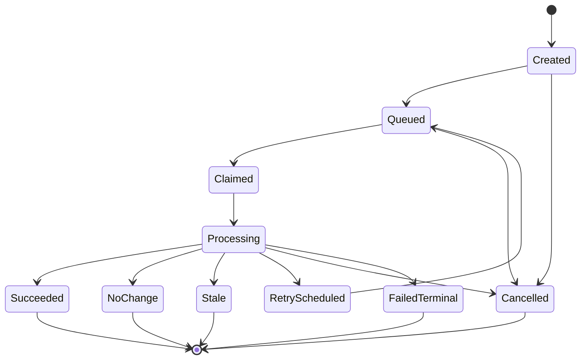
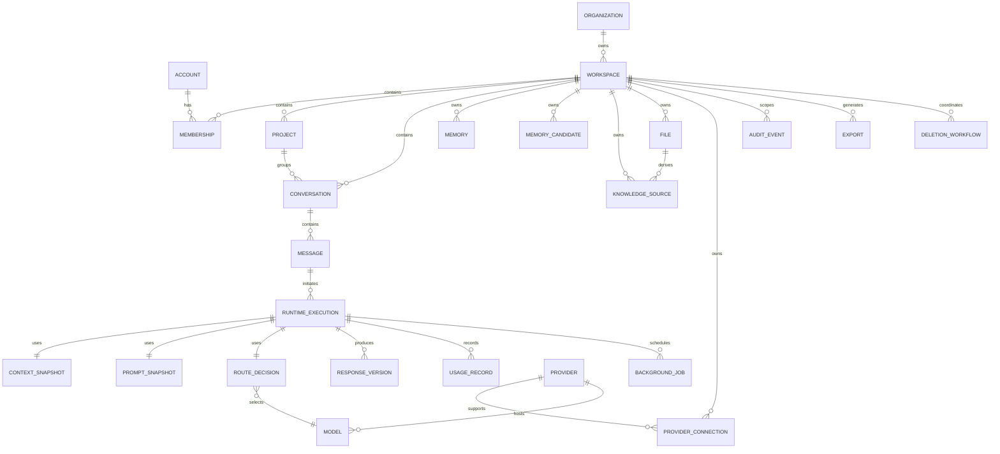
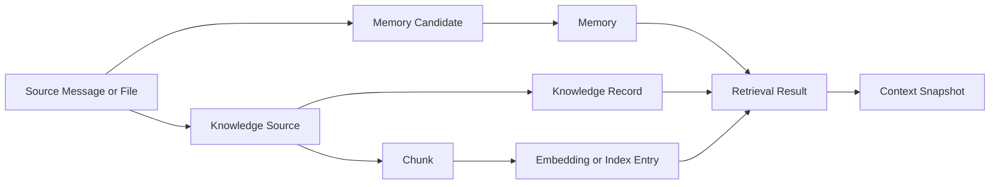
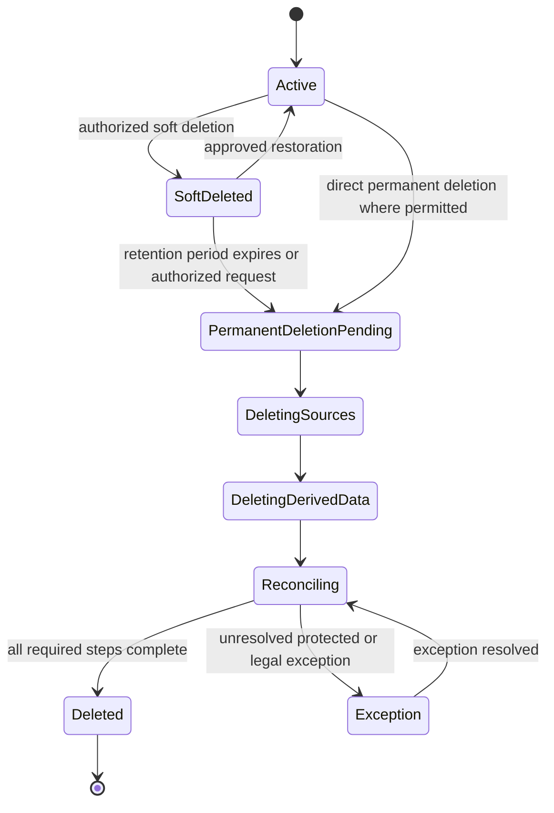

# GEXOR

## Domain Model Specification

**Document Version:** 1.0-MVP  
**Document Type:** Domain Model Specification  
**Product:** Gexor — AI Runtime Platform  
**Product Stage:** Pre-development  
**Status:** Complete — Pending Baseline Approval  
**Source Documents:** `PRD.md`, `FUNCTIONAL-REQUIREMENTS.md`, `NON-FUNCTIONAL-REQUIREMENTS.md`, `SYSTEM-CONTEXT-AND-HIGH-LEVEL-ARCHITECTURE.md`, `RUNTIME-PIPELINE.md`  
**Primary Release:** MVP  
**Target File:** `DOMAIN-MODEL.md`

---

# Document Control

| Field | Value |
| --- | --- |
| Document owner | Founder / Product Owner |
| Architecture owner | Principal Enterprise AI Architect / Designated Architecture Authority |
| Domain design authority | Designated Domain Architecture Owner |
| Primary source of truth | Approved Documents 1–5 |
| Intended audience | Product, architecture, backend, AI, data, security, QA, operations, and implementation teams |
| Domain baseline | MVP |
| Change authority | Founder / Product Owner with Architecture Authority review |
| Implementation status | Not started |
| Approval status | Pending Product Owner baseline approval |
| Repository action | No GitHub modification authorized by this document generation |

---

# Contents

1. Document Purpose and Scope  
2. Domain-Model Principles  
3. Domain Vocabulary and Terminology  
4. Bounded Contexts  
5. Aggregate Boundaries  
6. Identity and Account Domain  
7. Organization and Workspace Domain  
8. Membership, Role, and Permission Domain  
9. Project Domain  
10. Conversation Domain  
11. Message Domain  
12. Runtime Execution Domain  
13. Context Snapshot Domain  
14. Prompt Snapshot Domain  
15. Memory Domain  
16. Memory Candidate Domain  
17. Knowledge Domain  
18. File and Source-Document Domain  
19. Retrieval and Search Domain  
20. AI Provider Domain  
21. Provider Connection and Credential-Reference Domain  
22. Model and Capability Domain  
23. Provider Route-Decision Domain  
24. Streaming and Response-Version Domain  
25. Usage, Token, and Cost Domain  
26. Quota and Spending-Control Domain  
27. Background Job and Workflow Domain  
28. Notification Domain  
29. Audit Domain  
30. Export, Retention, Deletion, and Recovery Domain  
31. Entity Identifiers and Identity Rules  
32. Entity Lifecycle States  
33. Entity Relationships  
34. Ownership and Workspace-Isolation Rules  
35. Aggregate Invariants  
36. Validation Rules  
37. Idempotency and Concurrency Rules  
38. Domain Events  
39. Cross-Context Interaction Rules  
40. Derived-Data and Source-of-Truth Rules  
41. Soft Deletion, Permanent Deletion, and Restoration Rules  
42. Domain Risks and Mitigations  
43. Traceability to PRD, FRS, NFRS, Document 4, and Document 5  
44. Approval and Baseline Status  

---

# 1. Document Purpose and Scope

## 1.1 Purpose

This document defines the implementation-independent domain model for the Gexor MVP.

The domain model describes the principal business entities, runtime entities, aggregates, value concepts, ownership boundaries, lifecycle states, relationships, invariants, domain events, and cross-context interaction rules required to implement Gexor consistently.

This document shall guide subsequent database, API, engine, security, testing, and implementation designs.

## 1.2 Objectives

The domain model shall:

* preserve workspace isolation;
* preserve provider independence;
* distinguish authoritative data from derived data;
* represent structured memory explicitly;
* support context minimization;
* support traceable runtime execution;
* preserve immutable or reproducible snapshots;
* support idempotent and recoverable workflows;
* maintain clear aggregate ownership;
* support deletion and restoration without corrupting provenance;
* avoid coupling the domain to a specific database, queue, cloud, or programming language.

## 1.3 Scope

This specification covers:

* identity and account;
* organization and workspace;
* membership, role, and permission;
* projects;
* conversations and messages;
* runtime executions;
* context and prompt snapshots;
* memory and memory candidates;
* knowledge and files;
* retrieval and search;
* providers, provider connections, models, and route decisions;
* response streaming and response versions;
* usage, tokens, cost, quota, and spending controls;
* background jobs and workflows;
* notifications;
* audit;
* export, retention, deletion, restoration, and recovery.

## 1.4 Out of Scope

This document does not define:

* physical tables, columns, indexes, or foreign keys;
* SQL or NoSQL implementation;
* API endpoint paths or payloads;
* source-code classes or methods;
* vendor-specific persistence;
* cloud-specific infrastructure;
* final user-interface layouts;
* detailed engine algorithms.

## 1.5 Authority Hierarchy

The following hierarchy shall apply:

1. `PRD.md`;
2. `FUNCTIONAL-REQUIREMENTS.md`;
3. `NON-FUNCTIONAL-REQUIREMENTS.md`;
4. `SYSTEM-CONTEXT-AND-HIGH-LEVEL-ARCHITECTURE.md`;
5. `RUNTIME-PIPELINE.md`;
6. `DOMAIN-MODEL.md`;
7. lower-level database, API, engine, security, testing, and implementation documents.

A lower-level artifact shall not contradict this approved domain baseline.

---

# 2. Domain-Model Principles

## 2.1 Workspace as the Primary Ownership Boundary

The workspace shall be the primary ownership, authorization, isolation, usage, retention, export, deletion, and recovery boundary for workspace-scoped data.

## 2.2 Provider Independence

Provider-specific protocols and identifiers shall not define core Gexor domain semantics.

Provider connections, models, requests, responses, and usage shall be represented through normalized domain concepts.

## 2.3 Aggregate Consistency

Each aggregate shall protect its own invariants and shall not require unrelated aggregates to participate in every transaction.

Cross-aggregate consistency may be eventual where explicitly permitted, but shall remain observable and reconcilable.

## 2.4 Explicit Lifecycle State

Entities with meaningful lifecycle behavior shall expose explicit states.

Lifecycle transitions shall be validated and traceable.

## 2.5 Structured Memory

Memory shall be a first-class structured domain entity with scope, provenance, lifecycle, eligibility, confidence or confirmation state, and conflict behavior.

## 2.6 Snapshot Immutability

Context and prompt snapshots shall be immutable or reproducible historical records.

A later memory, file, policy, provider, or configuration change shall not mutate a prior execution snapshot.

## 2.7 Source and Derived Data Separation

Authoritative source entities shall remain distinguishable from derived chunks, embeddings, indexes, summaries, projections, or cached views.

Derived data shall preserve source lineage.

## 2.8 Reversible Automation

Automated memory, knowledge, and classification changes should be reversible where practical.

## 2.9 Canonical Time

Security, lifecycle, ordering, retention, timeout, expiry, and audit decisions shall use canonical server-controlled time.

## 2.10 Idempotent Mutation

Operations that may be repeated shall use stable idempotency or conditional-commit controls.

## 2.11 Fail-Closed Isolation

A missing, inconsistent, or mismatched workspace scope shall prevent protected access or mutation.

## 2.12 Implementation Independence

The domain shall remain portable across valid implementation technologies.

---

# 3. Domain Vocabulary and Terminology

| Term | Meaning |
| --- | --- |
| Account | The Gexor identity record representing a human user. |
| Workspace | The primary isolated operating and data-ownership scope. |
| Organization | An optional higher-level grouping that may own or contain workspaces. |
| Membership | The relationship between an account and a workspace or organization. |
| Role | A named permission grouping. |
| Permission | An authorization capability applied to an action or resource. |
| Project | A workspace-scoped grouping for related conversations, files, knowledge, and instructions. |
| Conversation | An ordered workspace-scoped interaction container. |
| Message | An immutable or versioned communication item within a conversation. |
| Runtime execution | One orchestration attempt for one accepted user request. |
| Context snapshot | The selected context identifiers, versions, categories, and budget decisions used by an execution. |
| Prompt snapshot | The effective provider-ready request representation used by an execution. |
| Memory | Structured durable information eligible for future retrieval. |
| Memory candidate | Extracted information not yet accepted as active durable memory. |
| Knowledge source | An approved source from which structured or indexed information is derived. |
| Source document | A file or external content source processed for knowledge retrieval. |
| Retrieval result | A scored, traceable reference to eligible context. |
| Provider | An external AI service family. |
| Provider connection | A workspace-owned connection to a provider. |
| Credential reference | A protected reference to provider authentication material. |
| Model | A provider-hosted AI model with declared capabilities. |
| Route decision | The traceable selection or validation of provider, model, and route. |
| Response version | One generated assistant outcome for a user message. |
| Usage record | Normalized token or request consumption associated with an execution. |
| Cost record | Estimated or reported financial value associated with usage. |
| Quota | A limit on requests, tokens, storage, concurrency, or other resource use. |
| Spending control | A financial constraint applied before or after provider use. |
| Background job | A uniquely identified deferred unit of work. |
| Workflow | A multi-step recoverable process coordinating related jobs or state transitions. |
| Audit event | A durable record of a material security, administrative, data, or runtime action. |
| Export | A generated portable representation of eligible workspace data. |
| Deletion request | A tracked request to remove source and derived data according to policy. |

---

# 4. Bounded Contexts

## 4.1 Context List

The MVP domain shall be divided into these bounded contexts:

1. Identity and Access
2. Workspace and Collaboration
3. Conversation and Messaging
4. Runtime Orchestration
5. Context, Memory, and Knowledge
6. Provider and Model Management
7. Usage, Quota, and Cost
8. File and Retrieval
9. Background Processing
10. Notification
11. Audit and Governance
12. Export, Retention, Deletion, and Recovery

## 4.2 Bounded-Context Map



## 4.3 Context Ownership Rules

Each bounded context shall own its authoritative entities and invariants.

A context shall not directly mutate another context’s authoritative aggregate without an approved command or workflow boundary.

Read models and derived projections may combine data across contexts, but shall not become authoritative.

## 4.4 Cross-Context References

Cross-context references shall use stable identifiers and shall not require direct object ownership.

A context receiving an external identifier shall revalidate the referenced entity’s eligibility where required.

---

# 5. Aggregate Boundaries

## 5.1 Principal Aggregates

The principal aggregates are:

* Account Aggregate
* Organization Aggregate
* Workspace Aggregate
* Project Aggregate
* Conversation Aggregate
* Runtime Execution Aggregate
* Memory Aggregate
* Knowledge Source Aggregate
* Provider Connection Aggregate
* Model Catalog Aggregate
* Usage and Spending Aggregate
* Background Job Aggregate
* Notification Aggregate
* Audit Aggregate
* Export Aggregate
* Deletion Workflow Aggregate

## 5.2 Aggregate Rules

1. Each aggregate shall have one aggregate root.
2. Invariants inside one aggregate shall be enforced atomically where practical.
3. Cross-aggregate effects shall use domain events, commands, or recoverable workflows.
4. Aggregate identifiers shall be globally unique or unique within an explicitly documented scope.
5. Workspace-scoped aggregates shall carry the workspace identifier.
6. Aggregate state transitions shall be versioned or conditionally committed.
7. Aggregate deletion shall preserve required audit and lineage.

## 5.3 Aggregate Size

Aggregates shall remain small enough to avoid requiring full workspace or conversation history to be loaded for common updates.

A conversation aggregate shall not require all messages to be loaded into one transaction.

## 5.4 Aggregate References

Aggregates shall reference other aggregates by stable identity rather than embedded mutable copies, except where immutable snapshots are intentionally embedded.

---

# 6. Identity and Account Domain

## 6.1 Account Aggregate

The Account aggregate shall represent a human user.

It shall include or resolve:

* account identifier;
* canonical identity reference;
* display metadata;
* account state;
* creation time;
* update time;
* security status;
* applicable preferences;
* deletion state.

## 6.2 Account States

Supported states shall include:

* invited;
* active;
* suspended;
* disabled;
* deletion_pending;
* deleted.

## 6.3 Account Invariants

1. An active account shall have at least one valid authentication identity.
2. A suspended or disabled account shall not initiate protected runtime operations.
3. Account deletion shall trigger membership, session, provider-connection, export, and retention evaluation.
4. Account state shall not imply workspace ownership.
5. Account restoration shall not silently restore revoked memberships or provider credentials.

## 6.4 Authentication Identity

Authentication identities may be external or internal references.

The domain shall not expose provider-specific identity tokens as account identifiers.

---

# 7. Organization and Workspace Domain

## 7.1 Organization Aggregate

An Organization may group one or more workspaces.

The MVP may support personal workspaces without requiring an organization.

## 7.2 Workspace Aggregate

The Workspace aggregate shall include or resolve:

* workspace identifier;
* workspace type;
* owning account or organization;
* lifecycle state;
* plan or entitlement reference;
* default policy reference;
* default provider policy;
* memory mode;
* file and retrieval policy;
* retention policy;
* spending policy;
* creation and update time.

## 7.3 Workspace States

Supported states shall include:

* provisioning;
* active;
* suspended;
* read_only;
* deletion_pending;
* deleted;
* restoration_pending.

## 7.4 Workspace Aggregate Diagram



## 7.5 Workspace Invariants

1. Every workspace shall have a valid owner.
2. A personal workspace shall have exactly one primary owning account unless converted through an approved workflow.
3. A deleted workspace shall not accept new runtime operations.
4. A suspended workspace shall not dispatch provider requests.
5. Workspace policy shall be versioned or reproducible for runtime snapshots.
6. Provider connections shall belong to exactly one workspace.
7. Workspace deletion shall coordinate all source and derived data.

---

# 8. Membership, Role, and Permission Domain

## 8.1 Membership Entity

A Membership shall connect an account to a workspace or organization.

It shall include:

* membership identifier;
* account identifier;
* target scope;
* role assignment;
* lifecycle state;
* invitation or activation time;
* revocation time where applicable.

## 8.2 Membership States

Supported states shall include:

* invited;
* active;
* suspended;
* revoked;
* expired.

## 8.3 Role Entity

A Role shall define a named set of permissions.

Roles may be:

* platform-defined;
* organization-defined;
* workspace-defined.

## 8.4 Permission Model

Permissions shall be explicit capabilities such as:

* view workspace;
* manage members;
* manage providers;
* submit messages;
* cancel executions;
* view memory;
* edit memory;
* manage files;
* view usage;
* manage spending controls;
* export data;
* delete data;
* administer workspace.

## 8.5 Invariants

1. Permission evaluation shall consider current membership state.
2. A role change shall affect future authorization decisions.
3. Revocation shall not depend solely on client refresh.
4. Platform administration shall remain separate from workspace administration.
5. A membership shall not grant access outside its target scope.

---

# 9. Project Domain

## 9.1 Project Aggregate

A Project shall group related conversations, instructions, files, knowledge, memories, and workflow state.

It shall include:

* project identifier;
* workspace identifier;
* name and description;
* lifecycle state;
* instruction reference;
* default retrieval policy;
* creation and update time.

## 9.2 Project States

Supported states shall include:

* active;
* archived;
* deletion_pending;
* deleted.

## 9.3 Project Invariants

1. A project shall belong to exactly one workspace.
2. Project instructions shall not override mandatory platform policy.
3. Archived projects may be read but shall not accept new activity unless restored.
4. Project deletion shall evaluate linked files, knowledge, memories, and conversations.
5. Project-scoped memory shall not be retrieved outside the project unless policy explicitly broadens scope.

---

# 10. Conversation Domain

## 10.1 Conversation Aggregate

A Conversation shall represent an ordered interaction container.

It shall include:

* conversation identifier;
* workspace identifier;
* optional project identifier;
* title;
* lifecycle state;
* provider or model defaults;
* memory mode;
* retrieval mode;
* instruction reference;
* creation and update time;
* ordering cursor or equivalent sequencing state.

## 10.2 Conversation States

Supported states shall include:

* active;
* archived;
* read_only;
* deletion_pending;
* deleted.

## 10.3 Conversation Invariants

1. A conversation shall belong to one workspace.
2. A project-bound conversation shall belong to a project in the same workspace.
3. An inactive or deleted conversation shall not accept new messages.
4. Conversation memory mode shall not weaken workspace restrictions.
5. Message ordering shall remain deterministic.
6. Conversation deletion shall preserve required audit and execution evidence while removing or excluding eligible content.

---

# 11. Message Domain

## 11.1 Message Entity

A Message shall include:

* message identifier;
* workspace identifier;
* conversation identifier;
* sender type;
* canonical content or content reference;
* content state;
* ordering position;
* creation time;
* deletion state;
* source references;
* runtime execution relationship where applicable.

## 11.2 Message Types

Message types may include:

* user;
* assistant;
* system-generated;
* tool or integration;
* status.

## 11.3 Message States

Supported states may include:

* accepted;
* processing;
* completed;
* failed;
* cancelled;
* partially_completed;
* deletion_pending;
* deleted.

## 11.4 Message Invariants

1. A user message shall not be overwritten by retry or regeneration.
2. An assistant response shall be a distinct message or response version.
3. A message shall belong to one conversation and workspace.
4. Deletion shall not corrupt ordering.
5. A failed message shall preserve a stable error reference.
6. Partial content shall be distinguishable from complete content.

---

# 12. Runtime Execution Domain

## 12.1 Runtime Execution Aggregate

The Runtime Execution aggregate shall represent one orchestration attempt.

It shall include:

* execution identifier;
* workspace identifier;
* conversation identifier;
* user-message identifier;
* requesting account;
* state;
* effective configuration reference;
* route reference;
* context snapshot reference;
* prompt snapshot reference;
* provider request reference;
* usage and cost references;
* terminal error reference;
* creation and transition times.

## 12.2 Runtime States

Supported baseline states shall include:

* created;
* validating;
* preparing;
* provider_pending;
* streaming;
* finalizing;
* reconciliation_pending;
* completed;
* failed;
* cancellation_requested;
* cancelled.

## 12.3 Conversation and Runtime Aggregate Diagram



## 12.4 Runtime Invariants

1. Each provider-eligible accepted request shall have a unique execution.
2. Retry and regeneration shall create new executions.
3. A terminal execution shall not return to a non-terminal state.
4. Provider dispatch shall occur only after mandatory gates.
5. An execution shall reference one effective workspace scope.
6. Late provider output shall not reactivate the execution.
7. Finalization shall be idempotent.
8. Snapshot references shall not change after dispatch.
9. Usage and cost shall remain execution-bound.

---

# 13. Context Snapshot Domain

## 13.1 Context Snapshot Entity

A Context Snapshot shall represent the exact selected context identities and versions used by one execution.

It shall include:

* context snapshot identifier;
* execution identifier;
* workspace identifier;
* selected source references;
* selected versions;
* context categories;
* relevance or inclusion metadata;
* token allocations;
* truncation, compression, or omission state;
* policy version;
* creation time.

## 13.2 Context Snapshot Invariants

1. A snapshot shall belong to one execution and workspace.
2. A snapshot shall be immutable after construction.
3. Uncommitted memory or knowledge candidates shall not appear in the snapshot.
4. Every selected context item shall preserve provenance.
5. Snapshot Lock shall bind rapid-fire executions to the committed context available at execution start.
6. Deletion policy may redact content while preserving required non-content audit references.

---

# 14. Prompt Snapshot Domain

## 14.1 Prompt Snapshot Entity

A Prompt Snapshot shall represent the immutable or reproducible effective request dispatched to a provider.

It shall include:

* prompt snapshot identifier;
* execution identifier;
* provider-independent canonical representation;
* provider adaptation reference;
* instruction-precedence representation;
* context snapshot reference;
* token budget;
* model constraints;
* output requirements;
* creation time.

## 14.2 Prompt Snapshot Invariants

1. A prompt snapshot shall belong to one execution.
2. Prompt enhancement shall preserve user intent.
3. Retrieved content shall remain distinguishable from trusted instruction.
4. A prompt snapshot shall not be modified after dispatch.
5. Snapshot retention shall follow privacy and deletion policy.
6. Provider credentials shall never be embedded.

---

# 15. Memory Domain

## 15.1 Memory Aggregate

A Memory shall include:

* memory identifier;
* workspace identifier;
* optional project or conversation scope;
* category;
* normalized content;
* lifecycle state;
* provenance;
* confirmation state;
* confidence or evidence state where applicable;
* retrieval eligibility;
* effective time;
* creation and update time;
* supersession or conflict references.

## 15.2 Memory Categories

Categories may include:

* user preference;
* project fact;
* decision;
* instruction;
* constraint;
* entity;
* goal;
* workflow state;
* long-term knowledge;
* temporary context.

## 15.3 Memory States

Supported states shall include:

* candidate_linked;
* active;
* inactive;
* conflicted;
* superseded;
* expired;
* deletion_pending;
* deleted.

## 15.4 Memory Invariants

1. Every memory shall belong to exactly one workspace.
2. Active memory shall be retrieval eligible only within approved scope.
3. Conflicting candidates shall not silently overwrite confirmed memory.
4. Memory changes shall preserve provenance.
5. Superseded memory shall remain traceable.
6. Deleted memory shall be removed from normal retrieval.
7. Memory derived from deleted source content shall be reevaluated.
8. A stale background job shall not overwrite newer memory state.

---

# 16. Memory Candidate Domain

## 16.1 Memory Candidate Entity

A Memory Candidate shall include:

* candidate identifier;
* workspace identifier;
* source reference;
* proposed category;
* proposed normalized content;
* confidence or evidence;
* conflict indicators;
* suggested action;
* lifecycle state;
* extraction time;
* processing version.

## 16.2 Candidate States

Supported states shall include:

* detected;
* validating;
* duplicate;
* conflict;
* pending_confirmation;
* accepted;
* rejected;
* expired;
* deleted.

## 16.3 Candidate Invariants

1. A candidate shall not be retrieved as active memory before acceptance.
2. A candidate shall preserve source provenance.
3. Duplicate detection shall occur before new active memory creation.
4. Acceptance shall be idempotent.
5. Rejection shall not remove the source evidence.
6. A candidate from a deleted or ineligible source shall not become active.

---

# 17. Knowledge Domain

## 17.1 Knowledge Source Aggregate

A Knowledge Source shall include:

* knowledge-source identifier;
* workspace identifier;
* source type;
* source reference;
* lifecycle state;
* processing state;
* version;
* provenance;
* retention state;
* creation and update time.

## 17.2 Knowledge Record

A Knowledge Record may represent structured information derived from an approved source.

It shall preserve:

* source identifier;
* source version;
* workspace;
* content or content reference;
* scope;
* lifecycle;
* provenance;
* retrieval eligibility.

## 17.3 Knowledge States

Supported states may include:

* registered;
* processing;
* active;
* failed;
* stale;
* archived;
* deletion_pending;
* deleted.

## 17.4 Knowledge Invariants

1. Knowledge shall remain linked to its source.
2. Source deletion shall make derived knowledge ineligible.
3. A stale source version shall not produce authoritative current knowledge.
4. Knowledge retrieval shall remain workspace-scoped.
5. Derived knowledge shall not become higher-authority instruction automatically.

---

# 18. File and Source-Document Domain

## 18.1 File Aggregate

A File or Source Document shall include:

* file identifier;
* workspace identifier;
* optional project identifier;
* owner or uploader;
* original name;
* detected type;
* declared type;
* size;
* object reference;
* lifecycle state;
* processing state;
* source version;
* integrity metadata;
* creation time;
* retention and deletion state.

## 18.2 File States

Supported states shall include:

* uploading;
* accepted;
* quarantined;
* processing;
* active;
* failed;
* archived;
* deletion_pending;
* deleted.

## 18.3 File Invariants

1. A file shall belong to one workspace.
2. A file shall not become retrievable until mandatory processing succeeds.
3. Unsupported or quarantined files shall not produce active knowledge.
4. File deletion shall propagate to chunks, embeddings, indexes, and knowledge.
5. A replacement file version shall not silently rewrite historical execution snapshots.
6. File processing shall use an identifiable source version.

---

# 19. Retrieval and Search Domain

## 19.1 Retrieval Request

A Retrieval Request shall represent one authorized context lookup.

It may include:

* retrieval identifier;
* execution identifier;
* workspace identifier;
* query or query representation;
* permitted source categories;
* scope;
* result limit;
* token limit;
* policy version;
* creation time.

## 19.2 Retrieval Result

A Retrieval Result shall include:

* retrieval identifier;
* source identifier;
* source version;
* workspace identifier;
* category;
* relevance score or rank;
* chunk or segment reference;
* inclusion eligibility;
* provenance.

## 19.3 Retrieval Invariants

1. Retrieval shall apply workspace scope before results become visible.
2. Deleted, inactive, quarantined, or stale sources shall not be eligible.
3. Search and vector stores shall not decide authorization independently.
4. Results shall preserve source lineage.
5. Result ranking shall not override mandatory scope or trust rules.
6. Retrieval output shall remain bounded.

---

# 20. AI Provider Domain

## 20.1 Provider Entity

A Provider shall represent a supported external AI service family.

It shall include:

* provider identifier;
* normalized name;
* lifecycle state;
* supported connection methods;
* capability profile;
* error and streaming profile;
* availability metadata reference;
* version or deprecation metadata.

## 20.2 Provider States

Supported states shall include:

* active;
* degraded;
* disabled;
* deprecated;
* retired.

## 20.3 Provider Invariants

1. Provider identifiers shall remain provider-independent domain references.
2. Retired providers shall not receive new dispatches.
3. Provider availability shall not define workspace ownership.
4. Provider state changes shall not mutate prior execution records.
5. Provider-specific protocol details shall remain outside core domain semantics.

---

# 21. Provider Connection and Credential-Reference Domain

## 21.1 Provider Connection Aggregate

A Provider Connection shall include:

* connection identifier;
* workspace identifier;
* provider identifier;
* connection type;
* lifecycle state;
* validation status;
* credential reference;
* account or tenant metadata where permitted;
* creation, validation, update, revocation, and deletion times.

## 21.2 Credential Reference

The domain shall store a protected reference to credential material rather than expose raw credentials.

## 21.3 Connection States

Supported states shall include:

* pending_validation;
* active;
* invalid;
* suspended;
* revoked;
* deletion_pending;
* deleted.

## 21.4 Connection Invariants

1. A connection shall belong to one workspace.
2. A connection shall reference one provider.
3. Raw credentials shall not be domain-visible.
4. A revoked or deleted connection shall not be used for dispatch.
5. Credential rotation shall preserve connection identity where appropriate.
6. Connection deletion shall not rewrite historical route decisions.

---

# 22. Model and Capability Domain

## 22.1 Model Entity

A Model shall include:

* normalized model identifier;
* provider identifier;
* provider-native model reference;
* lifecycle state;
* context limit;
* output limit;
* streaming support;
* modality support;
* tool support where enabled;
* pricing metadata reference;
* capability profile;
* effective and deprecation dates.

## 22.2 Capability Entity

A Capability may represent:

* text generation;
* structured output;
* streaming;
* large context;
* file or image support;
* tool use;
* reasoning class;
* latency tier.

## 22.3 Model States

Supported states shall include:

* active;
* degraded;
* deprecated;
* retired;
* unavailable.

## 22.4 Model Invariants

1. A model shall belong to one provider.
2. Retired models shall not receive new dispatches.
3. Capability validation shall occur before dispatch.
4. Model metadata changes shall not alter prior route decisions.
5. Pricing versions shall be independently traceable.

---

# 23. Provider Route-Decision Domain

## 23.1 Route Decision Entity

A Route Decision shall include:

* route-decision identifier;
* execution identifier;
* workspace identifier;
* selected provider connection;
* selected provider;
* selected model;
* route type;
* fallback policy;
* capability match;
* cost estimate reference;
* decision factors;
* creation time.

## 23.2 Provider and Routing Model Diagram



## 23.3 Route Invariants

1. A route decision shall belong to one execution.
2. The selected connection shall belong to the execution workspace.
3. The selected model shall belong to the selected provider.
4. Fallback shall follow explicit policy.
5. Route decisions shall be immutable historical evidence.
6. A retry shall create a new route decision.

---

# 24. Streaming and Response-Version Domain

## 24.1 Response Version Entity

A Response Version shall represent one assistant outcome for one user message.

It shall include:

* response-version identifier;
* workspace identifier;
* conversation identifier;
* user-message identifier;
* execution identifier;
* content or content reference;
* lifecycle state;
* provider and model references;
* finish reason;
* partial or complete status;
* creation and finalization time.

## 24.2 Stream Session Entity

A Stream Session may include:

* stream identifier;
* execution identifier;
* workspace identifier;
* authorized principal;
* connection state;
* event cursor;
* terminal state;
* creation and closure time.

## 24.3 Response States

Supported states shall include:

* pending;
* streaming;
* partial;
* completed;
* failed;
* cancelled;
* deletion_pending;
* deleted.

## 24.4 Invariants

1. Regeneration shall create a new response version.
2. Earlier response versions shall not be overwritten.
3. A stream shall be bound to one execution.
4. Reconnection shall revalidate authorization.
5. Late provider events shall not alter a terminal response version.
6. Partial content shall remain distinguishable from complete content.

---

# 25. Usage, Token, and Cost Domain

## 25.1 Usage Record

A Usage Record shall include:

* usage identifier;
* execution identifier;
* workspace identifier;
* provider request identifier;
* provider and model;
* measurement source;
* input usage;
* output usage;
* total usage;
* special usage classes where supported;
* measurement time;
* reconciliation state.

## 25.2 Cost Record

A Cost Record shall include:

* cost identifier;
* usage identifier or execution identifier;
* provider;
* model;
* pricing version;
* currency or billing unit;
* estimated cost;
* reported or reconciled cost;
* adjustment state;
* creation and update time.

## 25.3 Usage States

Supported states may include:

* estimated;
* reserved;
* provider_reported;
* reconciled;
* adjusted;
* disputed;
* failed.

## 25.4 Invariants

1. Estimated and provider-reported usage shall both be preserved when they differ.
2. Pricing version shall be traceable.
3. Failed and cancelled executions shall record usage where provider use occurred.
4. Reconciliation shall be idempotent.
5. Usage shall belong to the execution workspace.
6. A cost record shall not be duplicated by retry or replay.

---

# 26. Quota and Spending-Control Domain

## 26.1 Quota Entity

A Quota shall define a limit for:

* requests;
* tokens;
* concurrent executions;
* provider concurrency;
* storage;
* files;
* retrieval;
* exports;
* background work.

## 26.2 Spending Control Entity

A Spending Control may define:

* per-request limit;
* daily limit;
* monthly limit;
* user limit;
* workspace limit;
* provider or model restriction;
* unknown-cost policy.

## 26.3 Reservation Entity

A Usage Reservation may include:

* reservation identifier;
* execution identifier;
* workspace identifier;
* reserved amount;
* reserved unit;
* creation time;
* expiry;
* release or reconciliation state.

## 26.4 Invariants

1. Reservation shall be execution-bound.
2. Concurrent reservations shall not oversubscribe a mandatory limit.
3. Reservation release and reconciliation shall be idempotent.
4. A denied execution shall not retain an active reservation.
5. Spending control shall not be bypassed by alternate routing.
6. Administrative adjustment shall be auditable.

---

# 27. Background Job and Workflow Domain

## 27.1 Background Job Aggregate

A Background Job shall include:

* job identifier;
* job type;
* job schema version;
* workspace identifier;
* source identifier;
* source version or snapshot;
* initiating execution;
* lifecycle state;
* idempotency key;
* attempt count;
* priority;
* creation and terminal time;
* error or stale outcome.

## 27.2 Job States

Supported states shall include:

* created;
* queued;
* claimed;
* processing;
* retry_scheduled;
* succeeded;
* no_change;
* stale;
* cancelled;
* failed_terminal;
* superseded.

## 27.3 Background Job Lifecycle



## 27.4 Workflow Aggregate

A Workflow may coordinate:

* export;
* deletion;
* restoration;
* file processing;
* reconciliation;
* usage adjustment.

It shall track dependent steps and terminal outcome.

## 27.5 Invariants

1. A job shall belong to one workspace.
2. A repeated delivery shall not duplicate committed effects.
3. A stale source shall not be overwritten.
4. Retry shall be bounded.
5. Job completion order shall not define authority.
6. Poison jobs shall reach a controlled terminal state.
7. Workflow progress shall be recoverable.

---

# 28. Notification Domain

## 28.1 Notification Aggregate

A Notification shall include:

* notification identifier;
* workspace identifier where applicable;
* recipient identity;
* event reference;
* template or category;
* delivery channel;
* lifecycle state;
* content reference;
* creation and delivery times.

## 28.2 Notification States

Supported states shall include:

* pending;
* queued;
* sent;
* delivered;
* failed;
* suppressed;
* cancelled.

## 28.3 Invariants

1. Notification content shall be minimized.
2. Notification preferences shall be enforced.
3. Delivery retries shall be idempotent.
4. Sensitive workspace content shall not be included unless explicitly permitted.
5. Notification failure shall not corrupt the originating domain event.

---

# 29. Audit Domain

## 29.1 Audit Event Aggregate

An Audit Event shall include:

* audit-event identifier;
* event category;
* workspace identifier where applicable;
* actor identity;
* target identity;
* action;
* outcome;
* canonical time;
* correlation identifiers;
* restricted metadata;
* integrity metadata.

## 29.2 Audit Categories

Audit shall cover:

* authentication and session events;
* membership and role changes;
* provider connection changes;
* runtime routing and terminal outcomes where required;
* memory lifecycle changes;
* file access and deletion;
* export;
* retention and deletion;
* administrative actions;
* spending-control changes;
* restore and recovery operations.

## 29.3 Invariants

1. Audit events shall be immutable or tamper-evident according to policy.
2. Audit shall not store plaintext credentials.
3. Audit access shall be restricted.
4. Audit retention shall be explicit.
5. Operational logs shall not replace audit records.
6. Audit events shall preserve canonical time and correlation.

---

# 30. Export, Retention, Deletion, and Recovery Domain

## 30.1 Export Aggregate

An Export shall include:

* export identifier;
* workspace identifier;
* requesting actor;
* scope;
* lifecycle state;
* manifest;
* generated artifact reference;
* creation, expiry, and terminal time.

## 30.2 Export States

Supported states shall include:

* requested;
* validating;
* generating;
* ready;
* failed;
* expired;
* deleted.

## 30.3 Retention Policy

A Retention Policy shall define:

* applicable entity categories;
* retention duration;
* legal or security exceptions;
* soft-deletion period;
* backup retention behavior;
* permanent-deletion eligibility.

## 30.4 Deletion Workflow Aggregate

A Deletion Workflow shall include:

* deletion identifier;
* workspace;
* target type and identifier;
* requested scope;
* actor;
* reason or policy reference;
* lifecycle state;
* source-deletion progress;
* derived-data progress;
* backup-handling state;
* exceptions;
* terminal time.

## 30.5 Recovery Aggregate

A Recovery or Restoration Workflow may include:

* restoration identifier;
* target;
* source backup or retained state;
* authorization;
* validation state;
* reconciliation state;
* terminal outcome.

---

# 31. Entity Identifiers and Identity Rules

## 31.1 Identifier Principles

1. Identifiers shall be stable.
2. Identifiers shall not be reused after permanent deletion.
3. Client-visible identifiers shall not expose secrets.
4. Provider-native identifiers shall remain separate from Gexor identifiers.
5. Retry shall create new execution identity.
6. Regeneration shall create new response identity.
7. Background jobs shall have unique job identity.
8. Derived data shall reference source identity and version.

## 31.2 Workspace Identity

Every workspace-scoped entity shall carry or resolve the authoritative workspace identifier.

## 31.3 Natural Keys

Natural business values such as email, provider name, file name, or model name shall not be treated as immutable entity identity.

## 31.4 Version Identity

Entities with concurrency or snapshot requirements shall expose a version, revision, effective timestamp, or equivalent conditional-commit token.

---

# 32. Entity Lifecycle States

## 32.1 General Lifecycle

A general lifecycle may be:

```text
Created → Active → Updated → Inactive → Archived → Deletion Pending → Deleted
```

Not every entity shall support every state.

## 32.2 Terminality

Deleted, failed-terminal, completed, cancelled, expired, or retired states shall be treated as terminal where defined.

## 32.3 State Transition Rules

1. Every transition shall be validated.
2. Terminal states shall not transition back unless restoration is explicitly supported.
3. Restoration shall create traceable restoration state.
4. State changes shall use canonical time.
5. Invalid transitions shall fail without partial mutation.
6. Security-relevant transitions shall be audited.

---

# 33. Entity Relationships

## 33.1 High-Level Entity Relationship Model



## 33.2 Relationship Rules

1. Cross-workspace relationships shall be prohibited unless explicitly administrative.
2. A child entity shall not outlive its required parent without an approved orphaning rule.
3. Historical runtime references may survive source deletion in redacted form.
4. Derived data shall preserve source relationship.
5. Provider-native references shall not replace Gexor ownership relationships.

---

# 34. Ownership and Workspace-Isolation Rules

## 34.1 Ownership Rules

The workspace shall own:

* projects;
* conversations;
* messages;
* runtime executions;
* snapshots;
* memories and candidates;
* files and knowledge;
* provider connections;
* route decisions;
* usage and cost;
* jobs;
* exports;
* deletion workflows;
* applicable audit events.

## 34.2 Isolation Rules

1. A workspace-scoped entity shall not reference mutable data from another workspace.
2. Retrieval shall filter by workspace before visibility.
3. Background jobs shall revalidate workspace.
4. Provider credentials shall be workspace-bound.
5. Usage and cost shall be attributed to one workspace.
6. Cache and index keys shall include workspace scope.
7. Export and restore shall preserve workspace boundaries.
8. Platform administrative access shall be explicit and auditable.

## 34.3 Personal and Organization Workspaces

A personal workspace may be owned directly by an account.

An organization workspace may be owned by an organization and accessed through membership.

The ownership model shall not weaken isolation.

---

# 35. Aggregate Invariants

## 35.1 Workspace Aggregate Invariants

* valid owner;
* valid lifecycle;
* policy versioning;
* no new runtime dispatch while suspended or deleted;
* membership and provider connections remain workspace-scoped.

## 35.2 Conversation Aggregate Invariants

* same-workspace messages;
* deterministic ordering;
* no new messages when inactive;
* retries do not overwrite prior responses.

## 35.3 Runtime Aggregate Invariants

* one execution per attempt;
* immutable snapshots after dispatch;
* explicit terminal state;
* idempotent finalization;
* no late-event reactivation.

## 35.4 Memory Aggregate Invariants

* one workspace;
* provenance preserved;
* conflict-safe updates;
* no retrieval after deletion or ineligibility;
* stale job protection.

## 35.5 Provider Connection Invariants

* one workspace;
* one provider;
* protected credential reference;
* no dispatch after revocation.

## 35.6 Usage Aggregate Invariants

* execution-bound usage;
* no duplicate reconciliation;
* estimated and actual preserved;
* pricing version traceable.

## 35.7 Job Aggregate Invariants

* one workspace;
* source identity and version;
* bounded attempts;
* idempotent commit;
* terminal state.

---

# 36. Validation Rules

## 36.1 General Validation

Every mutation shall validate:

* actor identity;
* permission;
* workspace scope;
* entity existence;
* lifecycle state;
* version or concurrency token where required;
* input structure;
* required relationships;
* policy constraints;
* time-dependent eligibility.

## 36.2 Reference Validation

A referenced entity shall:

* exist;
* belong to the expected workspace;
* be in an eligible state;
* be compatible with the requested operation.

## 36.3 State Validation

A command shall be rejected when the requested transition is not permitted from the current state.

## 36.4 Provider Validation

Provider and model references shall be validated against active catalog state before dispatch.

## 36.5 Memory Validation

Memory creation or update shall validate:

* category;
* scope;
* provenance;
* conflict;
* duplicate state;
* source eligibility;
* confirmation policy.

## 36.6 File Validation

File acceptance shall validate:

* type;
* size;
* workspace quota;
* ownership;
* integrity;
* processing eligibility.

---

# 37. Idempotency and Concurrency Rules

## 37.1 Idempotency Rules

Idempotency shall apply to:

* message acceptance;
* provider dispatch claim;
* cancellation;
* finalization;
* usage reconciliation;
* background job commit;
* notification delivery;
* export generation;
* deletion propagation;
* restoration.

## 37.2 Concurrency Control

Concurrency may use:

* version checks;
* conditional writes;
* leases;
* exclusive claims;
* unique effect keys;
* event sequence numbers.

## 37.3 Stale-Write Rule

A stale operation shall not overwrite newer committed state.

## 37.4 Snapshot Lock Rule

An execution shall read committed eligible state available at snapshot creation.

Later commits shall apply only to subsequent executions.

## 37.5 Conflict Outcomes

A concurrent conflict may result in:

* retry;
* no-op;
* superseded;
* stale;
* manual review;
* reconciliation.

## 37.6 Duplicate Event Rule

Repeated event delivery shall not duplicate domain effects.

---

# 38. Domain Events

## 38.1 Event Principles

Domain events shall:

* represent completed domain facts;
* include event identity;
* include aggregate identity;
* include workspace scope where applicable;
* include event version;
* include canonical time;
* preserve correlation;
* remain idempotently consumable.

## 38.2 Representative Events

Identity and Workspace:

* AccountActivated
* AccountSuspended
* WorkspaceCreated
* WorkspaceSuspended
* MembershipGranted
* MembershipRevoked

Conversation and Runtime:

* ConversationCreated
* MessageAccepted
* RuntimeExecutionCreated
* RuntimeDispatchApproved
* ProviderRequestDispatched
* RuntimeStreamingStarted
* RuntimeCompleted
* RuntimeFailed
* RuntimeCancelled

Memory and Knowledge:

* MemoryCandidateDetected
* MemoryCandidateAccepted
* MemoryActivated
* MemoryConflicted
* MemorySuperseded
* KnowledgeSourceRegistered
* KnowledgeSourceIndexed
* SourceBecameIneligible

Provider and Usage:

* ProviderConnectionActivated
* ProviderConnectionRevoked
* RouteDecisionCreated
* UsageEstimated
* UsageReported
* UsageReconciled
* SpendingLimitReached

Background and Lifecycle:

* BackgroundJobQueued
* BackgroundJobSucceeded
* BackgroundJobFailed
* ExportRequested
* ExportReady
* DeletionRequested
* DeletionCompleted
* RestorationCompleted

## 38.3 Event Consumption

Consumers shall:

* validate schema version;
* validate workspace scope;
* apply idempotency;
* reject stale or unauthorized effects;
* record failure;
* support bounded retry.

---

# 39. Cross-Context Interaction Rules

## 39.1 Command Ownership

A bounded context shall send commands to the context that owns the target aggregate.

## 39.2 Event Propagation

Cross-context effects should be driven by domain events where immediate atomic consistency is not required.

## 39.3 Read Models

Cross-context read models may combine data for:

* runtime preparation;
* administration;
* usage dashboards;
* audit views;
* export manifests.

Read models shall not become authoritative mutation targets.

## 39.4 Runtime Coordination

The Runtime Orchestration context may coordinate other contexts but shall not directly own their authoritative entities.

## 39.5 Deletion Coordination

The deletion workflow shall coordinate source contexts and derived stores through explicit steps and terminal status.

## 39.6 Failure Handling

Cross-context failure shall be represented as:

* retryable;
* recoverable pending;
* terminal failure;
* manual review required.

---

# 40. Derived-Data and Source-of-Truth Rules

## 40.1 Authoritative Sources

Authoritative data includes:

* account and workspace state;
* memberships and roles;
* canonical messages;
* runtime execution state;
* memory records;
* provider connection metadata;
* usage and cost records;
* file metadata;
* lifecycle and deletion state.

## 40.2 Derived Data

Derived data includes:

* embeddings;
* search indexes;
* chunks;
* summaries;
* ranking features;
* cached provider metadata;
* projections;
* analytics views.

## 40.3 Rules

1. Derived data shall reference source identity and version.
2. Derived data shall not decide ownership independently.
3. Derived data may be rebuilt.
4. Source deletion shall make derived data ineligible.
5. Derived state shall not silently overwrite authoritative state.
6. Reconciliation shall detect orphaned derived data.
7. Historical runtime snapshots may retain protected references according to policy.

## 40.4 Memory and Knowledge Model Diagram



---

# 41. Soft Deletion, Permanent Deletion, and Restoration Rules

## 41.1 Soft Deletion

Soft deletion shall:

* remove the entity from normal use;
* preserve recoverability for the configured period;
* prevent retrieval or dispatch where applicable;
* preserve audit and lineage;
* trigger derived-data ineligibility where required.

## 41.2 Permanent Deletion

Permanent deletion shall:

* require authorization;
* verify target scope;
* remove eligible source data;
* remove or invalidate derived data;
* update indexes and caches;
* address queued jobs;
* record exceptions;
* reach a terminal workflow state.

## 41.3 Restoration

Restoration may be supported only for eligible soft-deleted entities.

Restoration shall:

* require authorization;
* validate parent state;
* revalidate memberships and permissions;
* not silently restore credentials;
* recreate derived data where required;
* preserve restoration audit.

## 41.4 Deletion and Restoration Lifecycle



## 41.5 Backup Handling

Backups shall follow approved retention and legal policy.

Deletion workflows shall record whether data remains temporarily in protected backups and when it becomes eligible for expiry.

## 41.6 Deletion Invariants

1. Deleted source data shall not remain retrievable through derived stores.
2. Restoration shall not cross workspace boundaries.
3. Permanent-deletion identifiers shall not be reused.
4. Deletion workflows shall be idempotent.
5. Audit evidence shall remain where legally and operationally required.

---

# 42. Domain Risks and Mitigations

| Risk ID | Domain Risk | Impact | Mitigation |
| --- | --- | --- | --- |
| DM-001 | Workspace identifier missing from a child entity | Cross-tenant leakage | Mandatory workspace binding and validation |
| DM-002 | Runtime aggregate becomes too large | Performance and coupling | Keep messages, snapshots, and usage as referenced entities |
| DM-003 | Retry overwrites original execution | Loss of traceability | New execution per retry |
| DM-004 | Memory candidate becomes active prematurely | Incorrect context | Explicit candidate lifecycle and acceptance |
| DM-005 | Derived data becomes authoritative | Deletion and integrity failure | Source-of-truth separation |
| DM-006 | Provider-native identifiers leak into core identity | Lock-in | Normalized Gexor identifiers |
| DM-007 | Background job commits stale state | Memory corruption | Source version and conditional commit |
| DM-008 | Deletion removes provenance needed for audit | Governance failure | Redacted historical references and policy-controlled audit retention |
| DM-009 | Restoration reactivates revoked access | Security failure | Revalidate memberships and credentials |
| DM-010 | Cross-context direct writes bypass invariants | Data corruption | Aggregate ownership and command boundaries |
| DM-011 | Conversation aggregate includes all messages | Scalability issue | Reference messages by identity and ordering |
| DM-012 | Cost record duplicated during reconciliation | Financial error | Idempotent reconciliation |
| DM-013 | Model metadata changes rewrite old route decisions | Historical inconsistency | Immutable route snapshots |
| DM-014 | File replacement mutates old context snapshots | Non-reproducible execution | Source versioning |
| DM-015 | Soft-deleted data remains searchable | Privacy failure | Immediate retrieval ineligibility |
| DM-016 | Role cache remains after revocation | Unauthorized access | Revalidation and bounded cache lifetime |
| DM-017 | Job completion order defines memory authority | Incorrect state | Version rules independent of completion order |
| DM-018 | Audit records contain secrets | Security exposure | Content minimization and restricted metadata |
| DM-019 | Organization and personal ownership conflict | Authorization ambiguity | Explicit workspace owner type |
| DM-020 | Cross-workspace project reference | Isolation failure | Same-workspace relationship invariant |
| DM-021 | Provider fallback route lacks traceability | Trust failure | Immutable route decision |
| DM-022 | Partial response treated as complete | User and memory error | Explicit response states |
| DM-023 | Deletion workflow terminates before derived cleanup | Data retention failure | Multi-step tracked workflow and reconciliation |
| DM-024 | Event replay duplicates effects | Corruption | Event identity and idempotent consumers |
| DM-025 | Natural keys reused as identity | Referential instability | Stable generated identifiers |
| DM-026 | Unknown memory category stored as confirmed | Retrieval inconsistency | Category validation |
| DM-027 | Usage attribution crosses workspace | Financial and security failure | Execution and workspace binding |
| DM-028 | Read model becomes mutation source | Divergent state | Authoritative aggregate-only mutation |
| DM-029 | Snapshot content retained beyond policy | Privacy failure | Snapshot retention and deletion rules |
| DM-030 | Account deletion silently deletes shared organization data | Data loss | Ownership and membership evaluation workflow |

---

# 43. Traceability to PRD, FRS, NFRS, Document 4, and Document 5

## 43.1 PRD Traceability

| Domain Area | Product Theme |
| --- | --- |
| Workspace and membership | Isolated personal and organization workspaces |
| Conversation and messages | Familiar AI chat |
| Runtime execution | Controlled AI runtime lifecycle |
| Memory and candidates | Structured, inspectable memory |
| Knowledge and files | Persistent project knowledge |
| Provider connection and model | Bring Your Own Provider and model choice |
| Route decision | Provider independence and transparency |
| Usage and cost | Token and cost visibility |
| Background jobs | Non-blocking extraction and processing |
| Export and deletion | User ownership and control |
| Audit | Traceability and transparency |

## 43.2 FRS Traceability

| Domain Section | Primary FRS Domains |
| --- | --- |
| Sections 6–8 | FR-AUTH, FR-WORKSPACE |
| Sections 9–11 | FR-PROJECT, FR-CONVERSATION, FR-MSG |
| Sections 12–14 | FR-RUNTIME |
| Sections 15–17 | FR-MEMORY, FR-KNOWLEDGE |
| Sections 18–19 | File processing, search, and retrieval requirements |
| Sections 20–23 | FR-PROVIDER and runtime routing |
| Section 24 | Streaming and message response requirements |
| Sections 25–26 | Usage, billing, quota, and administration requirements |
| Section 27 | FR-BACKGROUND |
| Section 28 | Notification requirements |
| Section 29 | Audit conventions and administrative requirements |
| Section 30 | Export, retention, deletion, and recovery requirements |
| Sections 31–41 | Cross-domain permission, validation, idempotency, atomicity, time, audit, and error conventions |

## 43.3 NFRS Traceability

| Domain Concern | NFR Domain |
| --- | --- |
| Workspace binding and isolation | Tenant isolation |
| Explicit states and conditional transitions | Reliability and correctness |
| Versioning and idempotency | Reliability and recovery |
| Provider-normalized entities | Portability |
| Snapshot and audit entities | Observability and governance |
| Deletion and restoration | Privacy, data integrity, retention |
| Quota and spending aggregates | Scalability and financial correctness |
| Small aggregates and references | Maintainability and scalability |
| Credential references | Security |
| Derived-data lineage | Data integrity and recoverability |

## 43.4 Document 4 Traceability

| Domain Area | Architecture Section |
| --- | --- |
| Bounded contexts | Major architectural components |
| Workspace ownership | Data ownership and isolation |
| Provider entities | Provider-routing boundary |
| File and knowledge | File-processing and retrieval flow |
| Audit | Observability and audit architecture |
| Recovery and deletion | Resilience and recovery architecture |
| Derived stores | Data-store categories |
| Trust and credentials | Security architecture |

## 43.5 Document 5 Traceability

| Domain Area | Runtime Pipeline Section |
| --- | --- |
| Runtime execution aggregate | Runtime lifecycle and state model |
| Context snapshot | Retrieval and snapshot preservation |
| Prompt snapshot | Prompt construction |
| Route decision | Provider routing |
| Response version | Streaming and finalization |
| Usage and cost | Usage reconciliation |
| Background job | Background handoff |
| Memory candidate | Snapshot Lock and post-processing |
| Idempotency and concurrency | Runtime atomicity and race rules |
| Reconciliation workflow | Runtime recovery |

## 43.6 Traceability Maintenance Rules

1. Every database entity shall trace to a domain entity or value concept.
2. Every API resource shall identify its owning bounded context.
3. Every engine shall identify the aggregates it reads or commands.
4. Derived data shall identify its source domain entity.
5. New lifecycle states shall update this document.
6. New cross-context writes shall require architecture review.
7. Test cases shall verify aggregate invariants and isolation rules.

---

# 44. Approval and Baseline Status

## 44.1 Completion Status

This document is complete as a proposed consolidated MVP domain-model baseline.

It defines:

* bounded contexts;
* aggregate boundaries;
* principal entities;
* lifecycle states;
* relationships;
* ownership and isolation;
* invariants;
* validation;
* concurrency;
* domain events;
* cross-context interaction;
* source-of-truth and derived-data rules;
* deletion and restoration;
* risks and traceability.

## 44.2 Mermaid Diagram Status

| Required Diagram | Status |
| --- | --- |
| Bounded-context map | Included |
| High-level entity relationship model | Included |
| Workspace aggregate | Included |
| Conversation and runtime aggregate | Included |
| Memory and knowledge model | Included |
| Provider and routing model | Included |
| Background job lifecycle | Included |
| Deletion and restoration lifecycle | Included |

## 44.3 Approval Conditions

Before baseline approval, reviewers shall verify:

1. every major FRS domain has a corresponding bounded context or entity model;
2. workspace ownership is explicit;
3. runtime execution, snapshots, and retries are modeled correctly;
4. memory candidates cannot become active implicitly;
5. provider independence is preserved;
6. derived data remains non-authoritative;
7. deletion and restoration are complete;
8. aggregate boundaries are small and enforceable;
9. idempotency and stale-write controls are represented;
10. all Mermaid diagrams render correctly;
11. GitHub has not been modified without approval.

## 44.4 Baseline Record

| Field | Status |
| --- | --- |
| Document generation | Complete |
| Documents 1–5 alignment | Complete |
| Domain coverage | Complete at MVP level |
| Mermaid diagrams | Included |
| GitHub modification | Not performed |
| Product Owner approval | Pending |
| Architecture approval | Pending |
| Domain baseline | Pending approval |
| Implementation authorization | Not granted by this document alone |

## 44.5 Approval Sign-Off

| Role | Name | Decision | Date | Notes |
| --- | --- | --- | --- | --- |
| Founder / Product Owner | Pending | Pending | Pending |  |
| Architecture Authority | Pending | Pending | Pending |  |
| Domain Architecture Owner | Pending | Pending | Pending |  |
| Security Reviewer | Pending | Pending | Pending |  |
| Data Architecture Reviewer | Pending | Pending | Pending |  |
| Engineering Lead | Pending | Pending | Pending |  |
| QA / Verification Lead | Pending | Pending | Pending |  |

## 44.6 Change History

| Version | Date | Change | Author | Approval |
| --- | --- | --- | --- | --- |
| 1.0-MVP | 2026-07-11 | Initial consolidated Domain Model Specification aligned to Documents 1–5 | OpenAI / Domain Architecture Draft | Pending |

---

# End of Document
