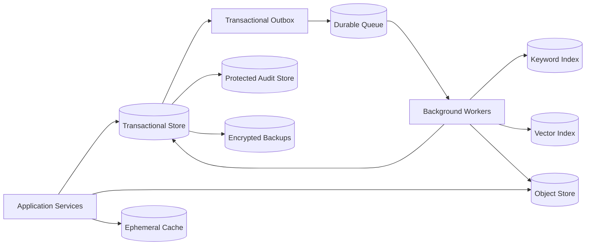
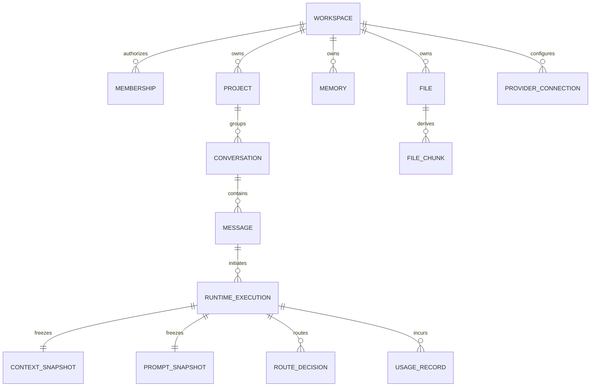

# GEXOR

## Database Design Specification

**Version:** 1.0-MVP

**Status:** Complete — Pending Baseline Approval
**Sources:** `PRD.md`, `FUNCTIONAL-REQUIREMENTS.md`, `NON-FUNCTIONAL-REQUIREMENTS.md`, `SYSTEM-CONTEXT-AND-HIGH-LEVEL-ARCHITECTURE.md`, `RUNTIME-PIPELINE.md`, `DOMAIN-MODEL.md`

---

# 1. Purpose and Principles

This document converts the Gexor domain model into an implementation-ready logical persistence design without selecting a database vendor. The design protects workspace isolation, provider independence, immutable runtime evidence, structured memory, recoverable workflows, and deletion propagation.

Mandatory principles:

1. Every tenant-owned row carries `workspace_id`; authorization never depends on client filtering.
2. Stable generated identifiers are used as primary keys; provider identifiers are attributes only.
3. Canonical records and derived search, vector, cache, and analytics records remain separate.
4. Timestamps are UTC; mutable aggregates carry `version`; soft-deletable records carry `deleted_at`.
5. Secrets are stored only in a secret manager; tables retain opaque credential references.
6. Runtime, route, context, prompt, usage, audit, and lifecycle evidence is append-only or immutable after finalization.
7. Foreign keys, unique constraints, checks, and transactional boundaries enforce domain invariants.

# 2. Logical Store Topology

The transactional store is authoritative. Object storage holds file bodies and generated exports. Search/vector indexes are rebuildable projections. Cache entries are disposable and must include workspace scope. Queue payloads reference durable source records rather than carrying unrestricted content.

# 3. Naming and Common Columns

Use `snake_case`, plural table names, and explicit join tables. IDs are sortable opaque UUID-compatible values. Common fields are `id`, `workspace_id`, `status`, `version`, `created_at`, `updated_at`, `deleted_at`, and `created_by`. Monetary values use integer minor units plus ISO currency; token counts use integers; hashes state their algorithm.

All workspace-scoped unique keys begin with `workspace_id`. All polymorphic references require an allow-listed type plus validated identifier. JSON fields are reserved for versioned snapshots or provider-neutral extensibility, not core relationships.

# 4. Core Relational Schema

| Table | Key fields and relationships | Required constraints/indexes |
| --- | --- | --- |
| `accounts` | identity profile, status, locale | unique normalized login identity; status check |
| `authentication_identities` | account, issuer, subject | unique `(issuer, subject)` |
| `sessions` | account, token hash, expiry, revocation | hash unique; expiry/revocation index |
| `organizations` | owner account, name, status | owner FK; status index |
| `workspaces` | owner type/id, name, policy version, status | owner check; status index |
| `memberships` | workspace, account, role, status | unique `(workspace_id, account_id)` |
| `roles`, `role_permissions` | workspace/system role and permission | unique scoped role name and permission |
| `projects` | workspace, name, description, status | `(workspace_id, status, updated_at)` |
| `conversations` | workspace, project, title, status | same-workspace project FK; list index |
| `messages` | workspace, conversation, role, sequence, content ref, state | unique conversation sequence; state index |
| `runtime_executions` | workspace, message, route, state, correlation, retry parent | unique acceptance idempotency key; state/time index |
| `context_snapshots` | execution, source manifest, token totals, hash | unique execution; immutable |
| `prompt_snapshots` | execution, canonical prompt ref/hash, policy version | unique execution/version; immutable |
| `response_versions` | execution, assistant message, sequence, state | unique `(execution_id, sequence)` |
| `stream_sessions` | execution, cursor, state, expiry | execution/state index |
| `memories` | workspace, category, scope, content ref, provenance, state | retrieval and lifecycle indexes |
| `memory_candidates` | workspace, source/version, proposed memory, state | unique extraction effect key |
| `knowledge_sources` | workspace, source type/id/version, state | unique active source version |
| `knowledge_records` | workspace, source, normalized content, state | source/state index |
| `files` | workspace, object key, media type, size, checksum, state | checksum/source index; quota index |
| `file_chunks` | workspace, file/version, ordinal, content ref | unique `(file_id, source_version, ordinal)` |
| `providers`, `models`, `model_capabilities` | normalized catalogue metadata | unique normalized provider/model keys |
| `provider_connections` | workspace, provider, credential ref, status | unique eligible scoped connection |
| `route_decisions` | execution, provider/model snapshots, reasons, fallback chain | unique execution/attempt; immutable |
| `usage_records` | workspace, execution, provider usage, source, state | unique execution/provider report effect |
| `cost_records` | usage record, pricing version, amount/currency | unique usage/pricing computation |
| `quotas`, `spending_controls`, `reservations` | workspace, period, limits, consumption | scoped period uniqueness; nonnegative checks |
| `background_jobs` | workspace, type, source/version, idempotency key, state, attempts | unique effect key; claim and retry indexes |
| `workflow_instances`, `workflow_steps` | workspace, workflow type, state | step uniqueness; recoverable state index |
| `notifications` | workspace/account, template, channel, state | deduplication key; delivery index |
| `audit_events` | actor, workspace, action, target, outcome, correlation, time | append-only; workspace/time/action indexes |
| `exports`, `deletion_workflows`, `recovery_operations` | workspace, target, state, manifest | request idempotency and state indexes |
| `outbox_events`, `inbox_receipts` | aggregate/event identity, schema version, delivery state | event ID unique; delivery/received indexes |

# 5. Relationship and Isolation Rules

Composite foreign keys should include `workspace_id` for tenant relationships. Where the database supports row-level security, it is defense in depth, with session scope set only by trusted server code. Service accounts receive least-privilege table access. Cross-workspace joins and uniqueness are prohibited except explicitly approved platform administration and global catalog data.

# 6. Transaction Boundaries and Concurrency

- Message acceptance atomically creates the canonical message, runtime execution, idempotency record, and outbox event.
- Provider dispatch uses a conditional claim so only one attempt crosses the external side-effect boundary.
- Finalization conditionally changes the execution to one terminal state and creates response/usage/outbox records.
- Quota reservation and release use atomic counters or serializable scoped transactions.
- Background commits compare source identity/version and store an inbox/effect receipt.
- Optimistic concurrency rejects stale aggregate versions; workers use bounded leases with fencing tokens.
- External calls never occur while holding a database transaction.

# 7. Index, Partition, and Capacity Strategy

Primary access indexes begin with workspace scope. High-volume tables (`messages`, executions, usage, audit, jobs, outbox) may partition by time and hash/workspace while preserving tenant-safe queries. Partial indexes target active/nondeleted states. Full-text and vectors remain in derived stores with `(workspace_id, source_id, source_version)` metadata and eligibility filters.

Query budgets require cursor pagination, bounded page sizes, no unscoped scans, and query-plan regression testing. Large content and stream chunks belong in object storage when row growth would impair hot paths.

# 8. Migration and Seed Policy

Migrations are immutable, ordered, peer-reviewed, tested on production-like volume, and deployed with expand/migrate/contract compatibility. Destructive schema changes require verified backups and rollback/roll-forward instructions. Seed data is limited to permissions, global provider/catalog metadata, and safe defaults; no production credentials or customer data enter fixtures.

# 9. Retention, Deletion, Backup, and Restore

Retention is policy-driven per data class. Soft deletion immediately removes retrieval eligibility. Permanent deletion traverses source rows, objects, indexes, caches, queued work, and derived projections, then records exceptions and terminal evidence. Backups are encrypted, access-controlled, restore-tested, and expired by policy; deletion workflows disclose protected-backup expiry where applicable.

Recovery targets follow the NFRS. Restore tests verify workspace isolation, referential integrity, credential-reference safety, outbox consistency, index rebuilds, and point-in-time recovery.

# 10. Verification and Traceability

Database acceptance requires automated schema linting, migration forward/backward tests, tenant-isolation tests, concurrency/idempotency tests, deletion propagation, restore drills, and representative query plans. Every table maps to a `DOMAIN-MODEL.md` aggregate/entity and every sensitive control maps to the NFRS security, privacy, isolation, integrity, and recovery requirements.

# 11. Approval

Owners: Data Architecture, Architecture Authority, Security, Engineering, QA, and Product Owner. Approval is pending. Any vendor selection or physical optimization must preserve this logical baseline.

---

# End of Document
