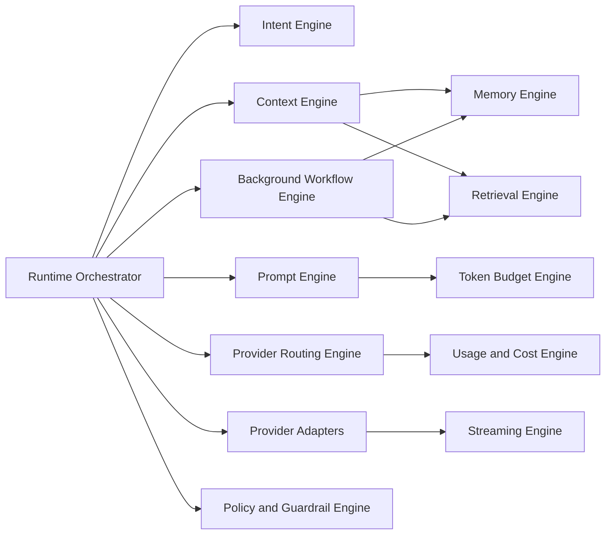

# GEXOR

## Core Engines Design Specification

**Version:** 1.0-MVP
**Status:** Complete — Pending Baseline Approval

---

# 1. Purpose

This document defines the deterministic contracts and safety boundaries of the engines that implement the Gexor runtime. Engines are logical components, not mandatory microservices. They communicate through provider-neutral typed contracts and never bypass workspace authorization or aggregate ownership.

# 2. Engine Map

# 3. Shared Contract

Every invocation carries execution/job ID, workspace ID, actor/service identity, correlation/causation IDs, source versions, effective configuration version, deadline, and cancellation signal. Every result carries engine/version, outcome, confidence where applicable, evidence references, warnings, latency, and normalized error. Engines must be deterministic for equivalent versioned inputs unless a controlled external inference call is explicitly part of the contract.

# 4. Runtime Orchestrator

The orchestrator owns stage progression, not domain data. It validates entry, snapshots effective configuration, chooses direct/enhanced/retrieval/clarification/denied routes, enforces deadlines, invokes engines, claims provider dispatch, coordinates streaming/finalization, and durably hands off background work.

It persists state before external side effects, never holds a database transaction across provider calls, and uses terminal-state precedence to resolve cancel/timeout/provider races. Restarts resume from durable state or reconciliation rather than replaying an ambiguous dispatch.

# 5. Intent and Task Classification Engine

Inputs are minimized user content, conversation signals, allowed metadata, and classification policy. Output includes normalized intent/task type, complexity, tool/retrieval needs, safety flags, confidence, reasons safe for audit, and recommended route. Low confidence selects conservative defaults or clarification. Classification cannot grant permissions, select unauthorized context, or silently change user intent.

# 6. Context Engine

The context engine creates a candidate manifest from authorized conversation, memory, knowledge, and file sources. It applies workspace/scope eligibility, trust labels, relevance, recency, provenance, deduplication, conflict handling, token priority, and Snapshot Lock. Output is an immutable ordered context snapshot containing source IDs/versions and exclusion reasons, never an untraceable content blob.

# 7. Memory Engine

The memory engine retrieves active eligible memories and processes post-response candidates. Extraction produces candidates with category, scope, normalized content, provenance, confidence, source version, and effect key. It does not automatically activate facts that require confirmation. Consolidation preserves lineage; conflicts are explicit; stale jobs cannot overwrite newer memory; deletion immediately removes retrieval eligibility.

# 8. Knowledge and Retrieval Engine

Ingestion scans, parses, normalizes, chunks, embeds/indexes, and publishes source versions. Retrieval combines allow-listed keyword/vector/hybrid strategies, then filters workspace, lifecycle, ACL, source version, and deletion state before ranking. Results include citations and scores. Derived indexes never establish authority and can be rebuilt from canonical sources.

# 9. Prompt Construction Engine

The prompt engine preserves instruction precedence: platform safety/system policy, authorized workspace policy, explicit developer/task controls, user request, then clearly delimited untrusted context. It prevents retrieved content from becoming instructions, represents attachments/citations, and produces a canonical prompt snapshot before adapter transformation. Hidden reasoning is neither requested for storage nor exposed.

# 10. Token Budget Engine

The engine calculates `modelContextLimit - outputReservation - protocolOverhead - safetyMargin`, estimates each prompt segment with the selected model tokenizer or conservative fallback, and reduces context deterministically by priority. Mandatory instructions and the current request are protected. Budget records preserve estimates, exclusions, model metadata version, and final totals.

# 11. Provider Routing Engine

Inputs include explicit user choice, workspace policy, provider connection state, model capabilities, context limits, region/policy constraints, cost/quota, health, and fallback policy. Output is an immutable ranked route decision with eligibility evidence and rejected alternatives. Explicit valid choice wins; fallback requires prior authorization and material differences are disclosed. Routing never reads plaintext credentials.

# 12. Provider Adapter and Streaming Engines

Adapters translate canonical prompts, credentials references, timeouts, cancellation, and tool schemas into provider protocols; normalize deltas, usage, finish reasons, and errors; and isolate provider-specific behavior. The streaming engine assigns ordered event sequences, persists recoverable checkpoints, controls backpressure, supports bounded reconnect, and emits one terminal outcome. Malformed or late output is quarantined/ignored according to state.

# 13. Usage, Cost, Quota, and Spending Engine

Before dispatch it estimates tokens/cost, checks quotas and spending ceilings, and creates a reservation. After execution it preserves estimated and provider-reported usage, applies a versioned price, reconciles the reservation idempotently, and flags discrepancies. Unknown pricing cannot be silently treated as zero.

# 14. Background Workflow Engine

Jobs contain workspace, type, source ID/version, idempotency key, attempt/deadline, and trace context. Workers reauthorize/revalidate eligibility, claim with a fenced lease, execute bounded retries, commit conditionally, and place poison work in a dead-letter/manual-review path. Categories include memory extraction, file indexing, usage reconciliation, notifications, exports, deletion, and repair.

# 15. Policy and Guardrail Engine

This engine evaluates authentication context, permissions, content trust, data-loss rules, provider policy, administrative elevation, and lifecycle constraints at defined gates. A policy decision includes policy/version, subject, resource/action, outcome, and safe reason. Failures are fail-closed for authorization/isolation and predictably degraded for optional enrichment.

# 16. Engine Quality Requirements

Each engine has a versioned schema, golden tests, property/invariant tests, adversarial inputs, latency/capacity budgets, metrics, feature-flagged rollout, and rollback compatibility. Evaluation datasets are privacy-reviewed, workspace-separated, and free of production secrets. Material model/prompt/ranking changes require offline evaluation and controlled canary comparison.

# 17. Traceability and Approval

Engine inputs/outputs trace to the runtime stages, domain aggregates, FRS runtime/memory/provider/file/usage requirements, and NFRS latency, reliability, isolation, security, portability, and observability requirements. Architecture, AI Engineering, Security, Data, QA, Product, and Operations approval is pending.

---

# End of Document
