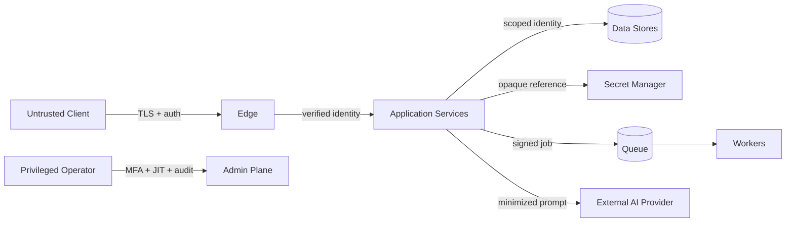

# GEXOR

## Security Architecture Specification

**Version:** 1.0-MVP
**Status:** Complete — Pending Security Approval

---

# 1. Security Objectives and Model

Gexor protects identity, workspace isolation, user-controlled context, provider credentials, runtime integrity, availability, privacy, auditability, and recoverability. The model assumes untrusted clients, user content, uploaded files, retrieved text, provider output, integration payloads, and compromised individual components. Controls use zero-trust verification, least privilege, defense in depth, deny-by-default authorization, data minimization, and recoverable operations.

# 2. Trust Boundaries

Data crossing a boundary is authenticated, authorized, schema-validated, size-limited, classified, encrypted in transit, and correlated. Optional services must fail without weakening mandatory isolation or authorization.

# 3. Identity and Session Security

Use standards-based identity integration and strong password hashing where passwords are owned. Require verified recovery, generic enumeration-resistant responses, rotation/revocation on credential changes, secure HttpOnly/SameSite cookies when browser sessions are used, CSRF protection, session inactivity/absolute expiry, device/risk signals, and MFA for privileged roles. Service identities are workload-bound, short-lived, and non-shareable.

# 4. Authorization and Workspace Isolation

Authorization evaluates authenticated subject, workspace membership/status, role/permission, target ownership, action, resource lifecycle, and elevated conditions on every request and worker commit. Workspace scope is propagated from trusted server context into database queries, cache keys, queue messages, object keys, search/vector filters, metrics dimensions, exports, and deletion workflows. Composite keys and row policies provide defense in depth. Administrative access is separate, just-in-time, time-bound, reason-coded, and audited.

# 5. Provider Credentials and Secrets

Provider keys are accepted only through protected endpoints, immediately transferred to a managed secret store, encrypted with managed keys, and represented elsewhere by opaque reference. Plaintext is available only to the authorized adapter at dispatch time and is never returned, logged, indexed, cached, placed on queues, included in backups outside approved secret-store protection, or exposed to support tooling. Rotation, validation, revocation, last-used metadata, and access audit are mandatory.

# 6. Data Protection and Classification

Classes are Public, Internal, Confidential, and Restricted. Authentication material, provider credentials, sensitive user content, security evidence, and recovery keys are Restricted. TLS protects transit; managed encryption protects stores, objects, indexes, queues, logs, and backups. Keys are environment-separated, access-controlled, rotated, and recoverable. Data minimization governs prompts, telemetry, notifications, exports, and provider transfer. Retention and deletion operate by class and source lineage.

# 7. Application and API Security

Controls include strict schema validation, canonicalization, parameterized queries, output encoding, CSP and secure browser headers, bounded upload types/sizes, malware scanning, archive-bomb protection, SSRF-safe fetch policy, allow-listed redirects/origins, request rate/cost limits, idempotency, replay protection, concurrency checks, and safe problem responses. Dependencies, containers, IaC, and secrets are scanned in CI and continuously monitored.

# 8. AI-Specific Threat Controls

Retrieved files, memories, search results, tool output, and provider responses are untrusted data and delimited from instructions. Prompt construction enforces explicit precedence and context minimization. Retrieval applies workspace and lifecycle filters after candidate generation. Tool/integration calls require allow-listed capabilities, parameter validation, user/workspace authorization, egress policy, deadlines, and audit. The system never exposes hidden system instructions, credentials, chain-of-thought, or unrelated context in response to prompt injection.

# 9. Infrastructure and Network Security

Public ingress terminates at protected edge services with WAF/DDoS controls. Application, worker, data, management, and observability planes are segmented. Data stores and secret managers have no public access. Egress is allow-listed for providers and approved integrations. Workloads use immutable minimal images, non-root execution, read-only filesystems where possible, resource limits, signed artifacts, runtime policies, patched base images, and short-lived workload credentials.

# 10. Audit, Detection, and Response

Security-significant authentication, permission, membership, credential, provider, export, deletion, policy, administrative, and recovery actions create tamper-resistant events with actor, target, workspace, outcome, time, correlation, and safe reason. Alerts cover credential misuse, cross-tenant attempts, anomalous exports, privilege changes, repeated authorization failures, suspicious prompt/tool behavior, malware, secret access, and audit gaps. Logs exclude secrets and minimize content.

# 11. Threat Register

| Threat | Principal controls |
| --- | --- |
| Cross-workspace data exposure | trusted scope, composite constraints, row policy, isolation tests |
| Provider key theft | secret manager, scoped access, redaction, rotation, audit |
| Prompt injection/data exfiltration | trust labels, instruction precedence, minimization, tool/egress policy |
| Account takeover | MFA, secure recovery/session, rate/risk controls |
| IDOR/BOLA | resource authorization on every lookup, opaque IDs |
| Malicious upload | type/size validation, scanning, isolated parsing |
| SSRF | no arbitrary fetch, allow-listed egress, DNS/IP validation |
| Replay/duplicate side effects | idempotency keys, signed timestamps, inbox receipts |
| Supply-chain compromise | lockfiles, provenance/SBOM, signing, scanning, review |
| Privileged misuse | separate admin plane, JIT elevation, approval, immutable audit |
| Backup leakage | encryption, access separation, expiry, restore controls |
| Denial of wallet/service | quotas, spending ceilings, rate limits, load shedding |

# 12. Secure SDLC and Assurance

Threat modeling occurs per material design change. Pull requests require review, automated SAST/SCA/secret/IaC/container scans, authorization and tenant tests, and signed build provenance. Critical vulnerabilities block release; exceptions require owner, compensating controls, expiry, and approval. Independent penetration testing precedes production and follows major boundary changes.

# 13. Security Acceptance

Release requires no unresolved critical/high exploitable findings, verified credential redaction, complete authorization matrix, tenant escape tests, upload and AI adversarial tests, encryption/key validation, incident runbooks, restore evidence, dependency inventory/SBOM, and Product/Security risk acceptance. Security Architecture, Engineering, Operations, Privacy, and Product approval is pending.

---

# End of Document
