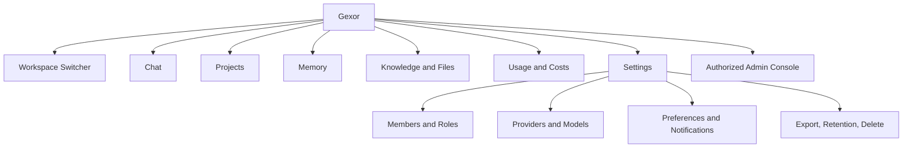

# GEXOR

## UX and Information Architecture Specification

**Version:** 1.0-MVP
**Status:** Complete — Pending UX Baseline Approval

---

# 1. Experience Promise

Gexor gives users a familiar AI conversation experience while making provider choice, workspace ownership, memory, knowledge, usage, and execution status understandable and controllable. The interface favors progressive disclosure: simple defaults for ordinary use, precise evidence and controls when requested.

# 2. UX Principles

1. Always show the active workspace and prevent accidental cross-workspace action.
2. Preserve the user's wording and make enhancement/routing transparent.
3. Stream useful output quickly without representing partial output as complete.
4. Make memory inspectable, correctable, confirmable, and deletable.
5. Explain provider/model, cost, quota, file-processing, and failure states in plain language.
6. Never expose secrets, internal prompts, raw provider failures, or hidden reasoning.
7. Meet WCAG 2.2 AA for the MVP surface.
8. Provide safe recovery for destructive, interrupted, and asynchronous actions.

# 3. Information Architecture

Desktop uses persistent workspace/global navigation and conversation context; narrow screens use an accessible drawer and preserve the composer as the primary action. Platform administration is visually and technically separate from workspace settings.

# 4. Core Journeys

## 4.1 First Run

Register/sign in, verify identity, enter the automatically provisioned personal workspace, receive a concise ownership/privacy explanation, optionally connect a provider, then start a conversation. Missing provider configuration is an actionable setup state, not a generic error.

## 4.2 Conversation

Create/select project and conversation, compose text and attach eligible files, see selected provider/model and relevant cost/quota state, submit once, receive immediate accepted state, watch ordered streaming output, cancel when eligible, then inspect citations, route/usage summary, retry, or regenerate. Rapid messages use the last committed eligible memory and never appear blocked by invisible background work.

## 4.3 Provider Connection

Choose supported provider, view required credential scope and data-transfer notice, enter credential in a protected form, validate without redisplaying it, choose permitted model/default, and revoke/rotate later. Connection status and last validation/usage are shown without secret material.

## 4.4 Memory and Knowledge

Memory is grouped by category/scope/status with provenance and last-used metadata. Candidates needing confirmation are clearly separate from active memory. Users can accept, edit, reject, deactivate, or delete. File upload shows scan/parse/index stages, errors, retry, source version, project scope, and deletion impact.

## 4.5 Usage and Data Control

Dashboards distinguish estimated from provider-reported tokens/cost, state currency/pricing time, and show quota/spending thresholds. Export and deletion flows explain scope, irreversible consequences, pending derived cleanup, backup expiry, identity reauthentication, and terminal status.

# 5. Chat Screen Anatomy

The header identifies workspace, project/conversation, provider/model, connection health, and usage entry. The timeline uses semantic user/assistant/system-status messages. Assistant output visibly distinguishes streaming, complete, cancelled, partial, and failed. Citations link to authorized source previews. The composer supports text, attachments, send, and accessible keyboard behavior; double submission is prevented with idempotency rather than disabling recovery.

# 6. State and Feedback Model

Every asynchronous object exposes a human-readable state and next action. Use inline progress for short tasks and persistent status for uploads, exports, deletions, or recovery. Optimistic updates are limited to reversible local presentation; authoritative success waits for server confirmation. Empty states teach one primary action. Skeletons preserve layout; spinners never replace an explanation for long work.

Errors state what happened, whether work was saved, whether retry is safe, and what the user can do. Provider failures are normalized while retaining a correlation ID for support. Destructive actions use scope-specific confirmation; high-impact deletion requires reauthentication and typed/explicit confirmation.

# 7. Workspace and Permission UX

The active workspace name/avatar appears in the global shell and destructive dialogs. Workspace changes reset scoped search/navigation safely. Unauthorized resources are not leaked. Members see only permitted controls; disabled controls are used only when explaining eligibility is beneficial, otherwise absent. Role and membership changes clearly state effect and are reflected promptly after revocation.

# 8. Accessibility and Inclusive Design

All functions are keyboard operable with visible focus, logical order, skip links, semantic headings/landmarks, accessible names, and no keyboard traps. Status changes use appropriate live regions without announcing every streamed token. Color is not the sole signal; text contrast meets AA; zoom/reflow works at 400%; motion respects reduced-motion; targets are usable; forms associate labels, descriptions, and errors. Streaming offers pause/less-frequent announcement behavior.

# 9. Responsive, Localization, and Content Rules

Layouts support 320 CSS-pixel width through large screens. Locale, time zone, number, currency, and date formatting are explicit; stored canonical time remains UTC. UI strings are externalized and expandable. Plain-language labels use “workspace,” “memory,” “provider,” and “model” consistently with the domain vocabulary. Safety and privacy notices are concise with deeper detail linked contextually.

# 10. Analytics and Privacy

Measure activation, provider setup completion, first successful response, time to first stream event, retry/cancel outcomes, upload completion, memory review, accessibility failures, and abandonment. Analytics use pseudonymous identifiers and minimized event properties; prompt/file/memory content and credentials are excluded. Experiments require purpose, guardrail metrics, accessibility review, and rollback.

# 11. UX Acceptance

Acceptance includes task-based usability tests for first response, provider setup, file-backed answer, memory correction, quota explanation, export, and deletion; keyboard/screen-reader/zoom/contrast checks; responsive and slow-network testing; localized string expansion; error and recovery testing; and verified workspace labeling. Product, UX, Accessibility, Security, Support, and Engineering approval is pending.

---

# End of Document
