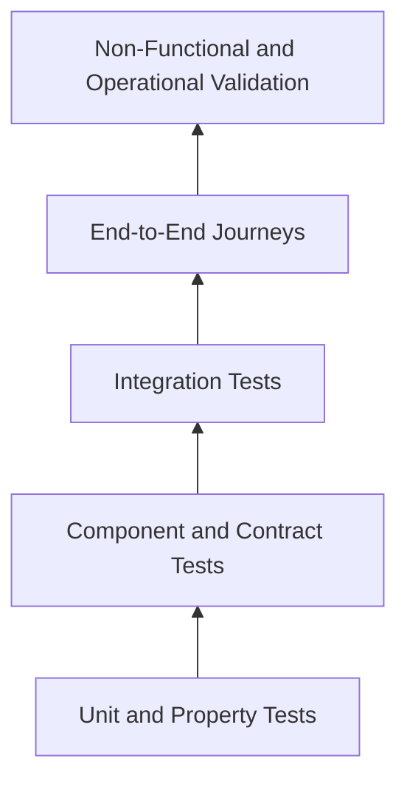

# GEXOR

## Testing and Quality Assurance Strategy

**Version:** 1.0-MVP
**Status:** Complete — Pending QA Baseline Approval

---

# 1. Quality Objective

Testing provides evidence that Gexor satisfies its approved product, functional, non-functional, architecture, runtime, domain, database, API, engine, security, UX, deployment, and operational baselines. Quality is owned by the whole delivery team; independent QA governs evidence and release decisions.

# 2. Test Model

Fast deterministic tests dominate. End-to-end tests cover only critical journeys. Provider adapters use fixtures and contract sandboxes by default; controlled live-provider tests verify integration without making CI dependent on external availability.

# 3. Test Levels

| Level | Primary evidence |
| --- | --- |
| Unit/property | validation, state machines, budget/routing rules, invariants, redaction |
| Component | service/engine behavior with controlled dependencies |
| Contract | OpenAPI, SSE, events, provider adapters, backward compatibility |
| Integration | database, object store, queue, search/vector, secret manager, identity |
| End-to-end | sign-in through chat, files, memory, usage, export/deletion |
| Non-functional | performance, scale, security, accessibility, resilience, recovery |
| Operational | deploy/rollback, dashboards, alerts, runbooks, restore and incident drills |

# 4. Critical Functional Suites

- Identity: registration, login, recovery, expiry, logout, MFA/elevation, revocation.
- Isolation: every workspace-owned endpoint/query/job/cache/index/export/delete path, including adversarial ID substitution.
- Conversation/runtime: acceptance atomicity, idempotency, state transitions, streaming order/reconnect, cancellation, retry/regeneration, timeout, terminal races, Snapshot Lock.
- Context/memory: eligibility, ranking, token reduction, candidate confirmation, conflict, stale job protection, provenance, deletion.
- Provider: credential lifecycle, catalog/model eligibility, explicit choice, fallback, normalized errors, late output.
- Files/search: type/size/malware, parsing/chunking, hybrid results/citations, source versions, derived cleanup.
- Usage: estimate/report reconciliation, price versions, reservations, quota/spending concurrency.
- Lifecycle: export completeness, soft/permanent deletion, backup disclosure, restoration authorization.

# 5. Non-Functional Verification

Performance tests measure the NFRS percentiles for message acceptance, runtime preparation, first stream event excluding provider latency where specified, relay overhead, retrieval, cancellation, enqueue, and token counting. Load profiles cover steady, burst, noisy-neighbor, large conversation, large workspace, and provider degradation. Soak tests detect leaks and queue drift.

Reliability tests inject process death, duplicate/out-of-order events, queue redelivery, database failover, cache loss, index lag, provider timeouts, partial streams, and ambiguous dispatch. Recovery evidence verifies RPO/RTO, restore integrity, reconciliation, and no cross-workspace contamination.

# 6. Security and Privacy Testing

CI includes SAST, dependency/license, secrets, IaC, container, and API schema scanning. Dynamic tests cover OWASP web/API risks, BOLA/IDOR, injection, SSRF, CSRF, session flaws, file attacks, rate/cost abuse, credential redaction, privilege escalation, webhook replay, and audit tampering. AI adversarial suites cover prompt injection, malicious retrieved documents, context exfiltration, unsafe tool parameters, and system-prompt/secret extraction. Penetration testing is required before production.

# 7. Accessibility and UX Testing

Automated checks are supplemented by keyboard-only, screen reader, zoom/reflow, contrast, reduced-motion, focus, status announcement, error recovery, responsive layout, and representative usability tests. Target is WCAG 2.2 AA. Critical journeys must work without a mouse and streaming announcements must remain usable.

# 8. Test Data and Environments

Tests use synthetic, deterministic, workspace-separated data factories. Production content, provider keys, and personal data are prohibited in lower environments unless an approved masked procedure exists. Each suite creates unique tenants and cleans them through product lifecycle APIs. Clocks, IDs, provider responses, and failures are controllable. Environment configuration is versioned and parity differences documented.

# 9. Automation Pipeline

Pull request gates: formatting/lint, unit/property, contract/breaking-change, component, migration, security/secret scans, and changed-scope accessibility tests. Main-branch gates add integration and end-to-end suites. Release candidates add performance smoke, resilience, full security, accessibility, deploy/rollback, observability, and backup/restore evidence. Flaky tests are quarantined only with owner, issue, expiry, and compensating coverage.

# 10. Defect and Evidence Governance

Defects record severity, affected requirement, environment/build, reproducible evidence, security/privacy impact, owner, and verification. Severity 1 blocks release; Severity 2 blocks unless formally risk-accepted; security exceptions require Security approval and expiry. A requirement traceability matrix maps requirement IDs to design, tests, results, defects, and release. Evidence is immutable enough for audit and retained by policy.

# 11. Release Exit Criteria

Release requires:

1. all MVP critical/required requirements have passing evidence;
2. no open Severity 1 or unaccepted Severity 2 defects;
3. security, tenant-isolation, accessibility, performance, resilience, migration, rollback, and restore gates pass;
4. alert/runbook checks and operational readiness review pass;
5. known risks and provider limitations are documented;
6. Product, Engineering, QA, Security, and Operations approve the candidate.

# 12. Production Quality Feedback

Post-release error rate, latency, availability, stream failures, provider outcomes, queue age, reconciliation drift, security signals, support themes, and rollback/canary results feed regression coverage and quality reviews. Production verification uses synthetic tenants and never weakens customer isolation.

---

# End of Document
