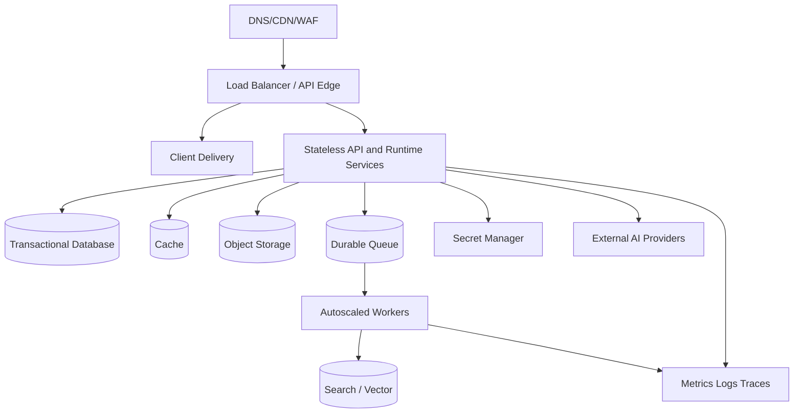
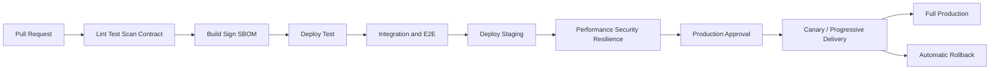

# GEXOR

## Deployment and DevOps Specification

**Version:** 1.0-MVP
**Status:** Complete — Pending Deployment Baseline Approval

---

# 1. Objectives

Gexor delivery must be repeatable, auditable, secure, reversible, environment-independent, and capable of zero/low-downtime change. This logical baseline avoids mandating a cloud vendor while defining controls for application services, workers, data stores, queues, indexes, secrets, observability, backups, and external-provider connectivity.

# 2. Environment Model

Development, test, staging, and production use separate accounts/projects, networks, identities, keys, secret namespaces, data, providers/quotas, observability, and deployment approvals. Production data and secrets do not enter lower environments. Staging mirrors production topology and policy at appropriate scale. Ephemeral preview environments use synthetic data, bounded spend, automatic expiry, and no production trust.

# 3. Logical Deployment Topology

Multi-zone placement is required for production stateful dependencies where supported. Public access is limited to edge endpoints. Management and data planes are private. Workloads are horizontally scalable and disposable; durable progress resides in approved stores.

# 4. Infrastructure as Code

All infrastructure, identity, network, policies, alerts, backup schedules, and environment configuration are version-controlled IaC. Modules are pinned, reviewed, scanned, planned in CI, and applied through an approved deployment identity. Manual production changes are emergency-only, audited, and reconciled back to code. Drift is detected continuously and blocks unsafe promotion.

# 5. Build and Artifact Supply Chain

Builds are hermetic and reproducible from locked dependencies. CI creates immutable versioned artifacts once; the same digest is promoted across environments. Images are minimal, non-root, scanned, SBOM-attached, provenance-signed, and stored in a restricted registry. No secret is baked into an artifact or build log. Critical exploitable findings block promotion.

# 6. CI/CD Flow

Protected branches, required review, least-privilege CI identities, isolated runners, and immutable evidence are mandatory. Production approval requires separation of duties. Deployment events include artifact/config/schema versions, approver, correlation, start/end, health result, and rollback decision.

# 7. Configuration and Secrets

Configuration is schema-validated, environment-specific, versioned, and safely defaulted. Feature flags have owner, purpose, environment, rollout, expiry, and kill switch. Secrets are injected at runtime from the secret manager using workload identity; rotation does not require source changes. Logs and command output are redacted. Provider credentials remain workspace-scoped application secrets, separate from platform deployment secrets.

# 8. Database and Data-Service Changes

Schema delivery follows expand/migrate/contract. Backward-compatible expansion deploys before code reliance; data backfills are resumable, throttled, idempotent, observable, and workspace-safe; contraction occurs after old versions and rollback windows end. Migrations never make external calls. Search/vector schema changes use parallel index build and alias/cutover. Queue event schemas support mixed-version producers/consumers.

# 9. Release and Rollback Strategy

Stateless workloads use rolling, canary, or blue/green delivery with readiness, liveness, startup, and business-level health signals. Promotion is based on error rate, latency, stream success, saturation, queue age, provider-normalized failures, and security signals. Automatic rollback applies to compatible application/config changes. Irreversible data changes require roll-forward plans, tested backups, and explicit approval.

# 10. Scaling and Resilience

API scaling uses concurrency/latency/saturation; worker scaling uses queue age/depth and job class; streaming capacity is separately measured. Resource requests/limits, disruption budgets, anti-affinity, graceful shutdown, connection draining, bounded retries, circuit breakers, load shedding, and per-workspace/provider quotas protect the system. Autoscaling never bypasses spend or tenant controls.

# 11. Backup, Recovery, and Continuity

Encrypted database point-in-time recovery, object versioning/backup, critical configuration/IaC retention, secret recovery procedures, and derived-index rebuild paths meet NFRS RPO/RTO. Restore drills occur on schedule and verify tenant isolation, referential integrity, outbox/queue consistency, credential references, and application readiness. Regional disaster recovery is selected according to approved MVP targets and documented with dependencies.

# 12. Deployment Security

Production access requires SSO/MFA, role-based least privilege, just-in-time elevation, approved reason, time limit, and audit. Workloads use network segmentation, allow-listed egress, encrypted service/data connections, runtime policy, and short-lived identity. CI cannot directly expose production customer data or workspace credentials. Break-glass use triggers immediate alert and review.

# 13. DevOps Acceptance

Before production: IaC plan/apply and drift checks pass; artifacts are signed/scanned with SBOM; staging deploy and rollback succeed; migrations/backfills are rehearsed; performance/resilience/security gates pass; dashboards/alerts/runbooks exist; backups restore successfully; capacity and provider quotas are approved; on-call and change owners sign off. DevOps, Security, Database, QA, Operations, Architecture, and Product approval is pending.

---

# End of Document
