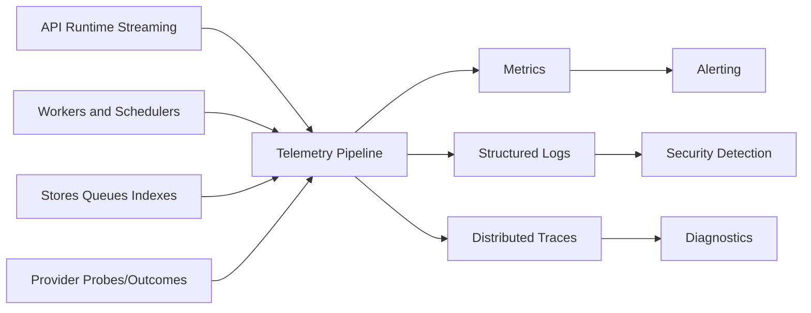

# GEXOR

## Operations, Monitoring, and Incident Response Specification

**Version:** 1.0-MVP
**Status:** Complete — Pending Operational Readiness Approval

---

# 1. Operational Objectives

Operations must detect customer-impacting or security-relevant degradation quickly, protect workspace confidentiality during diagnosis, restore safe service within approved targets, preserve evidence, communicate clearly, and convert incidents into verified improvements. Provider failures are measured separately from Gexor-controlled availability while the user experience remains end-to-end observable.

# 2. Service Ownership and Readiness

Every production service, job class, data store, integration, dashboard, alert, and runbook has a named technical owner and escalation path. A service catalog records dependencies, data classification, SLOs, capacity limits, deployment/version, recovery targets, dashboards, runbooks, and on-call rotation. Production readiness review is required before launch and material architecture changes.

# 3. Telemetry Model

Correlation uses request, trace, workspace-safe pseudonym, conversation/message, execution, job, provider route, deployment, and schema/config versions as appropriate. Telemetry never contains passwords, bearer tokens, provider keys, hidden instructions, full prompts, file bodies, memory content, or unrestricted provider payloads. Access and retention follow data classification.

# 4. SLIs, SLOs, and Error Budgets

SLIs include authenticated API availability, message acceptance latency/success, runtime preparation latency, first stream event and relay overhead, completed/cancelled/failed executions, SSE reconnect success, retrieval latency/quality signals, queue age/job success, usage reconciliation lag, deletion/export completion, and backup/restore success. Provider availability/latency/error is labeled independently by provider/model/region without leaking tenant data.

Exact MVP targets are taken from the approved NFRS. SLO windows and exclusions are explicit. Error-budget burn controls release velocity: fast burn pages immediately; sustained burn creates action and may freeze risky releases. Planned maintenance is communicated and never used to conceal avoidable failure.

# 5. Dashboards and Alerts

Dashboards cover customer journey, runtime stages, providers, streaming, data stores, queues/workers, search/vector ingestion, usage/cost/quota, security, deployments, and business-safe adoption. Alerts must be actionable, symptom-oriented, deduplicated, routed to an owner, and linked to a runbook. Paging is reserved for urgent user/security impact; tickets handle trends and capacity warnings.

Priority alerts include cross-workspace/isolation signals, credential access anomalies, authentication spikes, elevated execution failures, no terminal stream events, queue age/dead letters, reconciliation drift, deletion failures, database saturation/replication lag, backup failure, provider-wide degradation, audit pipeline gaps, and rapid spending anomalies.

# 6. Standard Runbooks

Required runbooks cover API latency/error, database exhaustion/failover, queue backlog/poison jobs, provider outage/rate limiting, streaming interruption, search/index lag, object-store/upload failure, secret rotation or suspected exposure, identity outage, cost/quota anomaly, stuck export/deletion, backup/restore failure, cross-tenant suspicion, malicious upload, failed deployment, and regional dependency loss.

Each runbook states symptoms, impact, safe diagnostic queries, required permissions, immediate containment, recovery, validation, rollback/escalation, communication, evidence preservation, and follow-up. Diagnostics use identifiers and aggregates before content; access to content requires explicit approved escalation.

# 7. Incident Classification

| Severity | Definition | Response |
| --- | --- | --- |
| SEV-1 | widespread outage, confirmed isolation/credential breach, irreversible critical data risk | immediate page, incident commander, executive/security/legal escalation |
| SEV-2 | major feature/provider degradation, significant subset affected, recovery risk | urgent page and coordinated response |
| SEV-3 | limited impact with workaround or nonurgent security issue | business-hours owner response |
| SEV-4 | minor defect/operational improvement | backlog with normal priority |

Security/privacy severity may be raised independent of availability. Severity is reassessed as evidence changes.

# 8. Incident Command Process

The incident commander coordinates; operations lead mitigates; communications lead provides updates; scribe preserves timeline; Security/Privacy joins relevant incidents; service owners diagnose. One shared incident record captures canonical time, hypotheses, commands/changes, approvals, customer impact, and decisions. Risky or destructive actions require explicit authorization unless immediate containment under approved emergency procedure is necessary.

# 9. Security and Privacy Incidents

Suspected cross-tenant access, credential exposure, unauthorized administrative activity, data exfiltration, malware, audit tampering, or supply-chain compromise triggers evidence-preserving containment. Rotate/revoke affected credentials, isolate workloads/integrations, preserve immutable logs/snapshots, restrict discussion/access, engage Security/Privacy/Legal, assess notification obligations, and document chain of custody. Do not delete evidence or broadly query customer content during triage.

# 10. Provider and External Dependency Incidents

Gexor distinguishes provider failure from internal failure, activates circuit breakers and authorized fallback, sheds optional enrichment when safe, respects user/provider policy, and communicates degraded capability without blaming or exposing provider internals. Fallback never bypasses explicit provider choice, region/data restrictions, cost ceilings, or credential authorization.

# 11. Recovery and Reconciliation

After mitigation, validate identity/authorization, message/runtime terminality, usage reservations, outbox/inbox state, queue duplicates, memory/source versions, search/index eligibility, deletion workflows, and audit continuity. Restore actions follow tested procedures and approved RPO/RTO. Derived stores may be rebuilt only from eligible canonical sources. Customer traffic resumes progressively with heightened monitoring.

# 12. Communications

Internal updates state severity, start/detection time, known impact, affected capabilities/regions/providers, current action, risk, owner, and next update. Customer/status communication is timely, factual, privacy-safe, and distinguishes confirmed facts from investigation. Resolution summaries state restoration and remaining risk. Regulatory/contractual notifications are controlled by Legal/Privacy requirements.

# 13. Post-Incident Review

SEV-1/2 and material security incidents require a blameless review covering timeline, detection gaps, contributing technical/organizational factors, control performance, customer/data impact, recovery effectiveness, and what went well. Corrective actions have owner, priority, due date, verification, and linked requirement/runbook/test. Repeat incidents escalate architecture and risk review.

# 14. Operational Cadence and Acceptance

Daily review covers pages, provider health, backups, queue/deletion exceptions, and security signals. Weekly review covers SLO/error budgets, capacity, costs, vulnerabilities, and unresolved actions. Monthly/quarterly exercises cover access, restore, failover, game days, incident simulation, dependency and retention review.

Launch acceptance requires owners/on-call schedules, NFR-derived SLOs, safe telemetry, actionable alerts, tested runbooks, incident roles/channels, status communication, capacity baseline, provider playbooks, backup/restore evidence, security response integration, and completed game day. Operations, SRE, Security, Privacy, Support, Engineering, and Product approval is pending.

---

# End of Document
